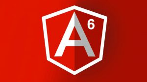

Angular 4/6, полностью переработаное продолжение JavaScript фреймворка AngularJS. Переработанный с нуля специалистами Google, Angular 2/4/6 предоставляет рассширенные возможности для создания Single-page application, такие как, декларативные шаблоны, двухсторонний дата биндинг, поддержка TypeScript, и внедрение зависимостей. Вместо контроллеров, характерных для архитектуры MVC, Angular 2/4 теперь использует компоненты. Это обновление, подходит как для мобильных так и для веб разработчиков.

**Аудитория:** Руководство предназначено для разработчиков которые хотят изучить основы Angular 6 и его концепции программирования, а так же для всех кто ищет для себя "что-то новое". Описывает компоненты Angular 6 с примерами.

**Минимальные навыки:** Базовые знания JavaSctipt. А так же, было бы хорошо знать смежные технологии  HTML, CSS, AJAX, AngularJS и т.д.

## **Что такое Angular?**

**Angular 6** - это платформа, которая упрощает разработку веб-приложений. Angular 6 сочетает в себе декларативные шаблоны, инъекцию зависимостей, комплексный end-to-end инструментарий и уже имплементированные best practice для решения любой сложности задач. _Angular 6_ позволяет создавать не только для веб-приложения но  так же мобильные и десктопные программы.

### Структура уроков по Angular 6 на русском ([angular.io](http://angular.io)):

1. Туториал
    1. [Введение в Angular 6](http://thewebland.net/development/javascript/angular/introduction-tour-of-heroes/)
    2. [CLI приложения Angular](http://thewebland.net/development/javascript/angular/2-cli-shell-prilozheniya-na-angular/)
    3. ["Редактор Героев"](https://thewebland.net/development/javascript/angular/3-redaktor-geroev-angular-6/)
    4. [Отображение списка](https://thewebland.net/development/javascript/angular/4-otobrazhenie-spiska-v-angular/)
    5. [Master/Detail Компоненты](https://thewebland.net/development/javascript/angular/5-master-detail-komponenty-tour-of-heroes/)
    6. Сервисы
    7. Роутинг
    8. HTTP
2. Основы
    1. Архитектура
    2. Компоненты и шаблоны
    3. Формы
    4. Observers & RxJS
    5. Конфигурирование, автозагрузка (bootstrapping)
    6. Модули (NgModules)
    7. Внедрение зависимостей
    8. HTTP Клиент
    9. Роутинг и навигация
    10. Анимация
    11. Тестирование
    12. Чит-лист
3. Техники
    1. Интернационализация (i18n)
    2. Сервисы языка Angular
    3. Безопасность / Защита приложений Angular
    4. Установка и Развертывание
    5. Сервис воркеры
    6. Рендеринг на стороне сервера (Angular SSR)

**Структура уроков Angular 2 на русском (tutorialspoint):**

- [Angular 2 - Обзор](http://thewebland.net/development/javascript/angular-2/overview/)
- [Angular 2 - Окружение](http://thewebland.net/development/javascript/angular-2/environment/)
- [Angular 2 - Hello World](http://thewebland.net/development/javascript/angular-2/hello-world/)
- [Angular 2 - Архитектура](http://thewebland.net/development/javascript/angular-2/architecture/)
- [Angular 2 - Модули](http://thewebland.net/development/javascript/angular-2/modules/)
- [Angular 4 - Компоненты](http://thewebland.net/development/javascript/angular-2/angular-4-components/)
- Angular 4 - Метаданные
- Angular 4 - Дата биндинг
- Angular 4 - Отображение данных
- Angular 4 - Взаимодействие с пользователями
- Angular 4 - Формы
- Angular 4 - Сервисы
- Angular 4 - Дерективы
- Angular 4 - Внедрение зависимости

**Полезные ссылки:**

- [Angular 2 видео](http://thewebland.net/development/javascript/angularjs/angularjs-2-video-lynda/) (eng)
- [Angular 2 видео на русском](https://youtu.be/DA965VLc8t4?list=PLIcAMDxr6tpprBS29b8IJMhZVcymPr-lM)
- [TypeScript](http://thewebland.net/development/javascript/typescript-video/)
