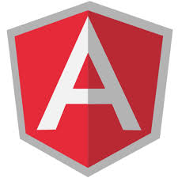

 

AngularJS расширяет HTML с новыми атрибутами.

AngularJS идеально подходит для одностраничного приложения.

AngularJS легко учить.

## **Узнайте AngularJS сейчас!**

## [Angular 2](http://thewebland.net/angular-2/)

* * *

##  Туториал по AngularJS

Этот учебник разработан специально, чтобы помочь вам как можно быстрее и эффективнее освоить AngularJS.

Первое, вы узнаете основы AngularJS: директивы, выражения, фильтры, модули и контроллеры.

Потом вы узнаете, все, что нужно о AngularJS,а именно: События, DOM формы (ввод, валидация), запросы и многое другое.

* * *

## Что вы должны знать перед изучением?

Перед тем как начать учить AngularJS вы должны понимать:

- HTML
- CSS
- JavaScript

## Ccылки на уроки:

1. [Введение в AngularJS](http://thewebland.net/development/javascript/angularjs/angularjs-part-one/)
2. [Установка и тестовое приложение](http://thewebland.net/development/javascript/angularjs/environment_setup/)
3. [MVC архитектура](http://thewebland.net/development/javascript/angularjs/angularjs-mvc/)
4. [Первое приложение](http://thewebland.net/development/javascript/angularjs/first-application/)
5. [Примеры использования директив](http://thewebland.net/development/javascript/angularjs/angularjs_directives/)
6. [Выражения](http://thewebland.net/development/javascript/angularjs/expressions-angularjs/)
7. [Контроллеры](http://thewebland.net/development/javascript/angularjs/controllers-angularjs/)
8. Фильтры
9. Таблицы
10. HTML DOM
11. Модули
12. Формы
13. Вставки
14. Ajax
15. Вид
16. Скоуп
17. Сервисы
18. Внедрение зависимости
19. Пользовательские директивы
20. Интернализация

### Дополнительные cсылки:

- [AngularJS директивы](http://thewebland.net/angularjs-tutorial/angularjs-references/)
- [AngularJS видео](http://thewebland.net/development/javascript/angularjs/angularjs-video/)

### Примеры приложений на AngularJS

- [AngularJS - ToDO Лист](http://18.185.47.240/wp-content/uploads/2016/12/todo.zip)
- [AngularJS - Блокнот](http://18.185.47.240/wp-content/uploads/2016/12/notepad.zip)
- [AngularJS - Модальное окно](http://18.185.47.240/wp-content/uploads/2015/07/bootstrap.zip)
- [AngularJS - Авторизация](https://www.tutorialspoint.com/angularjs/src/login/login.zip)
- AngularJS - Загрузка файла

```
<html>
   
   <head>
      <script src = "https://ajax.googleapis.com/ajax/libs/angularjs/1.3.14/angular.min.js"></script>
   </head>
   
   <body ng-app = "myApp">
	
      <div ng-controller = "myCtrl">
         <input type = "file" file-model = "myFile"/>
         <button ng-click = "uploadFile()">upload me</button>
      </div>
      
      <script>
         var myApp = angular.module('myApp', []);
         
         myApp.directive('fileModel', ['$parse', function ($parse) {
            return {
               restrict: 'A',
               link: function(scope, element, attrs) {
                  var model = $parse(attrs.fileModel);
                  var modelSetter = model.assign;
                  
                  element.bind('change', function(){
                     scope.$apply(function(){
                        modelSetter(scope, element[0].files[0]);
                     });
                  });
               }
            };
         }]);
      
         myApp.service('fileUpload', ['$http', function ($http) {
            this.uploadFileToUrl = function(file, uploadUrl){
               var fd = new FormData();
               fd.append('file', file);
            
               $http.post(uploadUrl, fd, {
                  transformRequest: angular.identity,
                  headers: {'Content-Type': undefined}
               })
            
               .success(function(){
               })
            
               .error(function(){
               });
            }
         }]);
      
         myApp.controller('myCtrl', ['$scope', 'fileUpload', function($scope, fileUpload){
            $scope.uploadFile = function(){
               var file = $scope.myFile;
               
               console.log('file is ' );
               console.dir(file);
               
               var uploadUrl = "/fileUpload";
               fileUpload.uploadFileToUrl(file, uploadUrl);
            };
         }]);
			
      </script>
      
   </body>
</html>
```

- [AngularJS - Меню](https://www.tutorialspoint.com/angularjs/src/nav/nav.zip)
- [AngularJS - Форма заказа](https://www.tutorialspoint.com/angularjs/src/order/order.zip)
- [AngularJS - Форма поиска](https://www.tutorialspoint.com/angularjs/src/search/search.zip)
- [AngularJS - Drag & Drop](https://www.tutorialspoint.com/angularjs/src/drag/drag.zip)
- [AngularJS - Корзина](https://www.tutorialspoint.com/angularjs/src/cart/src/cart.zip)
- [AngularJS - Локализация](https://www.tutorialspoint.com/angularjs/src/translate/translate.zip)
- [AngularJS - Карты](https://www.tutorialspoint.com/angularjs/src/map/map.zip)
- [AngularJS - Погода](https://www.tutorialspoint.com/angularjs/src/temp/temp.zip)
- [AngularJS - Таймер](https://www.tutorialspoint.com/angularjs/src/timer/timer.zip)
- [AngularJS - Листовка](https://www.tutorialspoint.com/angularjs/src/leaflet/leaflet.zip)
- [AngularJS - LastFM](https://www.tutorialspoint.com/angularjs/src/lastfm/lastfm.zip)

## Всегда пробуйте код своими руками!

```
<!DOCTYPE html>
<html>
<script src= "http://ajax.googleapis.com/ajax/libs/angularjs/1.3.14/angular.min.js"></script>
<body>

<div ng-app="">
 
<p>Input something in the input box:</p>
<p>Name : <input type="text" ng-model="name" placeholder="Enter name here"></p>
<h1>Hello {{name}}</h1>

</div>

</body>
</html>

```

 [**Попробовать**](http://www.w3schools.com/angular/tryit.asp?filename=try_ng_default)

## **AngularJS история**

AngularJS был первоначально разработан в 2009 году Мишко Хевери и Адамом Абронсом как программное обеспечение позади сервиса хранения JSON-данных, измеряющихся мегабайтами, для облегчения разработки приложений организациями. Сервис располагался на домене «GetAngular.com» и имел нескольких зарегистрированных пользователей, прежде чем они решили отказаться от идеи бизнеса и выпустить Angular как библиотеку с открытым исходным кодом.

Абронс покинул проект, но Хевери, работающий в Google, продолжает развивать и поддерживать библиотеку с другими сотрудниками Google Игорем Минаром и Войта Джином.

 

## Философия Angular

AngularJS спроектирован с убеждением, что декларативное программирование лучше всего подходит для построения пользовательских интерфейсов и описания программных компонентов, в то время как императивное программирование отлично подходит для описания бизнес-логики. Фреймворк адаптирует и расширяет традиционный HTML, чтобы обеспечить двустороннюю привязку данных для динамического контента, что позволяет автоматически синхронизировать модель и представление. В результате AngularJS уменьшает роль DOM-манипуляций и улучшает тестируемость.

### Цели разработки

- Отделение DOM-манипуляции от логики приложения, что улучшает тестируемость кода.
- Отношение к тестированию как к важной части разработки. Сложность тестирования напрямую зависит от структурированности кода.
- Разделение клиентской и серверной стороны, что позволяет вести разработку параллельно.
- Проведение разработчика через весь путь создания приложения: от проектирования пользовательского интерфейса, через написание бизнес-логики, к тестированию.

Angular придерживается MVC-шаблона проектирования и поощряет слабую связь между представлением, данными и логикой компонентов. Используя внедрение зависимости, Angular переносит на клиентскую сторону такие классические серверные службы, как видозависимые контроллеры. Следовательно, уменьшается нагрузка на сервер и веб-приложение становится легче.

Материал взят с: [https://ru.wikipedia.org/wiki/AngularJS](%20https://ru.wikipedia.org/wiki/AngularJS)


