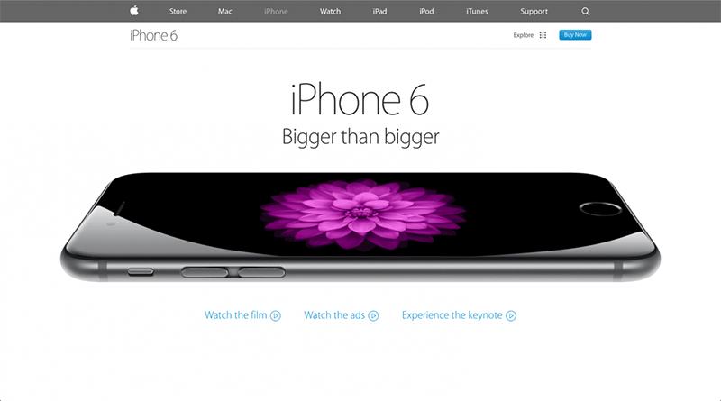
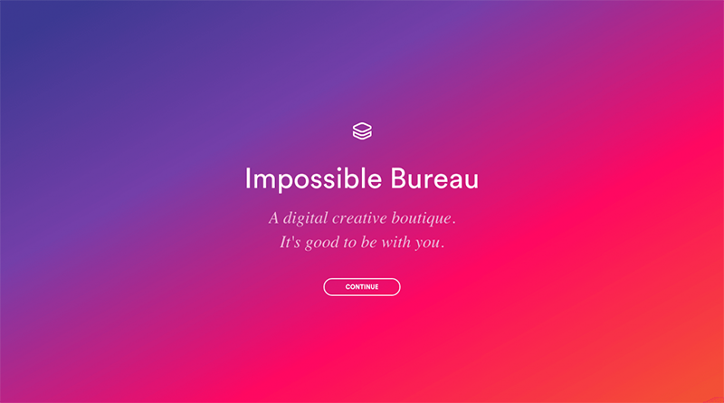
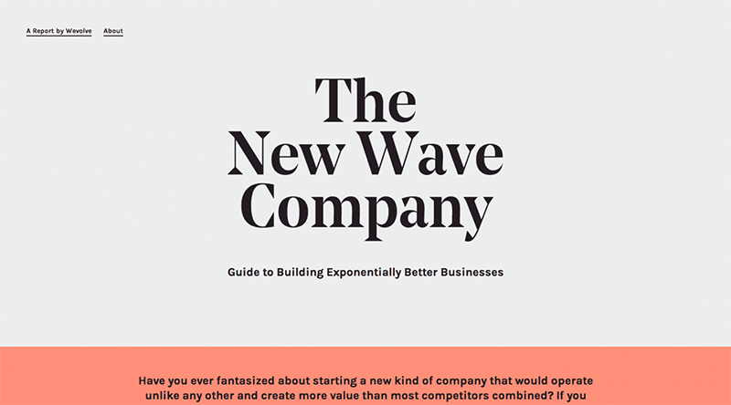
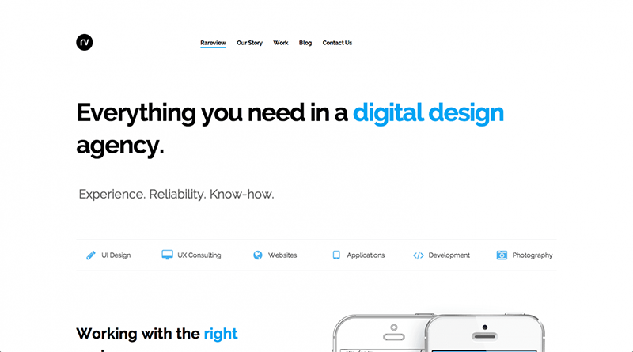
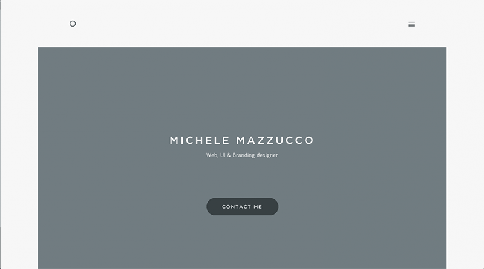
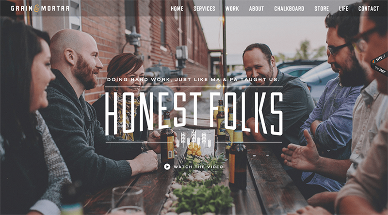
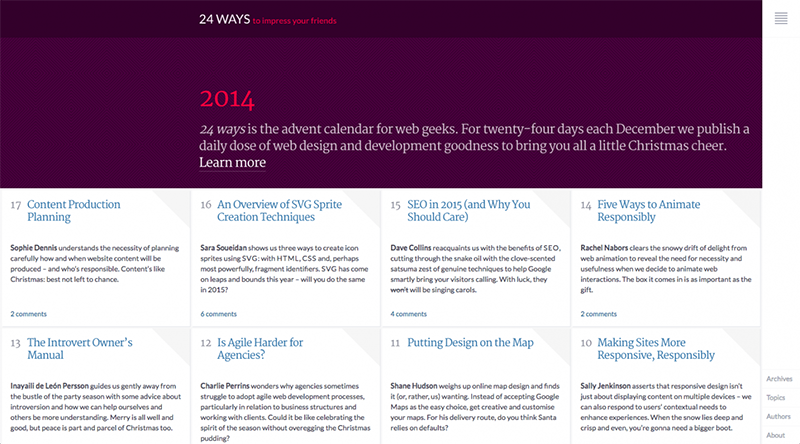
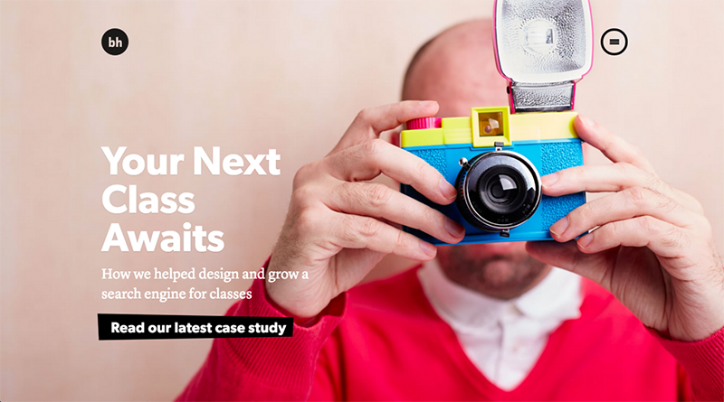
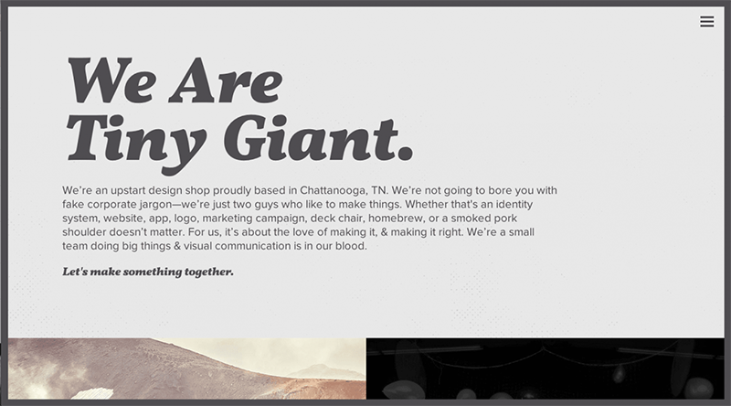

Основатель студии January Creative Эмбер Тернер подготовила для издания The Next Web список из 10 элементов веб-дизайна, которые получат широкое распространение в 2015 году.<!--more-->

## **1\. Лонгриды**

Страницы с «длинным» вертикальным скролом по-прежнему останутся популярными в 2015 году. По мнению Тернер, скрол удобнее поиска разделов в меню и требует меньше действий при потреблении контента.

В 2015 году «длинными» станут не только домашние страницы, но и разделы «О компании», каталог продукции и другое. Пример — обновленный сайт [Apple](http://www.apple.com/iphone-6/).

# **2\. Сторителлинг и интерактивность**

В 2015 году интерфейсы сайтов сосредоточатся на контенте. Сервисы все чаще будут использовать подачу информации через рассказ с интерактивными элементами.

Например, сайт [Space Needle](http://www.spaceneedle.com/) — компания рассказывала о своей деятельности с помощью лонгрида с различными интерактивными элементами.

# **3\. Отказ от больших изображений в шапке сайта

**

Большая фотография с крупным текстом на ней — этот тренд в оформлении шапки сайта популярен уже несколько лет. Однако в 2015 году, по мнению автора The Next Web, его сменит более минималистичное решение. Дизайнеры просто уберут картинку и оставят только текст.Пример — сайт [The New Wave Company](http://newwavecompany.co/). 

# **4\. Упрощение**

 

Минимализм продолжит развитие в 2015 году — дизайнеры откажутся от лишних элементов в интерфейсах, избавятся от сеток, большого количества  фотографий, слоёв.

# **5\. Фиксированная ширина сайтов**

Раньше сайты имели фиксированную ширину и располагались по центру. Им на смену пришли «растягивающиеся» сайты, в которых контент подстраивается под ширину браузера.

Тенденция по созданию сайтов на всю ширину экрана возвращается, но в обновленном формате, пишет Тернер.

Например, сайт [Michele Mazzucco](http://michelemazzucco.it/) зафиксировал максимальную ширину страницы в 1350 пикселей. Однако при просмотре на более широком экране контент ресурса растягивается, но имеет визуальные отступы по краям.

# **6\. Профессиональные фотографии**

 

Другой тренд — фотографии для сайта, сделанные профессиональными фотографами. Такие снимки, сделанные специально для конкретного сервиса, придают сайту уникальность, считает автор The Next Web. Пример — [grainandmortar.com](http://grainandmortar.com/).

# **7\. Меню как в приложениях**

Адаптивная верстка, ставшая популярной в последние годы, означала создание сайтов прежде всего для веб, с поправкой на то, чтобы они корректно отображаются и на мобильных устройствах.

Тренд получит развитие в 2015 году. Дизайнеры начнут адаптировать сайты для одинакового отображения и в мобильной, и в веб-версии — без потери функциональности. Это приведет к созданию универсальных элементов интерфейса — за основу возьмут решения из приложений, предполагает Тернер.  Примеры — [24ways](http://24ways.org/), [Rawnet](http://www.rawnet.com/).

# **8\. Спрятанное меню**

 

Еще одно развитие минимализма — прятать основное меню за иконкой «гамбургер». Пример — [Brian Hoff Design](http://brianhoffdesign.com/).

# **9\. Гигантские шрифты**

В 2015 году шрифты в интернете станут еще больше, считает издание. Пример — [Tiny Giant](http://madebytinygiant.com/).

# **10\. Скорость**

 

Увеличение скорости загрузки сайтов — еще один тренд, на который будут опираться дизайнеры в следующем году. Минимализм интерфейсов, упрощение, отказ от лишних иллюстраций, приведут к уменьшению размера страниц, считает автор The Next Web.

Статья взята из [siliconrus.com](http://siliconrus.com/2015/01/design-trends-2015/?_utl_t=fb) Оригинал [thenextweb.com](http://thenextweb.com/dd/2015/01/02/10-web-design-trends-can-expect-see-2015/)
