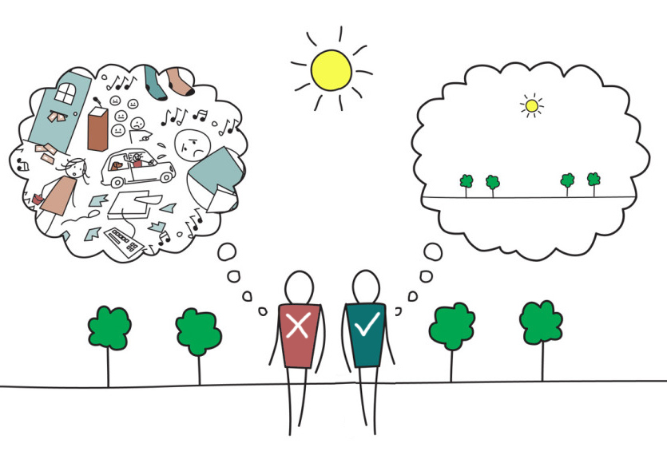
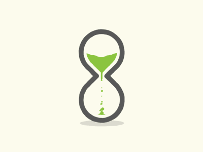
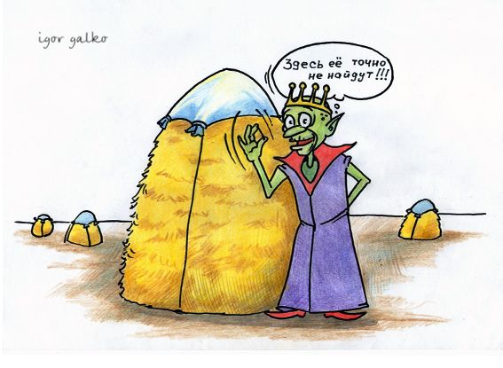
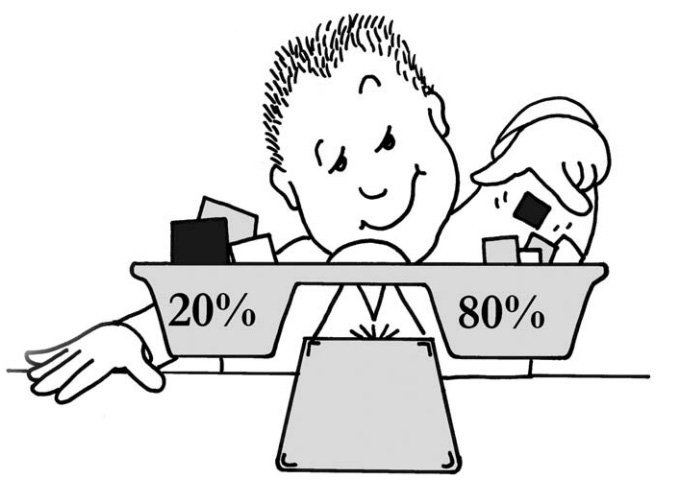
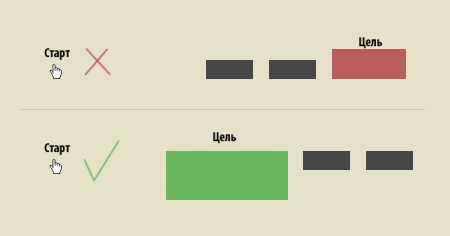
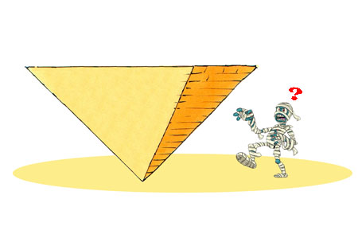

Мы собрали самые основные и ключевые правила юзабилити в интерфейсе. Применимые как к веб-ресурсам так и к приложениям. <!--more-->

## Правило 7±2

Возможности мозга по обработке информации не безграничны, в соответствии с результатами исследования Джорджа Миллера кратковременная память может одновременно содержать от 5 до 9 сущностей. Этот факт часто используется при обосновании необходимости сократить количество элементов в навигационных меню (и структуры экрана) до примерно 7 логических елементов.

## Правило 2-х секунд

Заключается в том, что пользователь не должен ждать любой реакции системы, к примеру, запуска или переключения приложения, более 2-х секунд.

## Правило 3-х кликов

Пользователь не будет в восторге от использования сайта, если он не может найти необходимую ему информацию за три клика мышкой. Другими словами это правило подчеркивает важность понятной и простой навигации. Во многих случаях важно не столько количество необходимых кликов, сколько общая понятность системы, даже 10 кликов не проблема, если на каждом этапе пользователь четко представляет, где он и куда должен двигаться дальше.

## Правило 80/20 (Принцип Парето)

Заключается в том, что 80% эффекта получается в результате 20% действий. В бизнесе это правило часто применяется в виде: «80% продаж приходится на 20% клиентов». В веб-дизайне и юзабилити это правило работает не менее эффективно. К примеру, значительно улучшить отдачу сайта можно определив 20% пользователей, заказчиков, действий, продуктов или процессов которые дают 80% прибыли и обратив на них особое внимание при разработке.

## Правило Фиттса

Опубликованная Паулем Фиттсом в 1954 году модель движений человека, определяет время, необходимое для быстрого перемещения в целевую зону как функцию от расстояния до цели и размера цели.

В юзабилити это стоит понимать так: Элементы, которые больше всего используются нужно делать больше и размещать ближе друг к другу. Например, при оформлении меню, кнопки нужно делать большими, а расстояние между ними нужно делать меньше. Или, к примеру, кнопка «заказать» должна быть большой и размещаться непосредственно возле контента. Правило Фиттса используется для сокращения времени работы пользователя на сайте.

 

## Перевернутая пирамида

Перевернутая пирамида — это стиль написания, при котором основная мысль представлена в начале статьи. Статья начинается с вывода, за которым следуют ключевые моменты, а завершается наименее важной информацией. Пользователи хотят получать информацию как можно быстрее, поэтому перевернутая пирамида как нельзя лучше подходит для любого потребителя.

В юзабилити это стоит понимать так: Пользователь, попав на Ваш сайт или приложение, сразу должен понимать зачему он сюда пришел, что он тут может делать и как он это может тут делать, а только потом все остальное.

## Удовлетворенность

Зачастую пользователи не выбирают оптимальный путь в поисках необходимой информации. Им не нужно самое лучшее и надежное решение, напротив — часто они готовы удовлетвориться быстрым и не самым лучшим решением, которое будет «вполне приемлемым». Применительно к веб, удовлетворенность описывается именно этим случаем: пользовать получил «вполне приемлемое» решение проблемы — даже если альтернативные решения полнее покрывают его требования на длительный срок.
