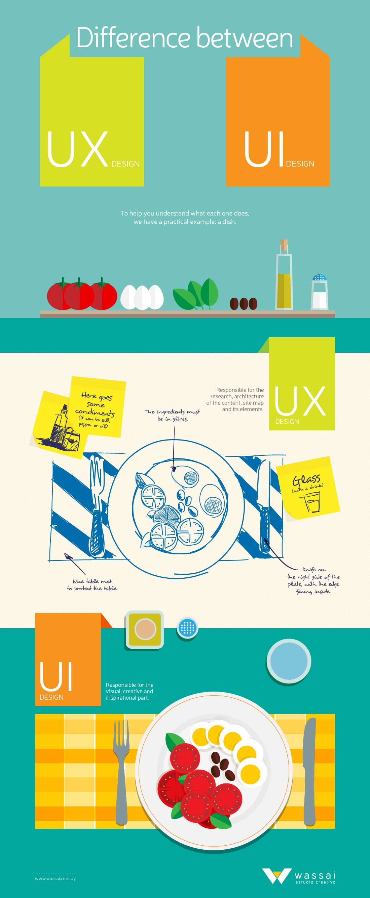

UI и UX дизайн очень востребован и обсуждаем сейчас в интернете. Но какая разница между ними? Если кто не знает, мы поробуем ответить очень коротко и понятно на этот вопрос.<!--more-->

UI (User Interface) это то, что видит пользователь, а UX (User Experience) это то, что он подумает и как себя будет вести.

Ниже более наглядная инфографика.

Источник [wassai.com.uy](http://wassai.com.uy/en/understanding-the-difference-between-ui-and-ux-design/)
