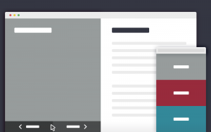

На создание шаблона о котором будем говорить вдохновил гайд [dropbox.com/guide](dropbox.com/guide), который выполнен в стиле «раскола миров» :)

Сегодняшний самородок является простым шаблоном похожим, на удивление, на руководство по Dropbox. На устройствах с большим разрешением, содержание делится на два основных контейнера. Когда пользователь переходит по страницам, новый контент перекрывает старый. На мобильных устройствах простая галерея проектов со слайд панелью содержащей дополнительную информацию по проекту.<!--more-->

[Демо](http://codyhouse.co/demo/2-blocks-template/index.html) [Cкачать](http://18.185.47.240/wp-content/uploads/2015/07/2-blocks-template.zip)

## 

## Создаем структуру

HTML структура состоит из двух списков, один (.cd-images-list) содержит изображения проекта ( выставлены как background-image для .cd-images-list > li), второй же содержит описание проекта, оба обернуты в два разных <div>. В добавок (ul.block-navigation) используется для создания навигации по проектам.

```
<div class="cd-image-block">
	<ul class="cd-images-list">
		<li class="is-selected">
			<a href="#0">
				<h2>2 Blocks Template</h2>
			</a>
		</li>
 
		<li>
			<a href="#0">
				<h2>Project Two</h2>
			</a>
		</li>
 
		<!-- other list items here -->
	</ul> 
</div> <!-- .cd-image-block -->
 
<div class="cd-content-block">
	<ul>
		<li class="is-selected">
			<div>
				<h2>Lorem ipsum dolor sit amet, consectetur adipisicing elit. Facere, illo!</h2>
				
				<!-- additional content here -->
			</div> 
		</li>
 
		<li>
			<div>
				<h2>Lorem ipsum dolor sit amet, consectetur.</h2>
				
				<!-- additional content here -->
			</div> 
		</li>
 
		<!-- other list items here -->
	</ul>
 
	<button class="cd-close">Close</button>
</div> <!-- .cd-content-block -->
 
<ul class="block-navigation">
	<li><button class="cd-prev inactive">&larr; Prev</button></li>
	<li><button class="cd-next">Next &rarr;</button></li>
</ul> <!-- .block-navigation -->
```

##  Добавляем стили

В мобильной версии, элемент .cd-content-block (содержит описание проекта) и он зафиксирован за областью просмотра (справа) что значит, что только видно изображение. Когда пользователь сделает тап/клик по одному из проектов, cd-content-block попадет в область просмотра (используя класс .is-visible), в то время как класс .is-selected присваивается элементу списка, содержащего информацию о выбранном проекте.

```
.cd-content-block {
  /* move the block outside the viewport (to the right) - mobile only */
  position: fixed;
  z-index: 1;
  top: 0;
  left: 0;
  transform: translateX(100%);
  transition: transform 0.3s;
}
.cd-content-block.is-visible {
  transform: translateX(0);
}
.cd-content-block > ul > li {
  position: absolute;
  height: 100%;
  overflow-y: scroll;
  opacity: 0;
  visibility: hidden;
}
.cd-content-block > ul > li.is-selected {
  /* this is the selected content */
  position: relative;
  opacity: 1;
  visibility: visible;
}
```

 Для устройств с разрешением экрана более 768px, оба .cd-image-block (контейнер изображения) и .cd-content-block (контейнер с описанием) имеют ширину: 50%, и высоту: 100%, а также overflow: hidden (для того что бы нельзя было про скролить на дочерние элементы).

 По умолчанию, оба .cd-image-block > ul > li и .cd-content-block > ul > li прижаты к правому краю  (translateX(100%)), таким образом, дочерние блоки не видны из-за родительских блоков.

 Когда выбрана одна из страниц, два соответствующих списка (один для изображения другой для описания) возвращается (с помощью класса .is-selected ) что делает их видимыми.

```
@media only screen and (min-width: 768px) {
  .cd-image-block,
  .cd-content-block {
    /* slider style - desktop version only */
    width: 50%;
    float: left;
    height: 100vh;
    overflow: hidden;
  }
  .cd-image-block > ul,
  .cd-content-block > ul {
    position: relative;
    height: 100%;
  }
  .cd-image-block > ul > li,
  .cd-content-block > ul > li {
    position: absolute;
    top: 0;
    left: 0;
    height: 100%;
    width: 100%;
    /* by default, the items are moved to the right - relative to their parent elements */
    transform: translateX(100%);
    transition: transform 0.5s;
  }
  .cd-image-block > ul > li.is-selected,
  .cd-content-block > ul > li.is-selected {
    /* this is the visible item */
    position: absolute;
    transform: translateX(0);
  }
  .cd-image-block > ul > li.move-left,
  .cd-content-block > ul > li.move-left {
    /* this is the item hidden on the left */
    transform: translateX(-100%);
  }
}
```

##  Обработка событий

Мы использовали jQuery для реализации навигации (предыдущей / следующей (клавиатура)) и для обнаружения событий клика по .cd-images-list > li > a (в мобильной версии), чтобы открыть слайд в панель.

Функция updateBlock() была определена для обновления видимого контента, и срабатывает как на мобильном так и в обычном варианте.

```
function updateBlock(n, device) { //n is the index of the selected project 
	var imageItem = imagesList.eq(n), //imageList contains the .cd-images-list > li elements
		contentItem = contentList.eq(n); //contentList contains the .cd-content-block > ul > li elements
	
	//this function assigns the is-selected class to the 2 selected list items, removing it from their siblings
	classUpdate($([imageItem, contentItem])); 
	
	if( device == 'mobile') {
		//on mobile version
		contentItem.scrollTop(0);
		//add a cover layer to the images
		$('.cd-image-block').addClass('content-block-is-visible');
		//move the slide-in panel back into the viewport
		contentWrapper.addClass('is-visible');
	} else {
		//hide scrolling bar while changing project content
		contentList.addClass('overflow-hidden');
		contentItem.one('webkitTransitionEnd otransitionend oTransitionEnd msTransitionEnd transitionend', function(){
			//wait for the end of the animation
			contentItem.siblings().scrollTop(0);
			contentList.removeClass('overflow-hidden');
		});
	}
 
	//this function updates the visibility of the .block-navigation buttons according to visible project
	updateBlockNavigation(n);
}
```

Спасибо за уделенное вами время за прочтение этого небольшого гайда. Сказать спасибо или поделиться своими мыслями всегда можно в комментариях :)

[Демо](http://codyhouse.co/demo/2-blocks-template/index.html) [Cкачать](http://18.185.47.240/wp-content/uploads/2015/07/2-blocks-template.zip)


