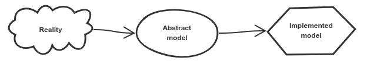
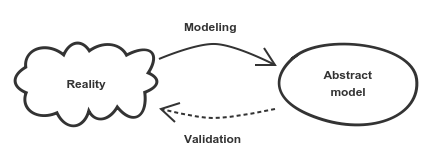
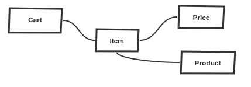

Все мы моделируем каждый день. Друг расказывает нам анекдот и мы представляем себе ситуацию, и если мы моделируем ее так, как нужно, мы находим ситуацию забавной. Клиент хочет иметь новую функциональность, и пока он говорит, мы пытаемся представить, чего хочет клиент - мы моделируем.

Мы собираемся взглянуть на то, что такое программное моделирование, как мы можем выразить модель и как мы можем запечатлеть ключевые понятия.

## Моделирование

Моделирование - это процесс, целью которого является захват ключевых концепций реальности и игнорирование нерелевантных деталей.

Реальность содержит все важное, все детали, все, что мы знаем, и многое другое, что скрыто. Мы не можем описать всю реальность и описывать ее, это не наша цель.

Мы можем рассказывать истории, которые охватывают важные концепции реальности. Мы можем конвертировать истории в прецеденты. Мы можем выразить абстрактные модели с диаграммами и изображениями - они прекрасно объясняют нашу абстрактную модель.

## Валидация

Когда у нас есть абстрактная модель в голове, она также описывается документацией и диаграммами, и мы должны ее проверить. Проверка выполняется экспертами домена, которые должны подтвердить или опровергнуть абстрактную модель.

 

Валидация обычно является непрерывным процессом. По мере того, как мы углубляем наши знания в области, когда мы моделируем и рисуем диаграммы, эксперты сразу же проверяют и корректируют абстрактную модель.

## Как получить правильную/точную информацию?

**Зачем? -** является самым важным вопросом. Мы должны задать даже самые простые вопросы. Задача состоит в том, чтобы очистить условия, требования, потребности и помочь нам избежать скрытых предположений.

**Что это? Для кого это?** - Мы хотим знать нашу целевую группу.

**Каковы требования к производительности? -** очень большая разница, если часть программного обеспечения используется один раз в час или тысячи раз в секунду. Высокопроизводительные требования могут привести к модели с множеством компромиссов.

Задавать правильные вопросы важно, чтобы получить правильную информацию, чтобы мы могли правильно моделировать. Задавать правильные вопросы также является самой сложной частью моделирования.

**Пример:**

Не имеет смысла объяснять моделирование на Foo, Bar и т. Д., Проект, основанный на домене, касается домена. Итак, давайте поговорим о корзине интернет магазина.

_\- В нашем интернет-магазине нам нужна корзина. Знаешь, ну, корзина, которая есть везде._

Хорошо, это хорошее начало, но можем ли мы объяснить, что такое корзина пятилетнему ребенку?

_\- Корзина ... это коробка, в которую вы помещаете продукты, например куклу-барби, которую хотите купить. Иногда вы также можете удалить любой предмет, который вы больше не хотите покупать, потому что вы нашли что-то лучше. Корзина не закрыта, вы всегда можете смотреть на предметы, которые у вас есть. Но, в отличие от реального мира, корзина электронного магазина всегда может сказать вам, сколько стоит все вместе._

Мы ведем разговор в реальном мире, задаем вопросы и строим умственную, абстрактную модель. В статье разговор был бы очень неудобным, поэтому мы просто притворимся, что это произошло.

### Use Cases и ограничения

- Добавить продукт в корзину.
- Удалить продукт из корзины.
- Показать корзину.
- Рассчитать общую стоимость корзины.
- Изменить количество продукта.
- Когда товар находится в корзине, его цена фиксирована.

### Ключевые идеи

Давайте определим понятия, обязанности и отношения.

Вся история о корзине, безусловно, является отправной точкой. Корзина - это коробка, в которой хранятся предметы. Мы можем видеть термин продукт во всех случаях использования, это то, что клиенты добавляют в корзину. Но в этой истории мы не исследуем, что такое продукт, мы предполагаем, что продукт уже существует в системе. Мы следим за корзиной.

Как только мы добавляем продукт в корзину, происходят более интересные вещи. Мы начинаем называть продукт предметом; товар - продукт в корзине. Продукт имеет свою цену в корзине, и цена фиксируется после добавления продукта в корзину. Нам нужна информация о ценах. Поскольку товар является товаром в корзине, фиксированная цена связана с товаром.

Вот наша абстрактная модель.

 

Мы всегда начинаем с неизвестной реальности и с неструктурированной историей. Мы должны открыть ключевые понятия, их отношения и игнорировать нерелевантную информацию и детали. Как только у нас есть абстрактная модель в голове, мы можем указать ее в виде диаграмм и историй, которые используют язык. Модель должна постоянно проверяться экспертом по домену, чтобы мы следили за правильным ходом.

В следующий раз мы собираемся сформировать абстрактную модель в модель реализации.
