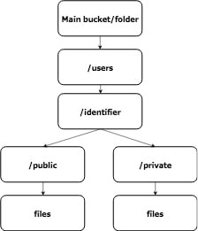

В одном из моих проектов возник вопрос: "Как позволить пользователям приложения читать/загружать публичные и личные файлы?"



Нет никаких проблем реализовать подход (**пользователь -> веб-сервер/(приложение) -> хранилище** (S3) ) - где приложение будет обрабатывать нужные права, но это трата пропускной способности, которой хотелось бы избежать. Было решено использовать подход ( **пользователь -> хранилище** (S3) ) и при увеличении количества пользователей нам не нужно будет беспокоиться о пропускной способности (веб-сервера). Последний, из двух, подход - позволить пользователям на прямую загружать файлы в хранилище. А єто, в свою очередь, означает что для чтения/записи файлов, мы должны понимать, имеет ли пользователь права прямо на сервисе **[AWS S3](https://aws.amazon.com/s3)**, для этого нам понадобиться **[AWS Cognito](https://aws.amazon.com/cognito/)**.

## Cognito

Мы используем Cognito для создания уникальных сущностей наших пользователей в серде AWS для дальнейшего доступа к S3. Используя [Идентификационные данные разработчика](http://docs.aws.amazon.com/cognito/latest/developerguide/developer-authenticated-identities.html) мы можем аутентифицировать пользователя нашего приложения с помощью уникального идентификатора и получить токены с которыми мы будем ходить в S3.

Первый фрагмент кода, возвращает сущность текущего пользователя (в AWS) для текущего идентификатора пользователя

```
def getCognitoIdentityAndToken(identifier):
    try:
        response = cognitoClient.get_open_id_token_for_developer_identity(
        IdentityPoolId=MAIN_COGNITO_POOL,
        Logins={
            COGNITO_PROVIDER_NAME: identifier
        },
        TokenDuration=TOKEN_EXPIRY
        )
        #response contains cognito identity for given identifier and a session token
        return response
    except botocore.exceptions.ClientError as err:
        print err
        return False
    except botocore.exceptions.EndpointConnectionError as err:
        print   err
        return False
```

Второй пример кода, используем на стороне клиента для получения учетных данных AWS из идентификатора и токена сеанса.

```
function setCredentials(cogId,token){
    AWS.config.region = AWS_REGION;
    AWS.config.credentials = new AWS.CognitoIdentityCredentials({
       IdentityPoolId: MAIN_COGNITO_POOL,
       IdentityId: cogId,
       Logins: {
          COGNITO_PROVIDER_NAME: token // provider name = cognito-identity.amazonaws.com for developer federated identities
       }
    });
  }
```

После даных "манипуляций", получилось отдать учетные данные клиенту (браузер в моем случае). Теперь нужно описать политики использования хранилища S3, что бы предоставить доступ к папке пользователя. Есть два возможных подхода к написанию нужных полити.

1. Использовать политики на уровне роли Cognito
2. Политики на уровне S3 Bucket.

Первый подход не масштабируеться, и в принципе, более сложный, так как есть ограничение в 10240 символов. Так что взял второй.

## Bucket Policy

На момент написания функционала, было хорошей идеей использовать уникальный идентификатор в пути к папке что значительно упростило написание политики.

```
{
    "Version": "2012-10-17",
    "Id": "Policy1487688853521",
    "Statement": [
       {
            "Sid": "Stmt1492075309356",
            "Effect": "Allow",
            "Principal": "*",
            "Action": [
                "s3:DeleteObject",
                "s3:GetObject",
                "s3:PutObject"
            ],
            "Resource": "arn:aws:s3:::BUCKET_NAME/users/${cognito-identity.amazonaws.com:sub}/*"
        },
        {
            "Sid": "Stmt1487688849187",
            "Effect": "Allow",
            "Principal": "*",
            "Action": "s3:GetObject",
            "Resource": "arn:aws:s3:::BUCKET_NAME/users/*/public/*"
        }
    ]
}
```

Первая политика, в секции (Statement), позволяет пользователю получить доступ к своей папке. ${cognito-identity.amazonaws.com:sub} - позволяет иметь доступ для сущеностей Cognito в bucket s3. Вторая политика позволяет читать/писать в папки s3 всем пользователям.

## В место заключения

- "Ничего нет более постоянного, чем временное"

- Через какое-то время полностью перевели систему аутентификации и авторизации в Cognito.

Буду благодарен за любые комментарии :)
