RabbitMQ Management - это удобный интерфейс, который позволяет вам контролировать ваш сервер RabbitMQ через веб-браузер. Можно работать с очередями, соединениями, каналами, пользователями и разрешениями пользователей. Вы можете контролировать скорость обработки сообщений и отправлять / получать сообщения вручную. В этой статье представлена информация о различных представлениях, которые вы можете найти в RabbitMQ Management.

<!--more-->

Материалы в серии:

- [Что такое RabbitMQ?](http://thewebland.net/development/devops/what-is-rabbitmq/)
- [Примеры кода](http://thewebland.net/development/devops/part-2-rabbitmq-primery-koda/)
    - [Node.js](http://thewebland.net/development/devops/rabbitmq-node-js/)
    - [Python](http://thewebland.net/development/devops/chast-2-2-rabbitmq-primery-koda-python/)
- **Интерфейс администратора**
- [Exchanges, ключи роутинга и биндинги](http://thewebland.net/development/devops/rabbitmq/exchanges-routing-kyes-and-bindingi/)

RabbitMQ Management - это плагин, который можно включить для RabbitMQ. Он дает одну

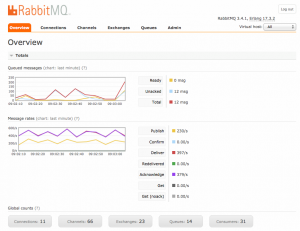

статическую HTML-страницу, которая делает фоновые запросы API HTTP для RabbitMQ. Информация из интерфейса управления может быть полезна, когда вы отлаживаете свои приложения или когда вам нужен обзор всей системы. Если вы видите, что количество незакрепленных сообщений начинает увеличиваться, это может означать, что ваши консьюмеры становятся медленными. Если вам нужно проверить, работает ли обмен, вы можете попробовать отправить тестовое сообщение.

Если у вас установлен RabbitMQ на локальном хосте, перейдите по адресу [http://localhost:15672/](http://localhost:15672/), чтобы найти страницу управления.

## Концепция

В предыдущем посте [RabbitMQ для начинающих. Что такое RabbitMQ?](http://thewebland.net/development/devops/what-is-rabbitmq/), в примерах был использован виртуальный хост, пользователь и права по умолчанию.

- **Пользователи**: Пользователи могут быть добавлены из интерфейса управления, и каждому пользователю могут быть назначены права, такие как права на чтение, запись и настройку привилегий. Пользователям также могут быть назначены права для конкретных виртуальных хостов.
- **Vhost**, **виртуальный хост**: виртуальные хосты обеспечивают способ разделения приложений с использованием одного и того же экземпляра RabbitMQ. Различные пользователи могут иметь разные права доступа к различным vhost и очередям.
- **Кластер**: кластер состоит из набора подключенных компьютеров, которые работают вместе. Если экземпляр RabbitMQ состоит из нескольких узлов - он называется кластером **RabbitMQ**. Кластер представляет собой группу узлов, то есть группу компьютеров.
- **Узел**: узел представляет собой единый компьютер кластера RabbitMQ.

### Обзор (OVERVIEW)

В OVERVIEW показаны две диаграммы: одна - сообщений в очереди и одна с частотой сообщений. Вы можете изменить временной интервал, показанный на графике, нажав текст (график: последняя минута) над диаграммами. Информацию обо всех различных статусах сообщений можно найти, нажав (?).

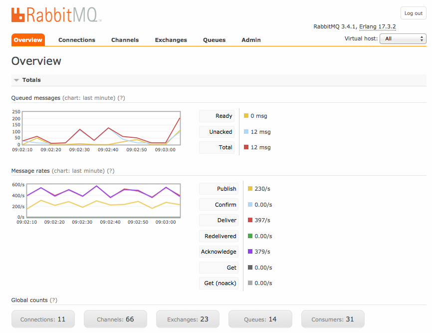

**Очередь сообщений (Queued messages)**

Диаграмма общего количества сообщений в очереди для всех ваших очередей. Покажет количество сообщений, которые могут быть доставлены. Unacked - количество сообщений, для которых сервер ожидает подтверждения.

**Скорость сообщений (Message rates)**

Диаграмма со скоростью обработки сообщений.

**Глобальный граф**

Общее количество подключений, каналов, обменов, очередей и потребителей для ВСЕХ виртуальных хостов, к которым имеет доступ текущий пользователь.

**Узлы (Nodes)**

Узлы показывают информацию о различных узлах кластера RabbitMQ (кластер представляет собой группу узлов, то есть группу компьютеров) или информацию об одном узле, если используется только один узел. Здесь можно найти информацию о памяти сервера, количестве процессов erlang на узел и другой информации, относящейся к узлу. Информация показывает, i.e дополнительную информацию об узле и включенных плагинах.

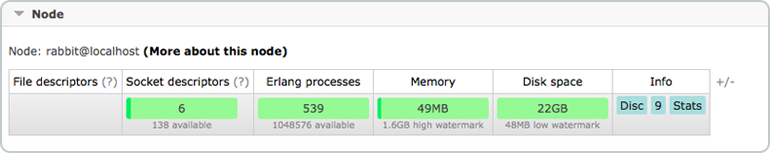

**Порт и контексты (Port and contexts)**

Прослушивание портов для разных протоколов можно найти здесь. Более подробная информация о протоколах будет найдена в более поздней части RabbitMQ для начинающих.

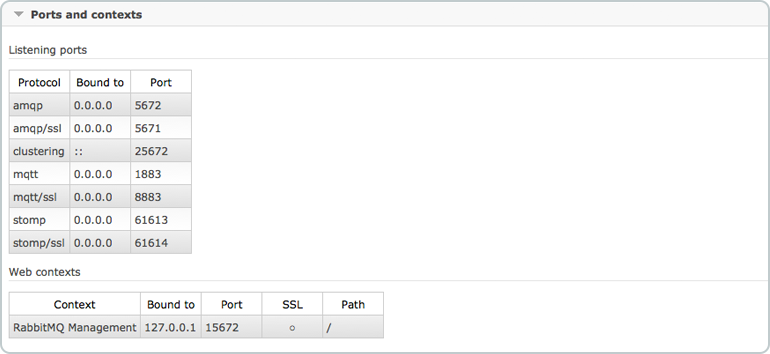

Импорт/экспорт определений (Import export definitions)

Можно импортировать и экспортировать конфигурации. Когда вы загружаете определения, вы получаете JSON-представление своего брокера (ваши настройки RabbitMQ). Это можно использовать для восстановления обменов, очередей, виртуальных хостов, политик и пользователей. Эта функция может использоваться как резервная копия. Каждый раз, когда вы вносите изменения в конфигурацию, вы можете сохранить старые настройки на всякий случай.

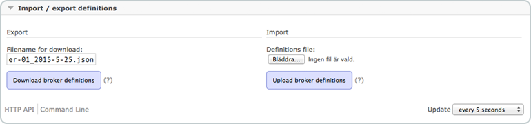

### СОЕДИНЕНИЯ И КАНАЛЫ (CONNECTIONS AND CHANNELS)

Соединение - это TCP-соединение между вашим приложением и брокером RabbitMQ. Канал - это виртуальное соединение внутри соединения.

Соединения и каналы RabbitMQ могут находиться в разных состояниях; запуск, настройка, открытие, запуск, поток, блокировка, блокировка, закрытие, закрытие. Если соединение входит в управление потоком, это часто означает, что клиент каким-то образом ограничивается скоростью; Хорошую статью для чтения, когда это происходит, можно найти здесь.

#### Cоединения (Connections)

На вкладке «Соединение» показаны соединения, установленные на сервере RabbitMQ. vhost показывает, в каком режиме работает соединение vhost, имя пользователя, связанное с соединением. Каналы сообщают количество каналов, использующих соединение. SSL / TLS указывает, защищено ли соединение с помощью SSL.

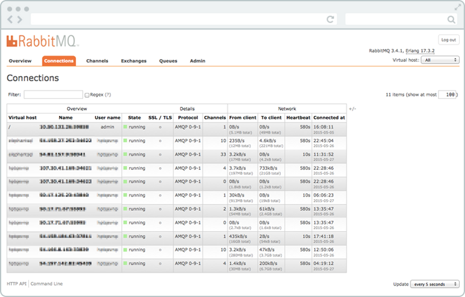

Если вы нажмете на одно из соединений, вы получите обзор этого конкретного соединения. Вы можете просматривать каналы в соединении и скорости передачи данных. Вы можете увидеть свойства клиента, и вы можете закрыть соединение.

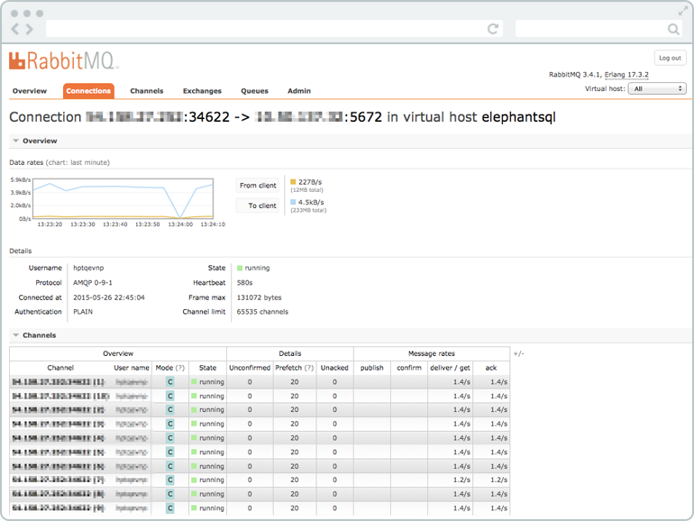

#### Каналы (Channels)

На вкладке канала отображается информация обо всех текущих каналах. Vhost показывает, в каком режиме работает канал vhost, имя пользователя, связанное с каналом. Режим говорит о режиме гарантии канала. Он может быть в режиме подтверждения или транзакции. Когда канал находится в режиме подтверждения, как сообщения брокера, так и сообщения клиента. Затем брокер подтверждает сообщения, когда он их обрабатывает. Режим подтверждения активируется, как только метод confirm.select используется на канале.

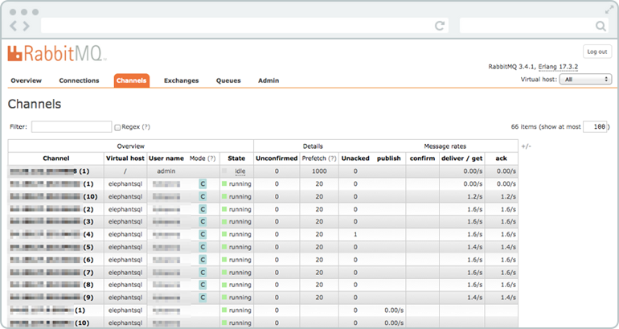

Если вы нажмете на один из каналов, вы получите подробный обзор этого конкретного канала. Отсюда вы можете увидеть скорость сообщения о количестве логических потребителей, получающих сообщения через канал.

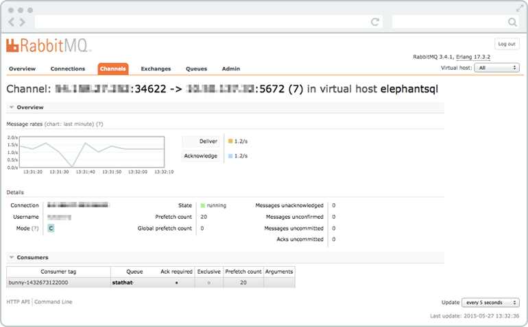

#### Exchanges

Обмен получает сообщения от производителей и подталкивает их к очередям. Обмен должен точно знать, что делать с сообщением, которое он получает. Все обмены могут быть перечислены на вкладке обмена. Виртуальный хост показывает vhost для обмена, тип - это тип обмена, такой как direct, topic, headers, fanout. Функции показывают параметры обмена (например, D stand for durable и AD для автоматического удаления). Функции и типы могут быть указаны при создании обмена. В этом списке есть некоторые обмены amq. \* И по умолчанию (неназванный) обмен. Они создаются по умолчанию.

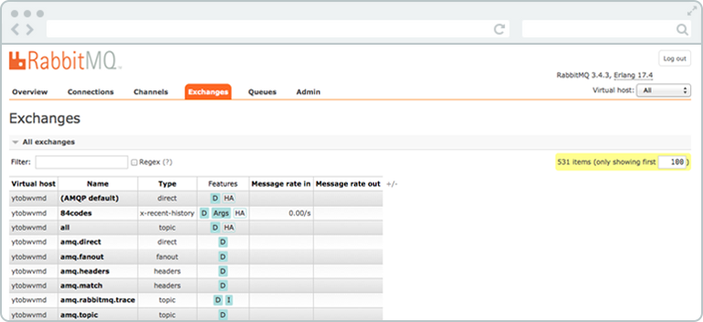

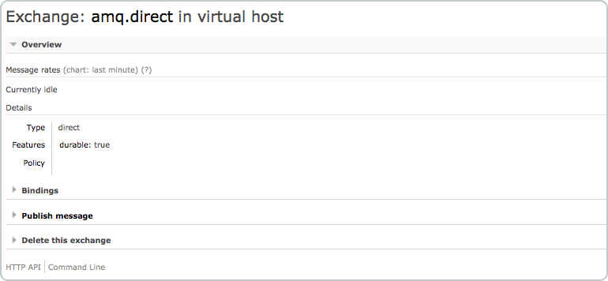

#### Очереди (Queues)

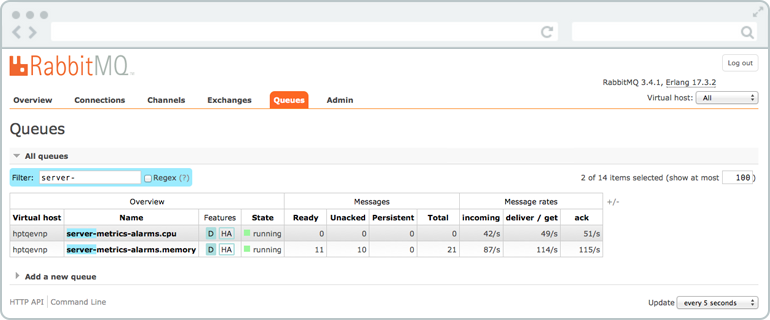

Очереди имеют разные параметры и аргументы в зависимости от того, как они были созданы. В столбце Feature отображаются параметры, принадлежащие очереди. Это могут быть функции, такие как Durable queue (которые гарантируют, что RabbitMQ никогда не потеряет очередь), Message TTL (который сообщает, как долго сообщение, опубликованное в очереди, может жить до того, как оно будет отброшено), Auto expire (который сообщает, как долго может стоять очередь до тех пор, пока он не будет автоматически удален), максимальная длина (которая сообщает, сколько (готовых) сообщений может содержать очередь, прежде чем она начнет их отбрасывать) и максимальные байты длины (которые сообщают общий размер тела для готовых сообщений, которые могут содержать очередь прежде чем он начнет их отбрасывать).

Вы также можете создать очередь из этого представления.

Если вы нажмете какую-либо выбранную очередь из списка очередей, вся информация о очереди будет показана, как на приведенных ниже рисунках.

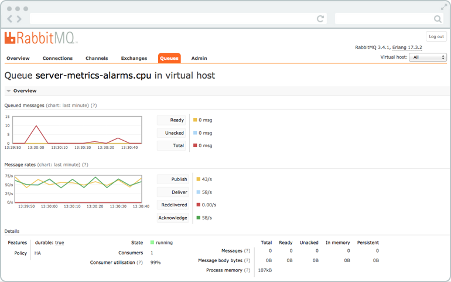

#### Consumers

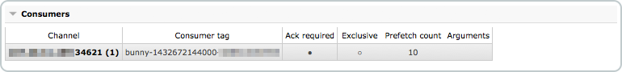

#### Bindings

Связывание может быть создано между обменом и очередью. Все активные привязки к очереди отображаются под привязками. Вы также можете создать новое связывание с очередью или отвязать очередь из обмена.

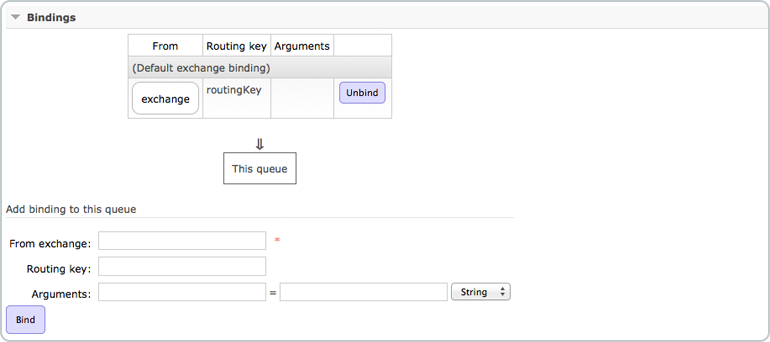

#### Опубликовать сообщение

Можно вручную опубликовать сообщение в очереди из «publish message». Сообщение будет опубликовано к обмену по умолчанию с именем очереди в качестве заданного ключа маршрутизации - это означает, что сообщение будет отправлено в очередь. Также можно опубликовать сообщение для обмена из вида обмена.

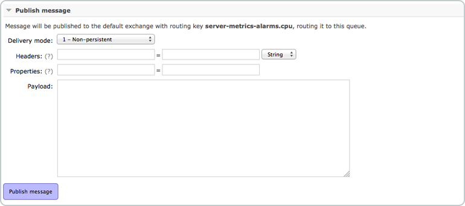

#### Получить сообщение

Можно вручную проверить сообщение в очереди. «Get message» получите сообщение, и если вы отметите его как «запрос», RabbitMQ вернет его в очередь в том же порядке.

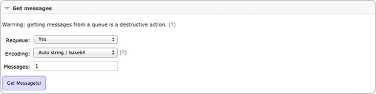

#### Удалить или очистить очередь

Очередь может быть удалена кнопкой удаления, и вы можете очистить очередь, нажав кнопку очистки.

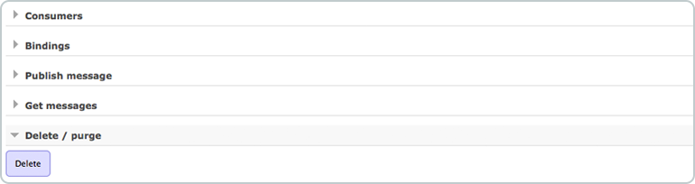

### Администратор (Admin)

В «Администратор» можно добавлять пользователей и изменять права пользователей. Вы можете настроить vhosts, политики..

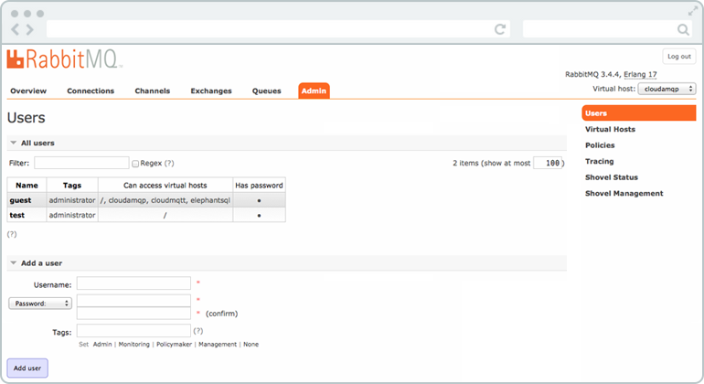 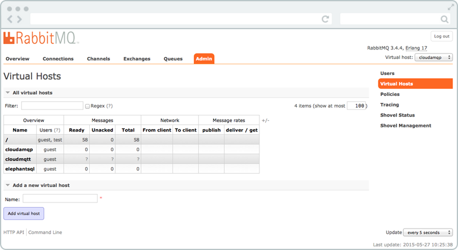
