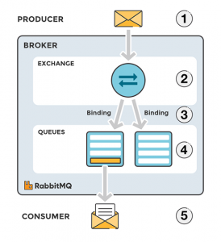
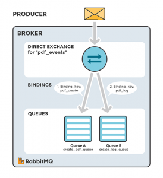
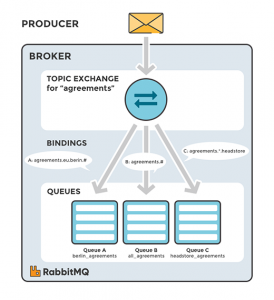
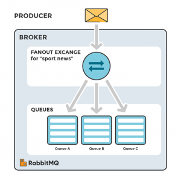
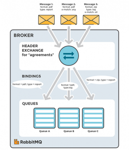

Что такое обмен (exchanges), биндинг и ключ маршрутизации? Как обмены и очереди связаны друг с другом? Когда следует использовать их и как? В этой статье объясняются различные типы обменов в RabbitMQ и сценарии того, как вы можете их использовать.

<!--more-->

Материалы в серии:

- [Что такое RabbitMQ?](http://thewebland.net/development/devops/what-is-rabbitmq/)
- [Примеры кода](http://thewebland.net/development/devops/part-2-rabbitmq-primery-koda/)
    - [Node.js](http://thewebland.net/development/devops/rabbitmq-node-js/)
    - [Python](http://thewebland.net/development/devops/chast-2-2-rabbitmq-primery-koda-python/)
- [Интерфейс администратора](http://thewebland.net/development/devops/chast-3-interfejs-upravleniya-rabbitmq/)
- **Exchanges, ключи роутинга и биндинги**

Сообщения не публикуются непосредственно в очередь, вместо этого паблишер отправляет сообщения на exchange. Exchange - агенты маршрутизации сообщений, определенные для виртуального хоста RabbitMQ. Exchange отвечает за маршрутизацию сообщений в разные очереди. Exchange принимает сообщения от приложения-publisher и направляет их в очереди сообщений с помощью атрибутов заголовка, биндинга и ключей маршрутизации.**Связывание (биндинг)** - это «ссылка», которую настраивают для привязки очереди к exchange.

**Ключ маршрутизации** - это атрибут сообщения (может не использоваться), используется обменником (exchange) для маршрутизации (выбора очереди(ей)) сообщений.

- используется при связывании очереди с обменником
- содержится в атрибуте сообщения при совпадении этих ключей сообщение будет отправлено в очередь

Обмен сообщениями, соединениями и очередями можно настроить такими параметрами, как длительность, время и автоматическое удаление при создании. Длительные обмены сохранят перезагрузку сервера и продлится до тех пор, пока они не будут явно удалены. Временные обмены существуют до тех пор, пока RabbitMQ не будет закрыт.

В RabbitMQ существует четыре разных типа обмена (exchange), которые маршрутизируют сообщение по-разному, используя разные параметры и настройки биндинга. Клиенты могут создавать свои собственные обмены или использовать предопределенные exchange по умолчанию, создаются, когда сервер запускается в первый раз.

## Стандартный поток сообщений RabbitMQ

1. Publisher публикует сообщение в exchange.
2. Exchange получает сообщение и теперь отвечает за маршрутизацию сообщения.
3. Необходимо установить привязку(биндинг) между очередью и обменом. В этом лучае у нас есть привязки к двум различным очередям из обмена. Обмен направляет сообщение в очереди.
4. Сообщения остаются в очереди до тех пор, пока они не будут обработаны клиентами (consumer)
5. Клиент обрабатывает сообщение.

## Типы Exchange

### Прямой обмен (Direct Exchange)

Прямой обмен отправляет сообщения в очереди на основе ключа маршрутизации сообщений. **Ключ маршрутизации** - это атрибут сообщения, добавленный в заголовок сообщения паблишера. Ключ маршрутизации можно рассматривать как «адрес», который использует exchange, чтобы решить, как маршрутизировать сообщение. Сообщение отправляется в очередь (очереди), чей ключ точно соответствует ключу маршрутизации сообщения.

Тип прямого обмена полезен, когда вы хотите отличать сообщения, опубликованные тем же обменом, используя простой строковый идентификатор.

Брокеры по обмену AMQP по умолчанию должны обеспечивать прямой обмен «amq.direct».

Представьте себе, что очередь A (create\_pdf\_queue) на изображении ниже (диаграмма прямого обмена) привязана к прямому exchange (pdf\_events) с ключом привязки pdf\_create. Когда новое сообщение с ключом маршрутизации pdf\_create поступает на прямой exchange, exchange направляет его в очередь, где binding\_key = routing\_key, в случае очереди A (create\_pdf\_queue).

\[caption id="attachment\_2250" align="alignright" width="355"\] Прямой обмен. Рисунок: сообщение отправляется в очереди, чей ключ точно соответствует ключу маршрутизации сообщения.\[/caption\]

**Сценарий 1**

- Exchange: pdf\_events
- Очередь A: create\_pdf\_queue
- Биндинг между exchange и очередью (pdf\_events) и Очередь A (create\_pdf\_queue): pdf\_create

**Сценарий 2**

- Exchange: pdf\_events
- Очередь B: pdf\_log\_queue
- Ключ (pdf\_events) и Очередь B (pdf\_log\_queue): pdf\_log

**Пример**

Пример: сообщение с ключом маршрутизации pdf\_log отправляется на обмен pdf\_events. Сообщения направляются в pdf\_log\_queue, потому что ключ маршрутизации (pdf\_log) соответствует ключу (pdf\_log).

Если ключ маршрутизации сообщения не соответствует ни одному ключу, сообщение будет отброшено.

### По умолчанию (Default Exchange)

Обмен по умолчанию - это предварительно объявленный прямой обмен без имени, определен пустой строкой «». Когда вы используете обмен по умолчанию, ваше сообщение будет доставлено в очередь с именем, равным ключу маршрутизации сообщения. Каждая очередь автоматически привязывается к обмену по умолчанию с ключом маршрутизации, который совпадает с именем очереди.

### Тема (Topic exchange)

Topic Exchange  отправляет сообщение в очередь основываясь на совпадение подстановки знаков между ключом маршрутизации и так называемым шаблоном маршрутизации, указанным привязкой (биндингом) очереди. Сообщения направляются в одну или несколько очередей на основе соответствия между ключом маршрутизации сообщения и этим шаблоном.

Ключ маршрутизации должен быть списком слов, ограниченным периодом (.), Примеры - _agreements.us_ и agreement.eu.stockholm, который в этом случае определяет agreements, которые настроены для компании с офисами в самых разных местах. Шаблоны маршрутизации могут содержать звездочку («\*») для соответствия словам в определенной позиции ключа маршрутизации (например, шаблон маршрутизации "agreements.\*.\*.b.\*" будет соответствовать только ключам маршрутизации, где первое слово «agreements», а четвертое слово - «b»). Символ («#») указывает на совпадение с ноль или более слов (например, шаблон маршрутизации «agreements.eu.berlin.#» Соответствует любым ключам маршрутизации, начинающимся с «agreements.eu.berlin»).

Консьюмеры указывают на то, какие темы им интересны (например, подписка на канал для отдельного тега). Consumer создает очередь и устанавливает привязку с заданным шаблоном маршрутизации к обмену. Все сообщения с ключом маршрутизации, которые соответствуют шаблону маршрутизации, будут перенаправляться в очередь и оставаться там до тех пор, пока не будут прочитаны все сообщения.

Брокеры обмена по умолчанию AMQP должны обеспечить обмен темой «amq.topic».

**Сценарий 1**

\[caption id="attachment\_2251" align="alignright" width="312"\] Тема Exchange: сообщения направляются в одну или несколько очередей на основе соответствия между ключом маршрутизации сообщения и шаблоном маршрутизации.\[/caption\]

На изображени справа показан пример, когда потребитель A заинтересован во всех agreements в Берлине.

- Exchange: agreements
- Очередь A: berlin\_agreements
- Шаблон роутинка между exchange (agreements) и Queue A (berlin\_agreements): agreements.eu.berlin.#
- Ключ маршрутизации будет соответствовать: agreements.eu.berlin и agreements.eu.berlin.headstore

**Сценарий 2** 

Консьюмера B интересуют  all\_agreements.

- Exchange: agreements
- Очередь B: all\_agreements
- Паттерн роутинга между обменом (agreements) и очередью B (all\_agreements): agreements.#
- Ключ маршрутизации будет соответствовать: agreements.eu.berlin и agreements.us

**Сценарий 3** 

Потребитель C заинтересован во всех соглашениях для европейских head магазинов.

- Exchange: agreements
- Очередь C: headstore\_agreements
- Паттерн роутинга между exchange (agreements) и Очередью C (headstore\_agreements): agreements.eu.\*.headstore
- Ключ маршрутизации будет соответствовать: agreements.eu.berlin.headstore и agreements.eu.stockholm.headstore

**Пример**

Сообщение с ключом маршрутизации agreement.eu.berlin отправляется в обмен _agreements_. Сообщения направляются в очередь _berlin\_agreements_, потому что шаблон маршрутизации "agreements.eu.berlin.#" соответствует любым ключам маршрутизации, начинающимся с «agreements.eu.berlin». Сообщение также направляется в очередь all\_agreements, потому что ключ маршрутизации (agreement.eu.berlin) соответствует шаблону маршрутизации (agreement.#).

### Ветвление (Fanout Exchange)

Fanout копирует и отправляет полученное сообщение во все очереди, привязанные к нему, независимо от того, какие ключи маршрутизации или шаблоны определены, как с прямыми так и направленными обменами. Предоставленные ключи будут просто проигнорированы.

Обмены Fanout может быть полезен, когда одно и то же сообщение необходимо отправить в одну или несколько очередей, с консьюмерами, которые могут обрабатывать одно и то же сообщение по-разному.

Изображение справа (Fanout Exchange Figure) показывает пример, когда сообщение, полученное обменом, копируется и направляется во все три очереди, привязанные к обмену. Это могут быть спортивные новости или новости о погоде, которые должны быть отправлены на каждое подключенное мобильное устройство, когда что-то произойдет.

Должен быть выставлен флаг «amq.fanout» в конфигурации брокера.

**Сценарий:**

- Exchange: sport\_news
- Очередь A: Мобильный клиент
- Binding: Связывание между роутером (sport\_news) и Очередью A (Mobile client A)

**Пример:**

Сообщение отправляется в sport\_news. Сообщение направляется ко всем очередям (очередь A, очередь B, очередь C), поскольку все очереди привязаны к обмену. При условии, что ключи маршрутизации игнорируются.

### Заголовки (Headers Exchange)

Роутинг Headers exchange базируеться на аргументах которые содержаться в хедерах и опциональных значениях. Headers exchange очень похож на Topic exchange, но он маршрутизируется на основе значений заголовков вместо ключей маршрутизации. Сообщение считается совпавшим, если значение заголовка равно значению, указанному при привязке.

Специальный аргумент с именем «x-match» указывает - должны ли совпадать все заголовки или только один. Свойство «x-match» может иметь два разных значения: «any» или «all», где «all» является значением по умолчанию. Значение «all» означает, что все пары заголовков (ключ, значение) должны совпадать, а значение «any» означает, что по крайней мере одна из пар заголовков должна совпадать. Заголовки могут быть построены с использованием более широкого диапазона типов данных - целых или хеш, например, вместо строки. Тип Headers exchange (используемый с «any») полезен для направления сообщений, которые могут содержать подмножество известных (неупорядоченных) критериев.

Должен быть выставлен флаг «amq.headers».

- Exchange: Привязка к Очереди A с аргументами (key = value): format = pdf, type = report
- Exchange: Привязка к Очереди B с аргументами (key = value): format = pdf, type = log
- Exchange: Привязка к Очереди C с аргументами (key = value): format = zip, type = report

**Сценарий 1**

Сообщение один публикуеться в роутер с аргументами заголовка (key = value): "format = pdf", "type = report" и "x-match = all"

Сообщение 1 доставляеться в Очередь A - все key/value пары совпали

**Сценарий 2**

Сообщение 2 публикуеться в роутер с аргументами заголовка (key = value): "format = pdf" и "x-match = any"

Сообщение 2  попадает в  Очередь A и Queue B - очередь настроена на соответствие любому из заголовков (формат или журнал).

**Сценарий 3**

Сообщение 3 публикуеться в роутер с аргументами заголовка (key = value):"format = zip", "type = log" и "x-match = all"

Сообщение 3 не попадает ни в одну из очередей - очередь настроена на соответствие всем заголовкам (формат или журнал).

### Dead Letter Exchange

Если для сообщения не найдено подходящей очереди, сообщение будет тихо удалено. RabbitMQ предоставляет расширение AMQP, известное как «Dead Letter Exchange» - Dead Letter Exchange предоставляет функции для захвата сообщений, которые не могут быть доставлены.
