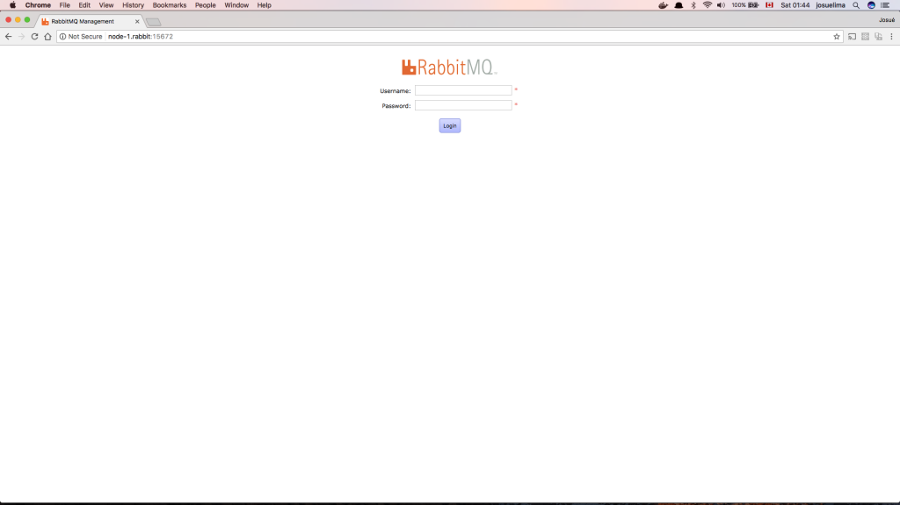
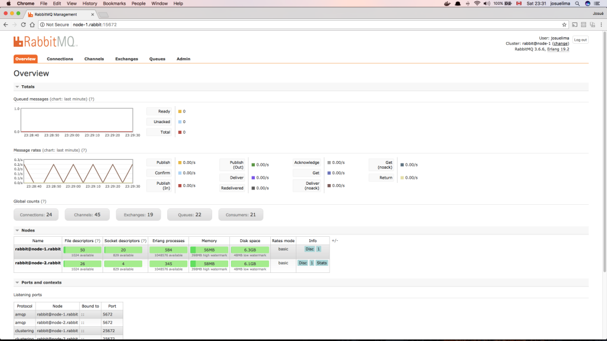

Туториал по настройке кластера [RabbitMQ](https://www.rabbitmq.com) в [Docker](https://www.docker.com).

Я предполагаю, что:

- Вы знакомы как с Docker, так и с RabbitMQ. - нет? пройдите по материалам по RabbitMQ - Начать можна с [Что такое RabbitMQ?](http://thewebland.net/development/devops/what-is-rabbitmq/)
- Узлы будут работать в системах UNIX.
- У нашего кластера будет два узла, поэтому вам понадобятся серверы.
- Серверы отвечают на полное доменное имя. (Я буду использовать node-1.rabbit и node-2.rabbit)

<!--more-->

## Подготовим окружение

Когда вы работаете с Docker, и у вас есть данные, которые вы не хотите потерять, вам нужно будет вынести их из контейнера, это хорошая практика, чтобы не допустить их потерю. RabbitMQ хранит все данные в /var/lib/rabbitmq внутри вашего контейнера, поэтому рекомендуется смотировать локальную папку вашего хоста на этот путь.Если ваш контейнер переходит в несогласованное состояние, вы можете просто повторно создать контейнер и смотритовать туда ту же папку данных. Или, если вам нужно сделать резервную копию данных или переместиться в другое место, просто закройте эту папку.

На этом этапе все, что вам нужно сделать, это создать папку, которая вскоре будет маунтиться в контейнеры RabbitMQ. Для продакшн серверов, я обычно создаю папку в корне системы. Вы вольны выбрать все, что хотите, но если вы работаете на macOS, у вас появятся [ограничения](https://docs.docker.com/storage/volumes/).

Итак, создайте каталог на обоих серверах (например: mkdir /data)

## Запуск RabbitMQ в docker контейнерах

Теперь пришло время для Докера! Сначала запустим наш основной узел RabbitMQ:

```
docker run -d -h node-1.rabbit                                      \
           --name rabbit                                            \
           -p "4369:4369"                                           \
           -p "5672:5672"                                           \
           -p "15672:15672"                                         \
           -p "25672:25672"                                         \
           -p "35197:35197"                                         \
           -e "RABBITMQ_USE_LONGNAME=true"                          \
           -e "RABBITMQ_LOGS=/var/log/rabbitmq/rabbit.log"          \
           -v /data:/var/lib/rabbitmq \
           -v /data/logs:/var/log/rabbitmq \
           rabbitmq:3.6.6-management
```

Если вы знакомы с Докером, вы, вероятно, знаете, что здесь происходит.

- В первой строке мы определяем имя хоста контейнера, которое будет использоваться для идентификации узла.
- Во второй строке мы определяем имя контейнера.
- В строках 3-7 мы сопоставляем порты контейнера с хостом. Таким образом, мы можем получить доступ к контейнеру через node-.rabbit:PORT. Для получения дополнительной информации о портах RabbitMQ [тут](https://www.rabbitmq.com/clustering.html#firewall).
- После этого мы определяем некоторые переменные среды, которые будут использоваться для конфигурации RabbitMQ. В нашем случае устанавливаем только два, RABBITMQ\_USE\_LONGNAME = true, чтобы каждый узел связывался друг с другом, используя свое полное доменное имя. Мы также устанавливаем RABBITMQ\_LOGS, поэтому весь вывод идет в файл журнала вместо STDOUT (что может быть проблемой на production).
- На 10-й и 11-й строках мы маунтим каталоги, которые создали для узла-1, в контейнер rabbit.
- Наконец, укажем, какой образ докера мы будем использовать. В этом случае RabbitMQ с плагином управления.

Откройте браузер и перейдите по адресу http://node-1.rabbit:15672. Вы должны увидеть что-то вроде:



Если проверить каталог данных, которій мы создали, вы увидите, что RabbitMQ создал для вас папку журнала, и у уже должны быть некоторые данные.

Сделаем тоже для второго хоста. Не забудьте изменить имя хоста в команде запуска docker.

```
docker run -d -h node-2.rabbit                                      \
           --name rabbit                                            \
           -p "4369:4369"                                           \
           -p "5672:5672"                                           \
           -p "15672:15672"                                         \
           -p "25672:25672"                                         \
           -p "35197:35197"                                         \
           -e "RABBITMQ_USE_LONGNAME=true"                          \
           -e "RABBITMQ_LOGS=/var/log/rabbitmq/rabbit.log"          \
           -v /data:/var/lib/rabbitmq \
           -v /data/logs:/var/log/rabbitmq \
           rabbitmq:3.6.6-management
```

## Конфигурация RabbitMQ кластера

### Erlang Cookie

Каждый узел RabbitMQ должен иметь файл с именем `.erlang.cookie`, расположенный в папке данных, в нашем случае `/data`. Этот файл содержит секрет (какой-то случайный хеш), который будет автоматически создан, если он не существует. Этот файл используется для определения того, может ли узел связываться с другим узлом. Связь будет разрешена, если оба узла используют один и тот же секрет в файле`.erlang.cookie`.

Просто скопируйте секрет с  `.erlang.cookie`  первого узла и вставьте во второй. Затем перезапустите контейнер Docker для второго узла.

### RabbitMQ UI

Плагин rabbitmq-management - браузерный интерфейс для мониторинга и настройки множества функций RabbitMQ. Вы можете получить доступ к нему по адресу: http://node-1.rabbit:15672

[Ознакомиться с интерфейсом управления RabbitMQ?](http://thewebland.net/development/devops/chast-3-interfejs-upravleniya-rabbitmq/)

К сожалению, вы не можете настроить 100% своего кластера через интерфейс браузера, поэтому мы будем использовать только инструмент командной строки `rabbitmqctl`.

### Отключаем пользователя guest

_Этот шаг не является обязательным, но для прода нужно будет отключить чисто из соображений безопасности. RabbitMQ по умолчанию создаст гостевого пользователя (пароль: guest)._

С этого момента мы будем вызывать `rabbitmqctl`  в docker-контейнерах RackbitMQ.

Удаляем пользователя guest: `docker exec rabbit rabbitmqctl delete_user guest`

Вам просто нужно сделать это на первом узле. Как только мы создадим кластер и подключим к нему второй узел RabbitMQ, все конфигурации будут скопированы.

### RabbitMQ virtual host

В учебных целях предположим, что у нас есть только один виртуальный хост /. Вся конфигурация будет на этом хосте. Еще раз, вам просто нужно сделать это на первом узле.

Создадим виртуальный хост: `docker exec rabbit rabbitmqctl add_vhost /`

### Создаем пользователей

Я собираюсь создать двух пользователей. Один из них - пользователь-администратор, который может иметь доступ к пользовательскому интерфейсу браузера и вносить изменения в конфигурации кластера. Второй - пользователь уровня приложения, который будет иметь разрешения на взаимодействие с RabbitMQ на уровне приложения. Он будет иметь права на чтение / запись на виртуальный хост. Вы можете настроить его в соответствии с вашими потребностями.

```
# Admin user
docker exec rabbit rabbitmqctl add_user josuelima MyPassword999
docker exec rabbit rabbitmqctl set_user_tags josuelima administrator

# Application user
docker exec rabbit rabbitmqctl add_user ruby_app SuperPassword000
docker exec rabbit rabbitmqctl set_permissions -p / ruby_app ".*" ".*" ".*"
```

Еще раз, вам просто нужно сделать это на первом узле.

### Создаем кластер RabbitMQ

Теперь, когда наш первый узел настроен, присоединим наш второй узел к первому и запустим кластер. Все, что нам нужно, это остановить второй узел RabbitMQ (а не контейнер докера), а затем подключить его к первому узлу.

Перейдем ко второму узлу и сделаем это:

```
docker exec rabbit rabbitmqctl stop_app
docker exec rabbit rabbitmqctl join_cluster rabbit@node-1.rabbit
docker exec rabbit rabbitmqctl start_app
```

Прекрасно! Теперь второй узел скопирует все настройки с первого узла, и мы должны получить наш кластер. Вы можете проверить его в пользовательском интерфейсе или с помощью командной строки.

Если вы заходите в интерфейс браузера по адресу http://node-1.rabbit:15672 или http://node-2.rabbit:15672 и входите в систему как администратор, вы должны увидеть что-то вроде этого:



Или же запустить комманду: `docker exec rabbit rabbitmqctl cluster_status`

Теперь у вас есть кластер RabbitMQ, работающий в Docker. Если хотите добавить к нему больше узлов, просто создайте новый контейнер Docker  с RabbitMQ и подключите его к кластеру.

## Очереди

Теперь, когда у нас работает кластер, пришло время подумать о том, как мы хотим, чтобы он себя вел. По умолчанию очереди в кластере RabbitMQ расположены на одном узле (узел, на котором они были сначала объявлены). Очень важно это понимать.

Ваши очереди будут распределены между вашими узлами кластера? Какой сценарий хотите? Хорошая ли єто?

### Распределенные очереди

Правильное использование распределенных очередей - это когда у вас действительно высокие скорости ввода-вывода для ваших очередей и вы хотите распределить нагрузку по всем узлам. Имейте в виду, что очередь будет жить в одном единственном узле, и если один узел упадет, все очереди, живущие на этом узле, будут недоступны, пока не вернутся узел.

Если это сценарий, который вам нужен, вам подойдут распределенные очереди по умолчанию.

Я также рекомендую вам взглянуть на [HAProxy Load Balancer](http://www.haproxy.org), или если вы используете AWS на [AWS Elastic Load Balancing](https://aws.amazon.com/elasticloadbalancing/). Это действительно полезно в сценарии распределенных очередей, где у вас много узлов.

### Зеркальные очереди

Также могут быть зеркальные очереди, которые являются своего рода набором реплик. В этой ситуации все узлы будут просто копией друг друга. Все сообщения, опубликованные в очередь, реплицируются на все узлы кластера.

Это очень полезно, когда нужна высокая доступность очередей. Таким образом, если узел падает, у вас все еще есть очереди на других узлах.

Чтобы настроить зеркальные очереди, вам просто нужно установить политику для своих очередей.

```
docker exec rabbit rabbitmqctl set_policy ha "." '{"ha-mode":"all"}'
```

В этом примере мы устанавливаем политику с именем `ha` так что все очереди  `.`  будут доступны на всех узлах `{"ha-mode":"all"}`.

У вас могут быть различные конфигурации для высокодоступных очередей, проверьте [документацию](https://www.rabbitmq.com/ha.html).

## Заключение

Мы рассмотрели концепции создания кластера RabbitMQ в Docker контейнерах. Для улучшения реализации кластера можно использовать, например, RAM Nodes, Firewall Nodes, Partition, Synchronization и т. д. Ниже две важные ссылки:

[RabbitMQ Clustering Guide](https://www.rabbitmq.com/clustering.html)

[Highly Available (Mirrored) Queues](https://www.rabbitmq.com/ha.html)
