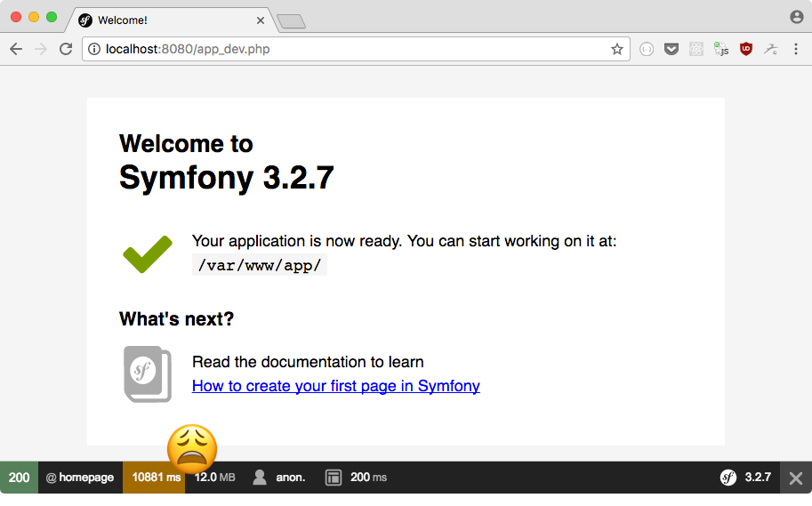

Docker - отличный инструмент для того что бы развернуть инфраструктуру вашего приложения где угодно. Как вы знаете, Docker имеет много преимуществ:

- Одна конфигурация для всех окружений
- Простота использования (добавление любого стека технологий в проект, всего несколько строк конфигурации).
- Производительнее чем виртуальная машина, по крайней мере, на Linux
- Простота развертывания окружения

Однако вы, вероятно, заметили, что приложения Symfony в Docker очень медленные, почти непригодные для использования. В этой статье мы расскажем о нескольких способах запуска Symfony в Docker.

Сначала мы создадим простой проект Symfony, чтобы оценить, как работают открытые решения. Если у вас уже есть проект Symfony, вы можете перейти непосредственно к решениям.

Тесты производительности были измерены на MacBook Pro 2015.

Первым шагом нам нужно [поднять Symfony в Docker](http://thewebland.net/development/devops/podnimaem-symfony-v-docker-kontejnere/)

После запуска видим следующее:



Итак ... все в порядке, кроме одного: приложение очень медленное в данный момент :(

Давайте проведем простой тест для prod и dev окружения:

```
ab -n 100 -r http://127.0.0.1:8080/
ab -n 100 -r http://127.0.0.1:8080/app_dev.php
```

**Результаты**:

- **Prod:** 17 секунд
- **Dev:** 129 секунд (ой!)

## Решение #1. Меняем путь к vendor

После нескольких тестов (показано здесь: [https://github.com/michaelperrin/docker-symfony-test](https://github.com/michaelperrin/docker-symfony-test)) оказалось, что узким местом, которое замедляет работу приложения, является совместное использование каталога vendor, в котором много файлов.

Одним из эффективных решений является перемещение каталога vendor в контейнере, тоесть, делаем его доступным только в контейнере, а не на хосте. Удивительно, что если сделать тоже для кеш-каталога мы не получем большой прирост, но это может быть второй шаг оптимизации производительности.

Для того что бы перенести vendor, отредактируйте файл _composer.json_ в папке приложения и добавьте параметр _config-dir_ в запись _config_:

```
{
    ...
    "config": {
        ...
        "vendor-dir": "/app-vendor"
    }
}
```

Отредактируйте файл _app / autoload.php_ в папке приложения и измените эту строку:

```
$loader = require __DIR__.'/../vendor/autoload.php';
```

на

```
$loader = require '/app-vendor/autoload.php';
```

Добавьте папку / app-vendor в качестве тома для контейнера php в файле docker-compose.yml:

```
services:  
  php:
    # ...
    volumes:
      # ...
      - /app-vendor
```

Убедитесь, что вы очистили папку кэша Symfony и снова установили зависимости композитора, выполнив следующую команду:

```
docker-compose run --rm composer install
```

**Результаты**:

- **Prod:** 2.8 секунды
- **Dev:** 16 секунд

Посмотрим, сможем ли мы сделать еще лучше без шеринга кеша в контейнер. Отредактируйте файл AppKernel.php,измените метод getCacheDir следующим образом:

```
class AppKernel  
{
    // ...
    public function getCacheDir()
    {
        return '/dev/shm/symfony_docker_test/cache/'.$this->environment;
    }
}
```

**Результаты тестов:**

- **Prod:** 1.2 секунд
- **Dev:** 5 секунд

Github [https://github.com/heilgar/docker-php](https://github.com/heilgar/docker-php)

Неплохо. Но будьте осторожны! vendor теперь скрыт в вашем контейнере и больше не будет отображаться на локальной машине. Вы не сможете отлаживать изменения в пакетах, и автозаполнение не будет доступно в вашей IDE. Мой совет? Сначала установите зависимости в стандартном каталоге, а затем снова измените файл composer.json, чтобы они были установлены в контейнере. Это обходное решение не так плохо, как кажется, если ваши зависимости не меняются часто.

Но для меня этот метод не совсем подходит, так как разработка проекта ведется в нескольких репозиториях и в основном они находятся в папке vendor.

## Решение #2. Docker sync

**Docker-sync** ([http://docker-sync.io/](http://docker-sync.io/)) - это инструмент, который использует **rsync** для синхронизации файлов томов между хостом и вашими контейнерами вместо использования Docker osxfs.

Установим docker-sync: sudo gem install docker-sync

Добавляем файл docker-sync.yml  в корень проекта:

```
version: '2'  
syncs:  
  app-sync:
    src: './app'
```

Копируем файл _docker-compose.yml_ в файл _docker-compose-dev.yml_ и добавляем строки в конец:

```
volumes:  
  app-sync:
    external: true
```

Используйте именованный том для кода вашего приложения, изменив:

```
services:  
  #...

  php:
    #...
    volumes:
      # ...
      - ./app:/var/www/app
```

на

```
services:  
  #...

  php:
    #...
    volumes:
      # ...
      - app-sync:/var/www/app
```

Добавим файл _Makefile_ в корень, который позволит легко запускать / останавливать команды независимо от того, в какой системе выполняется проект:

```
OS := $(shell uname)

start_dev:  
ifeq ($(OS),Darwin)  
    docker volume create --name=app-sync
    docker-compose -f docker-compose-dev.yml up -d
    docker-sync start
else  
    docker-compose up -d
endif

stop_dev:           ## Stop the Docker containers  
ifeq ($(OS),Darwin)  
    docker-compose stop
    docker-sync stop
else  
    docker-compose stop
endif
```

Теперь вы можете запустить свой проект, выполнив: make start\_dev

Команда запустит ваши контейнеры и демон docker-sync.

**Результаты тестов:**

- **Prod:** 0.6 секунд
- **Dev:** 1.2 секунд

Это прорыв! К сожалению, иногда я испытываю несколько проблем с синхронизацией, когда файлы не синхронизируются между хостом и контейнером, а также некоторые проблемы с правами пользователя на некоторых файлах (chmod 777 в помощь).

## Решение #3. Система кэширования Docker

Команда Docker знает о медлительности Docker для Mac (см. [здесь](https://github.com/docker/for-mac/issues/77) и [здесь](https://forums.docker.com/t/file-access-in-mounted-volumes-extremely-slow-cpu-bound/8076/178))

В последних версиях Docker (например, «Edge») появились новые способы монтирования томов.

Если вы загрузили Edge версию, просто добавте _:cached_ в файл docker-compose.yml в корне проекта:

```
services:  
  php:
    # ...
    volumes:
      - # ...
      - ./app:/var/www/app:cached
```

- **Prod:** 5.1 секунд
- **Dev:** 15.7 секунд

Неплохо, но не так эффективно, как другие решения. Однако этого может быть достаточно для некоторых проектов. На данный момент я не могу сказать, есть ли недостатки для этого решения, но возможно буду экспериментировать с ним и обновлю эту запись в будущем.

## Вместо заключения

|  | Dev benchmark | Prod benchmark | Pros | Cons |
| --- | --- | --- | --- | --- |
| Default | 129 секунд | 17 секунд | Просто | Не возможно использовать |
| Решение #1. Меняем путь к vendor | 5 секунд | 1.2 секунд | Быстро | Теряеться связь с vendor |
| Решение #2. Docker sync | 1.2 секунд | 0.6 секунд | Очень быстро | Использование 3rd-party tool |
| Решение #3. Система кэширования Docker | 15.7 секунд | 5.1 секунд | Простое решение | Медленно. Експерементальное решение. |
