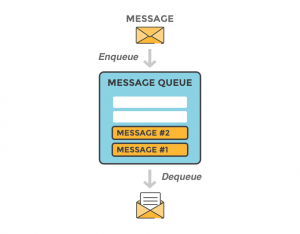
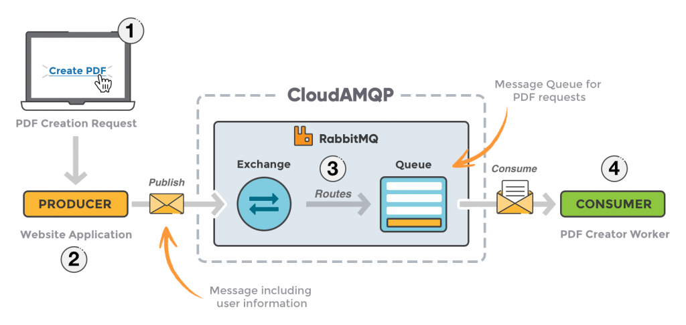
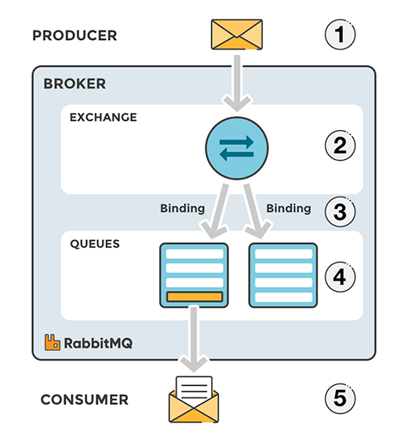
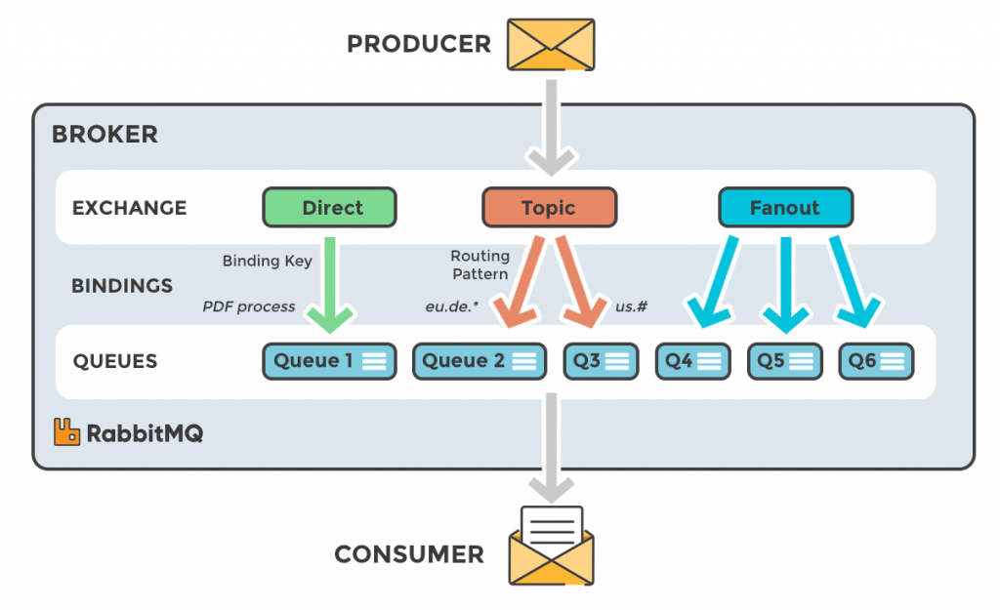

Это первая из четырех частей статья в которой мы рассмотрим что такое RabbitMQ и как с помощью менеджера очередей обмениваться данными между процессами, приложениями и серверами. Также рассмотрим основные концепции обмена сообщениями. Пройдем путь от настройки подключения и отправки/получения сообщений с очереди. <!--more-->

Материалы в серии:

- **Что такое RabbitMQ?**
- [Примеры кода](http://thewebland.net/development/devops/part-2-rabbitmq-primery-koda/)
    - [Node.js](http://thewebland.net/development/devops/rabbitmq-node-js/)
    - [Python](http://thewebland.net/development/devops/chast-2-2-rabbitmq-primery-koda-python/)
- [Интерфейс администратора](http://thewebland.net/development/devops/chast-3-interfejs-upravleniya-rabbitmq/)
- [Exchanges, ключи роутинга и биндинги](http://thewebland.net/development/devops/rabbitmq/exchanges-routing-kyes-and-bindingi/)

RabbitMQ - это приложение для работы с очередями сообщений \*(message-queueing)\*, еще его называют меседж брокер \*(message broker)\* или менеджер очередей \*(queue manager)\*. Простыми словами - это программное обеспечение в котором могут быть определены очереди к которому могут подключатся различные приложения и передавать/получать сообщения.

  Сообщение может включать в себя любую информацию. Для примера у нас есть информация о процессе/задаче которую должно начать другое приложение (или же другой сервер) или же это может быть простым текстовым сообщением. Менеджер очередей - приложение которое сохраняет сообщение до тех пор пока другое приложение (сервер), которому адресовано сообщение, не подключиться и не заберет (получит) сообщение из очереди. Затем проложение-получатель обработает сообщение нужным ему образом.

## RabbitMQ пример

RabbitMQ может выступать как прослойка между несколькими сервисами (приложениями, серверами). (В примере рассмотрим веб-приложение.) Может использоваться для уменьшения нагрузки и ускорение отклика веб-приложения, поскольку задачи которые обычно занимают довольно много времени, могут быть делегированы третьей стороне, единственной задачей которой является их выполнение. В этом примере RabbitMQ, мы рассмотрим сценарий когда веб приложение позволяет пользователям загружать информацию на сайт. Сайт будем обрабатывать эту информацию, генерировать PDF и отправлять обратно пользователю на электронную почту.

Обработка информации, генерация PDF и отправка email займет несколько секунд и это покажет вам как можно использовать очереди сообщений.

Когда пользователь введет информацию в веб интерфейс, приложение создаст задание на генерацию PDF и вся информация в сообщении и сообщение пользователя будут помещены в очередь определенную в RabbitMQ.

Базовая архитектура очереди сообщений довольно таки простая, клиентское приложение (Producer) создает сообщение и доставляет его в меседж брокер. Другое приложение (Consumer) получатель подключается к очереди и подписывается на сообщение которые должно обработать. Ваше приложение может быть как поставщиком сообщений, так и получателем или же и тем и другим одновременно. Сообщения размещенные в очереди сохраняются до тех пор пока получатель не получит их (простите за тавтологию).

###  Когда и почему использовать RabbitMQ

Очереди сообщений позволяют серверам получать/отправлять запросы быстрее вместо того что бы ожидать выполнения ресурсоемких процедур. Очередь сообщений также хорошо применима к задаче отправки сообщений набору получателей для снижения потребления памяти или балансировки нагрузки между воркерами. Возвращаясь к примеру выше получатель может взять сообщение из очереди и начать обрабатывать, например PDF в тоже время когда поставщик добавляет новые сообщения в очередь. Получателем может быть совершенно другой сервер нежели поставщик, или же они могут находиться на одном и том же. Запрос может быть создан на одном языке программирования и обработан другим - они "общаються" только через сообщения которые посылают один другому. Исходя из этого, приложения будут иметь низкую связь между отправителем и получателем.

1. Пользователь посылает запрос на создание PDF
2. Приложение (Producer) посылает сообщение в rabbitMq, включая в запрос информацию например имя и электронная почта.
3. Обработчик принимает сообщения от приложения поставщика и направляет его в нужную очередь сообщений.
4. Воркер обработки PDF (Consumer) получает задание - начать генерацию PDF.

**Обработчик (обменник) сообщений** Сообщения публикуются в очередь не на прямую, вместо этого, поставщик шлет сообщение обработчику который отвечает за перенаправление сообщения в нужную очередь с помощью биндинга ключей роутинга.

**Поток сообщений в RabbitMQ**

1. Поставщик публикует сообщение в обработчик. Когда создаем обработчик мы определяем его тип. (Более детально мы вернемся к этому вопросу позже)
2. Обработчик получает сообщение и отвечает за его перенаправление. Обработчик берет различные атрибуты, такие как, ключ роутинга, зависимость на тип обмена и другие.
3. Создается связь между обработчиком и очередью
4. Сообщение остается в очереди до тех пор пока не будет обработано получателем.
5. Получатель обрабатывает сообщение

**Типы обработчиков сообщений**

> Во второй части, данного "руководства", будет использоваться только тип direct. Более глубокое описание различных типов обработчиков сообщение, ключей связи, ключей маршрутизации и того что, как и когда использовать будет описано в Части 4 Обработка сообщений, ключи маршрутизации и привязки.

- **Direct**: Тип пересылает сообщение в нужную очередь базируясь на ключе маршрутизации.
- **Fanout**: Тип перенаправляет сообщения во все связанные очереди
- **Topic**: Делает соответствие между ключом маршрутизации и шаблоном маршрутизации указаных в привязке
- **Headers**: Использует атрибуты заголовка сообщения для маршрутизации

### 

### RabbitMq основные определения

Немного определений должны быть описаны до того как мы более глубоко погрузимся в rabbitmq.

- **Producer**: Приложение которое посылает сообщение
- **Consumer**: Приложение которое получает сообщение
- **Queue**: Буфер который хранит сообщения
- **Message**: Информация которая была отправлена от Producer k Consumer через rabbitmq
- **Connection**: TCP соединение между приложениями и менеджером очередей
- **Channel**: Виртуальное соединение внутри соединения. Когда вы публикуете или получаете сообщения через очередь - это все делается в канале.
- **Exchange**: Получает сообщение от поставщика и отправляет его в очередь. Зависит от типа.
- **Binding**: Связь между очередью и обработчиком сообщений
- **Routing key**: Ключ на который смотрит обработчик и решает в какую очередь перенаправить сообщение
- **AMQP**: Advanced Message Queuing Protocol - протокол используемый для обмена сообщениями в rabbitmq
- **Users**: Возможность подключится к брокеру сообщений с помощью имени пользователя и пароля. Каждый пользователь может иметь права доступа, такие как чтение, запись управление привилегиями. Пользователи так же могут иметь привилегии на определенный виртуальных хост.
- **Vhost, virtual host**: Способ разделения приложений используя один и тот же экземпляр RabbitMQ. У разных пользователей могут быть разные права доступа к различным виртуальным хостам и очередям, так же обработчики сообщений могут существовать только в одном.
