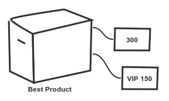
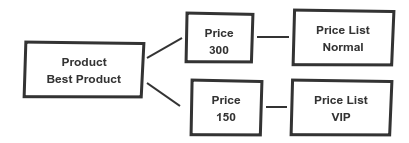

**Предметно-ориентированное проектирование (DDD)** - это дизайн программного обеспечения, который фокусируется на понимании бизнеса. Это полезно для долгосрочных проектов,  это приводит к высококачественному программному обеспечению, которое обслуживает пользователей, помогает при решении сложных проблем, отображает основные проблемы и мешает нам потеряться в коде.

<!--more-->

Перечень всех материалов по [DDD](http://thewebland.net/domain-driven-design/) - [http://thewebland.net/domain-driven-design/](http://thewebland.net/domain-driven-design/)

## Домен

Домен - это область, охватывающая проект, у нее есть своя терминология, требования, проблемы. Конкретный домен - это собственный маленький мир. Это может быть интернет магазин, спортивная статистика, управление контентом, ваш новый проект. У домена есть свои естественные границы, он не охватывает все.

### Язык домена

У каждого домена есть своя терминология, собственный язык. Термин в одном домене означает нечто совершенно другое в другом домене.

**Примеры:**

**Банковский счет** - позволяет нам отправлять и получать деньги и имеет уникальный номер. В любое время, когда мы говорим об учетной записи в банке, учетная запись всегда является банковским счетом. С другой стороны, учетная запись в информационной системе используется для авторизации пользователя. У нас есть термин «учетная запись», означающий нечто совершенно другое в двух разных областях. Домен влияет на то, что мы представляем, когда кто-то говорит конкретный термин. Поэтому нам нужно сначала изучить и определить термины домена.

**Цена -** Давайте поговорим о домене интернет-магазина. Что такое цена? Для нас, как клиентов, это то, сколько мы платим. Управляющий может думать о цене как о сумме, которую его компания платит поставщику. Для бухгалтера цена - это всего лишь номер. И теперь программист интернет магазина может запутатся.

Язык имеет решающее значение, поскольку клиенты и эксперты рассказывают свои истории на своем языке. Но это также естественный язык, неточный, двусмысленный, контекстно-зависимый. И, как мы видим, язык может быть сложным даже в пределах одного домена.

#### Общий язык домена

Чтобы уменьшить неопределенность на естественном языке, мы можем ввести точный язык.

Цена, которую мы продаем, всегда цена продажи? Используют ли пользователи часто скидочную цену вместо обычной? Отлично, возможно, эксперты согласны с тем, что мы используем только термин цена продажи, потому что он является окончательным. Когда мы обсуждаем с пользователями, мы всегда используем термин «цена продажи», пользовательский интерфейс сообщает цену продажи, мы находим цену продажи в документации. Что написано в коде - переменные, классы, методы? Цена продажи. Всегда.

Строгий термин стал частью повседневной жизни, общения между экспертами и программистами. Этот термин повсюду, он стал общим.

Язык объединяет пользователей, экспертов домена, программистов, поэтому он создает магистраль проекта. Возможно, неплохо документировать ключевые термины, особенно если у вас есть условия использования. Документация может помочь новым программистам, а также пользователям, войти в проект.

Будьте осторожны, с определением терминов языка, они окончательны, специфические термины должены всегда исходить от экспертов или пользователей домена, их рассказов и их разговоров. Мы не должны изобретать наши термины, наш язык. Никогда.

## Влияние на модель

**VIP Цена**

Продолжим говорить о интернет-магазине. Наш клиент хочет иметь более выгодные цены как постоянный покупатель, поэтому он продолжают покупать продукты. Клиент начинает называть эти цены VIP-тарифами, поскольку они предназначены только для VIP-клиентов.

Мы можем думать о прецеденте - нам нужна другая цена. Ну, что будет, когда он попросит еще одну цену? Мы снова должны переписать наше программное обеспечение. Что, если мы обобщим эту задачу? Мы можем предложить неограниченное количество цен, введя прайс-листы. Продукт может иметь цену в нескольких прайс-листах. Звучит неплохо, не так ли?

### Ментальная модель

Как клиент видит цену на продукт?

Как мы видим модель продукта?

Когда клиент рассказывает нам свои истории, мы должны сопоставить свой язык с нашим языком и нашей моделью. Когда он использует программное обеспечение, он должен сопоставить свою модель с языком в пользовательском интерфейсе.

А теперь представьте, что клиент хочет снизить цену VIP. Для него это прямолинейно - он хочет изменить номер, который называется ценой VIP. Что это для программиста? Мы должны найти прейскурант VIP, найти цену для данного продукта в прейскуранте и, наконец, изменить стоимость. Что произойдет, если прейскурант не будет найден? Если цена в прейскуранте не найдена? Теперь у нас есть варианты использования, которые не существуют в домене клиента. Клиент не может объяснить, что должно произойти, потому что для него это не имеет смысла.

Модель не подходит для использования пользователями, язык модели испорчен. Если мы будем изобретать наш язык, мы будем говорить с пользователями в терминах, которые они не понимают, и они будут использовать их язык в любом случае, потому что это их язык домена. Пользовательский интерфейс не будет связываться с ними на своем языке, и использование программного обеспечения вызовет разочарование.

Способом решения проблемы расхождения модели и языка является рефакторинг программного обеспечения, поэтому пользователь и программист будут использовать один и тот же язык.

## Эволюция домена

Домен может развиваться, ничто не является постоянным. Важно то, что язык развивается вместе с доменом, также как и программное обеспечение. Когда изменяется язык, ментальная модель изменяется, и программное обеспечение реорганизуется с новой моделью.

 

 

Блок архитектуры, основанной на домене, является языком. Язык соединяет людей в проекте, поэтому каждый может понять друг друга. Мы должны продолжать использовать язык, который поступает из домена, и никогда не изобретать наши собственные.

Так просто, но так мощно.

В следующий раз мы рассмотрим моделирование.
