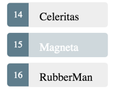

В этой статье мы поговорим о том как отобразить список при помощи angular, как выбрать элемент списка и просмотреть его детали.

<!--more-->

В конечном итоге мы будем получать их с удаленного сервера данных. Но пока создадим некий макет героев и притворимся, что они пришли с сервера.

Создайте файл mock-heroes.ts в папке src / app /. Определите константу HEROES как массив из десяти героев и экспортируйте ее. Файл должен выглядеть так.

```
import { Hero } from './hero';

export const HEROES: Hero[] = [
  { id: 11, name: 'Mr. Nice' },
  { id: 12, name: 'Narco' },
  { id: 13, name: 'Bombasto' },
  { id: 14, name: 'Celeritas' },
  { id: 15, name: 'Magneta' },
  { id: 16, name: 'RubberMan' },
  { id: 17, name: 'Dynama' },
  { id: 18, name: 'Dr IQ' },
  { id: 19, name: 'Magma' },
  { id: 20, name: 'Tornado' }
];
```

## Выводим список angular с нашими героями

Отрефакторим уже созданный компонен HeroesComponent:

```
import { HEROES } from '../mock-heroes';

```

Изменим свойство heroes

```
export class HeroesComponent implements OnInit {

  heroes = HEROES;
```

Выводить список мы будим с помощью \*ngFor

Откроем шаблон HeroesComponent и внесем некоторые изменения

- Добавим заголовок <h2>
- Под ним тег списка <ul>
- Далее внутри тега <ul> теги <li> в которых будут выводиться hero

```
<h2>My Heroes</h2>
<ul class="heroes">
  <li>
    <span class="badge">{{hero.id}}</span> {{hero.name}}
  </li>
</ul>
```

Теперь изменим наш тег <li>

```
<li *ngFor="let hero of heroes">
```

**\*ngFor** \- деректива повторения Angular. Он повторяет элемент хоста для каждого элемента в списке.

> Не забываем звездочку (\*) перед ngFor. Это критическая часть синтаксиса.

После обновления страницы мы должны увидеть список.

### Застайлим "героев"

Список героев должен быть привлекательным и должен визуально реагировать, когда пользователи наводятся и выбирают героя из списка.

В [первом уроке "Введение в Angular 6"](http://thewebland.net/development/javascript/angular/introduction-tour-of-heroes/)  мы установили базовые стили для всего приложения в styles.css. Эта таблица стилей не содержит стилей для списка.

Мы можем продолжать расширять эту таблицу стилей но мы пойдем другим путем и используем стили компонента.

> Стили и таблицы стилей, идентифицированные в метаданных @Component, привязаны к этому конкретному компоненту. Стили heroes.component.css применяются только к HeroesComponent и не влияют на внешний HTML или HTML в любом другом компоненте.

### Отображение подробной информации

Когда пользователь нажимает на героя в главном списке, компонент должен отображать детали выбранного героя внизу страницы.

Мы будете прослушивать событие click item героя и обновлять детали героя в низу страницы.

Привязка события click к <li> делается следующим образом:

```
<li *ngFor="let hero of heroes" (click)="onSelect(hero)">
```

Пример синтаксиса привязки события Angular.

Скобки вокруг клика указывают, что нужно прослушать событие click элемента <li>. Когда пользователь нажимает на <li>, Angular выполняет метод onSelect(hero).

onSelect () - это метод HeroesComponent, который мы напишем чуть позже. Angular 6 вызывает его с объектом героя, отображаемым в <li>.

Переименуем свойство hero компонента в selectedHero, но не назначим его. Когда приложение запускается, героя нет и добавим метод onSelect(), который назначает героя по клику из шаблона выбранному компоненту Hero.

```
selectedHero: Hero;
onSelect(hero: Hero): void {
  this.selectedHero = hero;
}
```

Теперь нам нужно обновить шаблон

```
<h2>{{selectedHero.name | uppercase}} Details</h2>
<div><span>id: </span>{{selectedHero.id}}</div>
<div>
  <label>name:
    <input [(ngModel)]="selectedHero.name" placeholder="name">
  </label>
</div>
```

Кликнув на героя мы получим ошибку в консоли разработчика:

```
HeroesComponent.html:3 ERROR TypeError: Cannot read property 'name' of undefined
```

Теперь кликнем еще по одному элементу из списка. Кажется, что приложение заработало. Герои появляются в списке, и описание выбраного героя появляются в нижней части страницы.

### Почему так происходит?

Когда приложение запускается, selectedHero не определен.

Связывание выражений в шаблоне, относящееся к свойствам selectedHero - выражений типа {{selectedHero.name}}, должно завершиться неудачей, потому что нет выбранного героя.

Чтобы это исправить нам нужно воспользоваться еще одной дерективой - \*ngIf.

```
<div *ngIf="selectedHero">

  <h2>{{selectedHero.name | uppercase}} Details</h2>
  <div><span>id: </span>{{selectedHero.id}}</div>
  <div>
    <label>name:
      <input [(ngModel)]="selectedHero.name" placeholder="name">
    </label>
  </div>

</div>
```

### Почему работает?

Когда selectedHero не определен, ngIf удаляет деталь героя из DOM. Нет никаких привязок к selectedHero.

Когда пользователь выбирает героя, selectedHero получает значение, а ngIf помещает деталь героя в DOM.

### Застайлим выбраного персонажа

Трудно определить выбранного героя в списке, когда все элементы <li> выглядят одинаково.

Если пользователь нажимает «Magneta», этот герой должен отображать с характерным, но тонким цветом фона, как например:



Выбранная окраска героя - это работа класса СSS .selected который мы добавили ранее. На просто нужно применить класс .selected когда пользователь нажмет на него.

Angular упрощает добавление и удаление СSS класса. Достаточно добавить \[class.some-css-class\]="some-condition" на нужный нам элемент

```
<li *ngFor="let hero of heroes"
  [class.selected]="hero === selectedHero"
  (click)="onSelect(hero)">
  <span class="badge">{{hero.id}}</span> {{hero.name}}
</li>
```

### Code review

```
import { Component, OnInit } from '@angular/core';
import { Hero } from '../hero';
import { HEROES } from '../mock-heroes';

@Component({
  selector: 'app-heroes',
  templateUrl: './heroes.component.html',
  styleUrls: ['./heroes.component.css']
})

export class HeroesComponent implements OnInit {

  heroes = HEROES;
  selectedHero: Hero;

  constructor() { }

  ngOnInit() {
  }

  onSelect(hero: Hero): void {
    this.selectedHero = hero;
  }
}
```

```
<h2>My Heroes</h2>
<ul class="heroes">
  <li *ngFor="let hero of heroes"
    [class.selected]="hero === selectedHero"
    (click)="onSelect(hero)">
    <span class="badge">{{hero.id}}</span> {{hero.name}}
  </li>
</ul>

<div *ngIf="selectedHero">

  <h2>{{selectedHero.name | uppercase}} Details</h2>
  <div><span>id: </span>{{selectedHero.id}}</div>
  <div>
    <label>name:
      <input [(ngModel)]="selectedHero.name" placeholder="name">
    </label>
  </div>

</div>
```

```
/* HeroesComponent's private CSS styles */
.selected {
  background-color: #CFD8DC !important;
  color: white;
}
.heroes {
  margin: 0 0 2em 0;
  list-style-type: none;
  padding: 0;
  width: 15em;
}
.heroes li {
  cursor: pointer;
  position: relative;
  left: 0;
  background-color: #EEE;
  margin: .5em;
  padding: .3em 0;
  height: 1.6em;
  border-radius: 4px;
}
.heroes li.selected:hover {
  background-color: #BBD8DC !important;
  color: white;
}
.heroes li:hover {
  color: #607D8B;
  background-color: #DDD;
  left: .1em;
}
.heroes .text {
  position: relative;
  top: -3px;
}
.heroes .badge {
  display: inline-block;
  font-size: small;
  color: white;
  padding: 0.8em 0.7em 0 0.7em;
  background-color: #607D8B;
  line-height: 1em;
  position: relative;
  left: -1px;
  top: -4px;
  height: 1.8em;
  margin-right: .8em;
  border-radius: 4px 0 0 4px;
}
```

### Итоги

- Приложение Tour of Heroes отображает список героев в представлении «Мастер / Деталь».
- Пользователь может выбрать героя и посмотреть подробности
- Использовали \* ngFor для отображения списка.
- Использовали \* ngIf для условного включения или исключения блока HTML.
