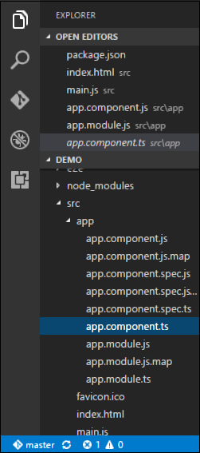
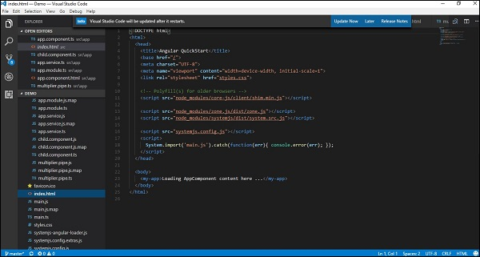

Компонент логическая часть приложения на Angular 4. Компонент в Angular содержит:

- **Шаблон** - Используеться для отображения. Содержит в себе HTML шаблон в котором отображаются данные приложения. Эта часть часто включает биндинг и дерективы.
- **Класс** - Содержит логику вашего компонента.
- **Метаданные** - Дополнительные данные для класса. Определяеться через декоратор

Давайте посмотрим на детали в коде:

## Класс Angular 4

TypeScript класс декоратора. Класс обычно имеет следующий синтаксис.

```
class classname {
   Propertyname: PropertyType = Value
}
```

### Параметры

- **Имя класса** - это имя, которое будет присвоено классу.
- **Имя свойства** - это имя, которое должно быть присвоено свойству.
- **PropertyType**. Поскольку TypeScript строго типизирован, вам нужно указать тип свойства.
- **Значение** - это значение, которое должно быть присвоено свойству.

```
export class AppComponent {
   appTitle: string = 'Welcome';
}
```

### Синтаксис и параметры шаблона

```
template: '
   <div>
      <h1>{{appTitle}}</h1>
      <div>To Tutorials Point</div>
   </div>
'
```

В этом примере необходимо отметить следующее:

- Мы определяем HTML-код, который будет отображаться в нашем приложении
- Мы также ссылаемся на свойство appTitle из нашего класса.

### Metadata

```
import { Component } from '@angular/core';

@Component ({
   selector: 'my-app',
   template: ` <div>
      <h1>{{appTitle}}</h1>
      <div>To Web Land</div>
   </div> `,
})

export class AppComponent {
   appTitle: string = 'Welcome';
}
```

В приведенном выше примере необходимо отметить следующее:

- Мы используем ключевое слово import, чтобы импортировать декоратор «Компонент» из ядра.
- Затем мы используем декоратор для определения компонента.
- У компонента есть селектор, называемый «my-app». Это не что иное, как наш пользовательский тег html, который можно использовать на нашей главной странице html.

Давайте проверим, что тег body теперь содержит ссылку на наш пользовательский тег в компоненте. Таким образом, в приведенном выше случае нам нужно убедиться, что тег body содержит следующий код -

```
<body>
   <my-app></my-app>
</body>
```
