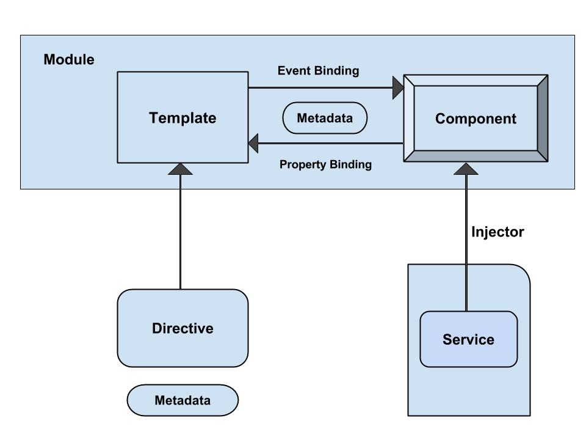

В этой главе обсудим архитектуру Angular 2 для создания интерфейса пользователя.



Рассмотрим:

- Модуль
- Компонент
- Шаблон
- Метаданные
- Дата биндинг (связывание значений)
- Сервис
- Директива
- Dependency Injection (Инъекция зависимости)

## Модуль

Компонент модуль характеризуется блоком кода, который может быть использован для выполнения одной задачи. Вы можете экспортировать значение чего-то из кода, например из класса. Angular приложения называются модулями и вы создавете приложения, используя множество модулей. Основным строительным блоком Angular 2 является класс компонента, который может быть экспортированы из модуля.

Некоторые приложений будут иметь имя компонента класса как AppComponent и найти его можно в файле с именем app.component.ts. Используйте export оператор для экспорта класса компонента из модуля, как показано ниже:

```
 
export class AppComponent { }

```

Выражение export определяет то что оно представляет собой модуль и AppComponent класс определяется как публичный и может быть доступны для других модулей приложения.

## Компонент

Компонент представляет собой класс контроллера с шаблоном, который в основном имеет дело с применением логики на странице. Это немного кода, который может быть использован во всем приложении. Компонент знает, как отобразить себя и настроить зависимость инъекций. Вы можете связать стили CSS с помощью inline стилей, стили url и шаблонов inline стилей компонента.

Для регистрации компонента используется директива(аннотация) @Component и может быть использована для того что бы разбить приложение на более маленькие логические части и в таком случае будет только один компонент для одного DOM елемента.

## Шаблон

Вид компонента может быть определен с помощью шаблона, который говорит Angular как отобразить компонент. Например, ниже простой шаблон показывает, как отобразить имя:

```
<div>
Your name is : {{name}}
</div>
```

Для отображения значения можно поместить шаблон выражения в фигурных скобках.

## Метаданные

Метаданные это способ обработки класса. У нас есть один компонент, который называется MyComponent, который будет классом, пока мы не сказажем Angular, что это компонент. Вы можете использовать метаданные к классу сказать Angular, что MyComponent является компонентом. Метаданные могут быть добавленны к TypeScript с помощью декоратора.

```
@Component({
   selector : 'mylist',
   template : '<h2>Name is Harry</h2>'
   directives : [MyComponentDetails]
})
export class ListComponent{...}
```

@Component это декоратор который использует объект конфигурации для создания компонента и его вид. Селектор создает экземпляр компонента, где он находит тег в родительскм HTML. Шаблон указывает Angular, как отобразить компонент. Директива декоратор используется для представления массива компонентов или директив.

## Data binding (связывание данных)

Связывание данных представляет собой процесс согласования значений данных приложения, объявляя привязку между источниками и целевым HTML-элементом. Он сочетает в себе детали шаблона с частями компонента и шаблон HTML и связан с разметкой для подключения обеих сторон. Есть четыре типа связывания данных:

- **Интерполирование:** отображает значения компонента внутри тегов DIV.
- **Связываение значений:** Свзязывает значения компонента родителя и компонента наследника
- **Собитие:** Срабатывает при нажатии на имя метода компонента
- **Двунаправленное связывание:** Связывает свойство и событие с помощью дерективы ngModel.

## Сервис

Сервисы - JavaScript функции которые отвечают за выполнение только конкретной задачи. Сервисы Angular внедряются с помощью механизма DI. Сервисы содержат значения и функции для будущего применения в приложении. Как правило, сервис является классом, который может выполнить что-то конкретное, например, передача данных, обмен сообщениями, конфигураци, експорт / импорт и так далее. Не следует за ранее волноватся о сервисах в Angular 2 так как в нем нет класа ServiceBase, но можно рассматривать как фундамент для разработки приложения.

## Директива

Директива - клас представления метаданных. Их существует 3 типа:

- **Директива компонента** - создает контроллер с использованием представления и использует используется в качестве пользовательского HTML элемента
- **Директива декоратор** - позволяет взять существующую функцию и изменить/расширить ее поведение.
- **Директива шаблона** - Преобразует HTML в многоразовый шаблон.

## Dependency injection

Dependency Injection является шаблоном, который передает объект в виде зависимостей в различных компонентах через приложения. Он создает новый экземпляр класса наряду с его необходимых зависимостей.

Вы должны помнить следующие пункты при использовании Dependency Injection:

- DI - может быть пременен везде
- Механизм инъекций поддерживает экземпляр службы и может быть создан с помощью поставщика (provider)
- Providers - путь создания сервисов
- Вы можете зарегистрировать провайдет через инъекторы
