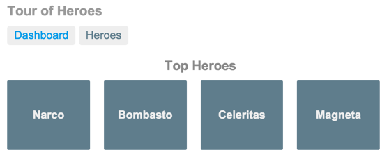
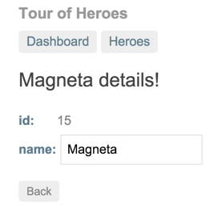
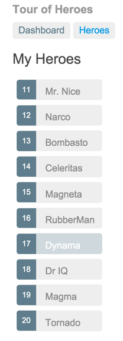
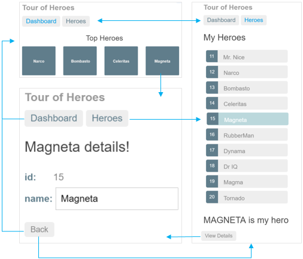
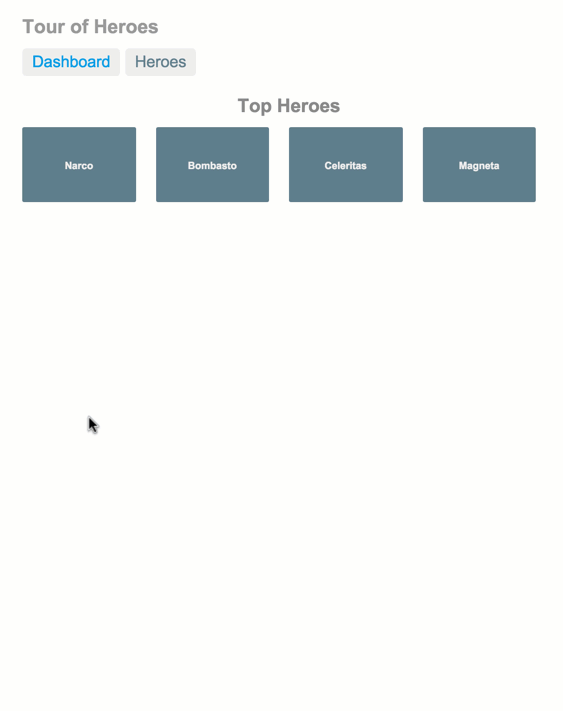

Учебник Tour of Heroes охватывает основы Angular 6. В этом учебном пособии вы создадите приложение, которое поможет кадровому агентству управлять своими героями.<!--more-->

Конечно, в этом учебнике будет рассмотрены только основные понятия. То, что мы создаем будем иметь много функций, которые мы ожидаем найти в полномасштабных, ориентированных на данные приложениях: получение и отображение списка героев, редактирование информации о выделенном герое, навигация между различными представления данных о героях.

К концу учебника вы сможете сделать следующее:

- Использовать встроенные директивы Angular что-бы отобразить/спрятать елементы и/или вывести список с героями.
- Создавать компоненты Angular 6 для отображение деталей и/или массива.
- Использовать односторонний связывание (one-way data binding) для read-only данных.
- Добавлять поля для редактирования данных модели используя двусторонее связывание (two-way data binding).
- Привязывать методы компонентов к событиям пользователя, например ввод текст или клик.
- Давать возможность пользователеям выбрать героя из списка и редактировать его в детальном описании.
- Форматировать данные при помощи каналов.
- Создавать серивисы для сбора наших героев.
- Использовать роутинг для навигации через представления и компоненты нашего приложения.

Мы узнаем Angular на столько, чтобы начать работу и получить уверенность, что Angular может все, что вам необходимо. Многое мы будем рассматривать поверхностно, но будут присутствовать ссылки для углубленного изучения.

После прохождения всех материалов, финально приложение будет выглядеть следующим образом [пример](https://angular.io/generated/live-examples/toh-pt6/stackblitz.html).

**Что будем создавать**

Для начала, посмотрим на визуальное визуальную идею, начнем с представления "Панели" самых героических героев:

Две верхние ссылки будут кликабельными ("Dashboard" и "Heroes") для премещения между представлениями панели и героев.

Так же, кликабельными будут и имена героев, и щелкунув на понравившегося попадем на представление с детальным описанием и возможностью редактировать выбранного героя.

Нажав на кнопку "Back", вернемся к панели "Dashboard". Ссылки сверху, кликабельны на всех екранах и если нажать "Heroes", проложение отобразит весь список Героев.

Когда же выберем любое имя героя с этого экрана, отобразиться минимальное описание героя под списком в режиме чтения.

А кнопка "View details", развернет детали, доступные для редактирования выбраного персонажа.

На следующей диаграмме перечислены все параметры навигации.

На следующей гифке, можно посмотреть, как будет работать наше приложение:

