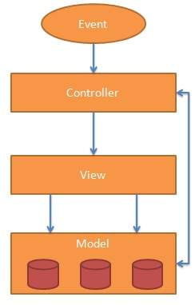
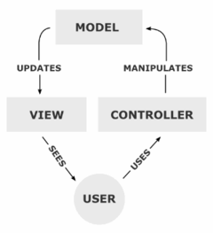

 

**M**odel **V**iew **C**ontroller или MVC, это шаблон проектирования для разработки веб-приложений. MVC шаблон состоит из трех основных частей:<!--more-->

- **Model**(Модель) − Это самый низкий уровень шаблона, ответственного за поддержание данных.
- **View** (Вид/Представление)− Отвечает за отображение всех или части данных пользователю.
- **Controller**(Контроллер) − Это программный код, который контролирует взаимодействие между моделью и представлением.

MVC схема использования нескольких шаблонов проектирования, с помощью которых модель приложения, пользовательский интерфейс и взаимодействие с пользователем разделены на три отдельных компонента таким образом, чтобы модификация одного из компонентов оказывала минимальное воздействие на остальные. Данная схема проектирования часто используется для построения архитектурного каркаса, когда переходят от теории к реализации в конкретной предметной области.

MVC является популярным, поскольку изолирует логику приложения от пользовательского интерфейса и поддерживает разделение задач. Контроллер принимает все запросы для приложения, а затем работает с моделью, чтобы подготовить какие-либо данные, необходимые для представления. Вид затем использует данные, полученные с помощью контроллера, чтобы генерировать конечный ответ. Абстракции MVC, можно графически представить следующим образом.

 

 

## Модель

Модель предоставляет знания: данные и методы работы с этими данными, реагирует на запросы, изменяя своё состояние. Не содержит информации, как эти знания можно визуализировать.

## Вид

Отвечает за отображение информации (визуализацию). Часто в качестве представления выступает форма (окно) с графическими элементами. Основаны системы шаблонов, такие как JSP, ASP, PHP и очень легко интегрировать с помощью технологии AJAX.

## Контроллер

Обеспечивает связь между пользователем и системой: контролирует ввод данных пользователем и использует модель и представление для реализации необходимой реакции.

AngularJS построен на основе MVC. В следующих главах мы увидим, как AngularJS использует методологию MVC.

Подробнее о MVC: [https://ru.wikipedia.org/wiki/Model-View-Controller](https://ru.wikipedia.org/wiki/Model-View-Controller)
