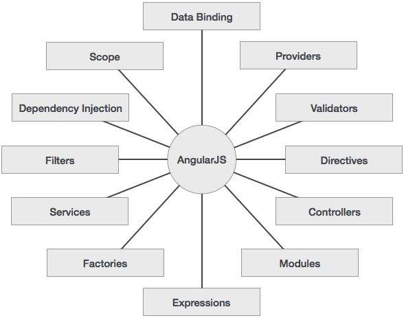

## Что такое AngularJS?

AngularJS является основой веб-приложений с открытым исходным кодом. Изначально он был разработан в 2009 году Misko Hevery и Adam Abrons. Cейчас поддерживается поддерживается Google. Его последняя версия 1.5 и AngularJS 2 beta.

Определение AngularJS, в его [официальной документации](https://docs.angularjs.org/guide/introduction) выглядит следующим образом -

> AngularJS представляет собой структурную основу для динамических веб-приложений. Это позволяет использовать HTML в качестве языка шаблонов и позволяет расширить синтаксис HTML, чтобы выразить компоненты вашего приложения четко и лаконично. Связывание данных и внедрения зависимостей устранит большую часть кода, который вам в настоящее время приходится писать. И все это происходит в браузере, что делает его идеальным партнером с любой серверной технологией.

## Особенности

- AngularJS является мощным JavaScript фермворком для создания многофункциональных интернет-приложений (RIA).
- AngularJS предоставляет возможность разработчикам писать приложения на стороне клиента (с помощью JavaScript) с чистым MVC (Model View Controller).
- Приложение, написанное в AngularJS является кросс-браузерное. AngularJS автоматически обрабатывает JavaScript код, подходящий для каждого браузера.
- AngularJS является open source, полностью бесплатный, и используется тысячами разработчиков по всему миру. Распространяется под лицензией Apache License версии 2.0.

В целом, AngularJS является основой для построения крупномасштабных, высокопроизводительных веб-приложений , сохраняя простоту в обслуживании.

## Основные особенности AngularJS

Ниже приведены наиболее важные основные черты AngularJS -

- **Data-binding** - Это автоматическая синхронизация данных между моделью и представлением.
- **Scope** \- Это объекты, которые относятся к модели. Они действуют как клей между контроллером и видом.
- **Controller** \- Эти функции JavaScript, которые связаны с конкретным **Scope**.
- **Services** \- AngularJS поставляются с несколькими встроенными служб, например, $http, чтобы сделать XMLHttpRequests. Это одноэлементные объекты, которые построены по принципу [singleton](https://ru.wikipedia.org/wiki/%D0%9E%D0%B4%D0%B8%D0%BD%D0%BE%D1%87%D0%BA%D0%B0_\(%D1%88%D0%B0%D0%B1%D0%BB%D0%BE%D0%BD_%D0%BF%D1%80%D0%BE%D0%B5%D0%BA%D1%82%D0%B8%D1%80%D0%BE%D0%B2%D0%B0%D0%BD%D0%B8%D1%8F\)).
- **Filters**  - Выбрать подмножество элементов из массива и возвращает новый массив.
- ****Directives**** \- Директивы являются маркерами на элементы DOM (такие как элементы, атрибуты, CSS, и многое другое). Они могут быть использованы для создания пользовательских HTML тегов, которые служат в качестве новых, пользовательских виджетов. AngularJS имеет встроенные директивы (ngBind, ngModel...)
- **Templates** \- Это рендер вида с информацией из контроллера и модели. Это может быть один файл (например, index.html) или несколько представлений на одной странице с помощью "partials".
- **Routing** \- Это концепция переключения видов.
- **Model View Whatever** \- MVC является шаблоном для разделения приложения на разные части (так называемый Model, View и Controller), каждый с различными обязанностями. AngularJS не реализует MVC в традиционном понимании этого слова, а скорее что-то ближе к MVVM (Model-View-ViewModel). Команда Angularjs относится это юмористически, как Model View Whatever.
- **Deep Linking** \- Глубокие ссылки позволяет кодировать состояние приложения в URL, так что он может быть закладкой. После этого приложение может быть восстановлен из URL в том же состоянии.
- **Dependency Injection** \- AngularJS имеет подсистему [внедрение зависимости](https://ru.wikipedia.org/wiki/%D0%92%D0%BD%D0%B5%D0%B4%D1%80%D0%B5%D0%BD%D0%B8%D0%B5_%D0%B7%D0%B0%D0%B2%D0%B8%D1%81%D0%B8%D0%BC%D0%BE%D1%81%D1%82%D0%B8), которая помогает разработчику легче разрабатывать, понимать и тестировать.

## **Идея**

Следующая диаграмма иллюстрирует некоторые важные части AngularJS которые мы будем обсуждать подробно в последующих главах.

## **Преимущества AngularJS**

- AngularJS обеспечивает возможность создания одностраничного приложения в очень чистым и обслуживаемым образом.
- AngularJS обеспечивает возможность связывать данные с  HTML, таким образом, давая пользователю богатый и адаптивный опыт
- AngularJS код подходит под Unit Tests.
- AngularJS использует внедрение зависимости и использует разделение задач.
- AngularJS обеспечивает повторно используемые компоненты.
- С AngularJS, разработчик пишет меньше кода и получает больше функциональных возможностей.
- В AngularJS, чистые HTML-страницы, а также контроллеры, написанные на JavaScript делает обработку бизнес логики.

Вдобавок ко всему, AngularJS приложения могут работать во всех основных браузерах и смартфонах, Android и IOS.

## Недостатки AngularJS

Хотя AngularJS поставляется с большим количеством плюсов, но то же самое время мы должны учитывать следующие моменты -

- **Не безопасно** -  будучи JavaScript фреймворком, приложения, написанные в AngularJS не являются безопасными. Проверка подлинности на стороне сервера и авторизация обязательно должны присутствовать в приложении.
- **Не разлагаемые** \- Если пользователь приложения отключает JavaScript, тогда он будет просто видеть HTML страницу и больше ничего.

## AngularJS Компоненты

 AngularJS можно разделить на следующие три основные части -

- **ng-app**  - Эта директива определяет и привязывает AngularJS к HTML.
- **ng-model** - Эта директива связывает значения данных приложения AngularJS в HTML элементы ввода.
- **ng-bind** - Эта директива связывает данные AngularJS для HTML-тегов.
