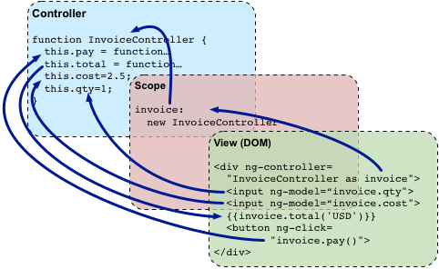

Все приложение AngularJS в основном полагаются на контроллеры для управления потоком данных в приложениях. Контроллер определяется с помощью директивы ng-controller. Контроллер представляет собой объект JavaScript, содержащий атрибуты, свойства и функции. Каждый контроллер принимает $scope в качестве параметра, который относиться к приложению или модулю как контроллер управления.<!--more-->

```
<div ng-app = "" ng-controller = "studentController">
   ...
</div>
```

**Cхематический пример взаимодействия контроллера и DOM:**



В примере мы объявили контроллер studentController используя ng-controlller. Следующим шагом будет объявление studentController в скрипте:

```
<script>
   function studentController($scope) {
      $scope.student = {
         firstName: "Mahesh",
         lastName: "Parashar",
         
         fullName: function() {
            var studentObject;
            studentObject = $scope.student;
            return studentObject.firstName + " " + studentObject.lastName;
         }
      };
   }
</script>
```

 

- StudentController определен как JavaSctipt объект с переменной $scope как аргумент.
- $scope.student это свойство studentController object.
- firstName & lastName два свойства объекта $scope.student. Мы присвоили им значения по умолчанию.
- fullName это функция объекта $scope.student, задача которой вернуть имя и фамилию.
- В функции fullName мы получаем объект студент и потом возвращаем полное имя (имя + фамилия).
- Примечание: мы можем определить контроллер в отдельном JS файле и подключить его к нашему HTML.

Теперь мы можем использовать свойства студента из studentController используя ng-model или используя выражения как показано в примере ниже.

```
Enter first name: <input type = "text" ng-model = "student.firstName"><br>
Enter last name: <input type = "text" ng-model = "student.lastName"><br>
<br>
You are entering: {{student.fullName()}}
```

- Мы связали имя и фамилию студента с двумя полями input
- А полное имя студена привязали к HTML
- Теперь вводя любые другие значения имени и фамилии в поля, полное имя и фамилия будут автоматически обновлятся.

**Полный пример:**

```
<html>
   
   <head>
      <title>Angular JS Controller</title>
      <script src = "http://ajax.googleapis.com/ajax/libs/angularjs/1.3.14/angular.min.js"></script>
   </head>
   
   <body>
      <h2>AngularJS Sample Application</h2>
      
      <div ng-app = "mainApp" ng-controller = "studentController">
         Enter first name: <input type = "text" ng-model = "student.firstName"><br><br>
         Enter last name: <input type = "text" ng-model = "student.lastName"><br>
         <br>
         
         You are entering: {{student.fullName()}}
      </div>
      
      <script>
         var mainApp = angular.module("mainApp", []);
         
         mainApp.controller('studentController', function($scope) {
            $scope.student = {
               firstName: "Mahesh",
               lastName: "Parashar",
               
               fullName: function() {
                  var studentObject;
                  studentObject = $scope.student;
                  return studentObject.firstName + " " + studentObject.lastName;
               }
            };
         });
      </script>
      
   </body>
</html>
```

**Вывод в браузер:**


