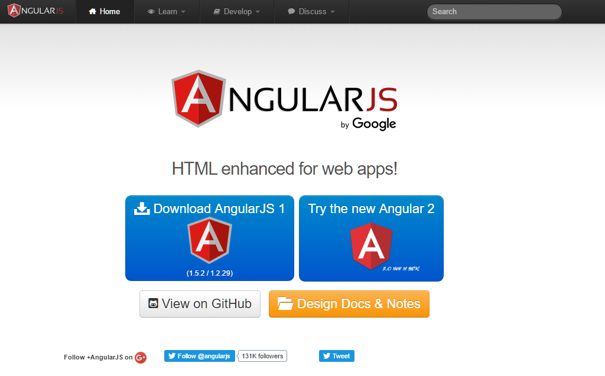
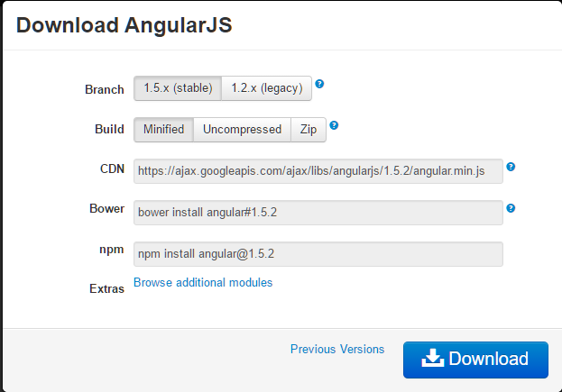

В этой главе мы поговорим о том, как настроить AngularJS для использования в разработке веб-приложений. Мы будем также кратко изучим структуру каталогов и ее содержимое.<!--more-->

Когда вы открываете ссылку [https://angularjs.org/](https://angularjs.org/), вы видите несколько вариантов, чтобы загрузить библиотеку AngularJS -



**View on GitHub** − Нажмите на эту кнопку, чтобы перейти к GitHub и получить все последние изменения библиотеки.

**Download** − Или при нажатии на эту кнопку будет видно следующий экран (в наших уроках мы используем AngularJS 1 версии) −



Этот экран дает различные варианты установки Angularjs -

- **Загрузка и хостинг файлов локально** \-
    - Есть два различных варианта. О различиях и переходе с версии на версию можно посмотреть по следующим ссылкам:
        - Список изменений - http://angularjs.blogspot.com/2016/02/angular-150-ennoblement-facilitation.html
        - Миграция с версии 1.2 на 1.5 - [https://habrahabr.ru/post/268265/](https://habrahabr.ru/post/268265/)
        - Интересные материалы по angular - [https://habrahabr.ru/hub/angularjs/](https://habrahabr.ru/hub/angularjs/)
        - Различие версий angular 1 & 2 (в бете) - http://35.156.110.60/development/javascript/angularjs/angular-2-vs-ang…-key-differences/ ‎
        - Статья о том что нас ждет в angularjs 2 - [https://sohabr.net/habr/post/247327/](https://sohabr.net/habr/post/247327/)
    - Мы также можем скачать минимизированный, несжатый или скрипт в архиве.
- **CDN доступ -** CDN даст вам доступ по всему миру для региональных центров обработки данных, в данном случае, Google хост. Это означает, что с помощью CDN ответственность за хостинг файлов переходит от ваших собственных серверов к серии внешних. Это также дает преимущество, что если посетитель веб-страницы уже загрузили копию AngularJS из той же CDN, он не должен будет повторно загружены.
    - О CDN - [https://ru.wikipedia.org/wiki/Content\_Delivery\_Network](https://ru.wikipedia.org/wiki/Content_Delivery_Network)
    - Почему CDN -
        - [http://oddstyle.ru/wordpress-2/stati-wordpress/pochemu-my-ne-ispolzuem-cdn-rasskaz-pro-spdy-i-ssl.html](http://oddstyle.ru/wordpress-2/stati-wordpress/pochemu-my-ne-ispolzuem-cdn-rasskaz-pro-spdy-i-ssl.html)
        - [https://habrahabr.ru/post/215173/](https://habrahabr.ru/post/215173/)

> Мы используем CDN библиотеки в данном туториале.

## Пример

Теперь давайте напишем простой пример использования библиотеки AngularJS. Давайте создадим файл first\_example.html, как показано ниже -

```
<!doctype html>
<html>
   
   <head>
      <script src = "//ajax.googleapis.com/ajax/libs/angularjs/1.3.0-beta.17/angular.min.js"></script>
   </head>
   
   <body ng-app = "myapp">
      
      <div ng-controller = "HelloController" >
         <h2>Welcome {{helloTo.title}} to the world of Tutorialspoint!</h2>
      </div>
      
      <script>
         angular.module("myapp", [])
         
         .controller("HelloController", function($scope) {
            $scope.helloTo = {};
            $scope.helloTo.title = "AngularJS";
         });
      </script>
      
   </body>
</html>
```

Следующие разделы описывают выше приведенный код подробно.

### Подключаем AngularJS

```
<head>
   <script src = "//ajax.googleapis.com/ajax/libs/angularjs/1.3.14/angular.min.js"></script>
</head>
```

### Точка входа в приложение AngularJS

Далее мы говорим, что часть HTML содержит приложение AngularJS. Это делается путем добавления атрибута ng-app к корневому HTML-элементу приложения AngularJS. Вы можете либо добавить его в HTML-элемент или элемент тела, как показано ниже -

```
<body ng-app = "myapp">
</body>
```

### Вид

Эта часть кода отвечает за вид:

```
<div ng-controller = "HelloController" >
   <h2>Welcome {{helloTo.title}} to the world of Tutorialspoint!</h2>
</div>
```

ng-controller говорит AngularJS какой контроллер использовать. helloTo.title говорит написать "модель" значения с именем helloTo.title в этом месте.

### Контроллер

Следующая часть кода отвечает за контроллер:

```
<script>
   angular.module("myapp", [])
   
   .controller("HelloController", function($scope) {
      $scope.helloTo = {};
      $scope.helloTo.title = "AngularJS";
   });
</script>
```

Этот код регистрирует функцию контроллера с именем HelloController в angular модель с именем MyApp. Мы будем изучать больше о моделях и контроллерах в соответствующих главах. Функция контроллера регистрируется через angular.module(...).controller(...) вызов функции.

$scope - Параметр, передаваемый функции контроллера является модель. Функция контроллера добавляет _helloTo_ в JavaScript объект, и в этом объекте он добавляет поле заголовка.

### Выполнение

Сохраните приведенный выше код, как first\_example.html и откройте его в любом браузере. Вы увидите следующее -

```
Welcome AngularJS to the world of Tutorialspoint!
```

При загрузке страницы в браузере, происходят следующее:

- HTML-документ загружен в браузер. Файл AngularJS JavaScript загружается и создается глобальный объект. Далее, JavaScript, который регистрирует функции контроллера выполняется.
- Далее, AngularJS просматривает HTML, чтобы найти точку входа в AngularJS и вид. После того, как вид найден, он соединяет присоединяет его к соответствующей функции контроллера.
- Далее, AngularJS выполняет функцию контроллера. Она рендерит вид с данными с модели загруженными в контроллере. Все теперь страница загружена.
