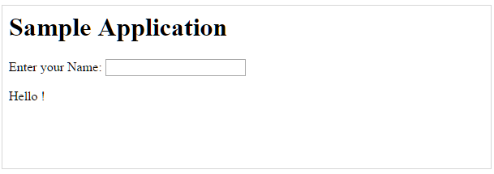

Перед тем как мы начнем создание первого HelloWorld приложения использующего AngularJS мы посмотрим на основные части нашего приложения. AngularJS приложение содержит три основных части:<!--more-->

- **ng-app** – Директива определяет и привязывает AngularJS приложение к HTML.
- **ng-model** – Директива связывает значения AngularJS с управляющими элементами (input, select, button) HTML страницы.
- **ng-bind** – Директива связывает данные AngularJS с HTML тегами.

 

## Шаги для создания приложения на AngularJS

### Шаг 1 – Загружаем фреймворк

```
<script src = "http://ajax.googleapis.com/ajax/libs/angularjs/1.3.14/angular.min.js">
</script>
```

 

### Шаг 2 – Определяем корневой элемент приложения

```
<div ng-app = "">
   ...
</div>
```

### Шаг 3 - Определяем модель используя директиву ng-model

```
<p>Enter your Name: <input type = "text" ng-model = "name"></p>
```

 

### Шаг 4 – Связываем значения модели с тегами

```
<p>Hello <span ng-bind = "name"></span>!</p>
```

 

## Шаги для запуска AngularJS приложения

Используем простую HTML страницу testAngularJS.htm.

```
<html>
   
   <head>
      <title>AngularJS First Application</title>
   </head>
   
   <body>
      <h1>Sample Application</h1>
      
      <div ng-app = "">
         <p>Enter your Name: <input type = "text" ng-model = "name"></p>
         <p>Hello <span ng-bind = "name"></span>!</p>
      </div>
      
      <script src = "http://ajax.googleapis.com/ajax/libs/angularjs/1.3.14/angular.min.js"></script>
      
   </body>
</html>
```

 

## Вывод

Откройте файл testAngularJS.htm в браузере. Введите имя и посмотрите что произойдет.



Как AngularJS интегрируется в HTML

- ng-app – директива определяет где начинается приложение AngularJS
- ng-model – директива которая создает модель переменной с названием «name» которая может быть использована в html странице вместе с блоком div с директивой ng-app
- ng-bind – далее, используется имя модели для отображения текста с инпута в span элементе.
- Закрывающийся </div> говорит о конце приложения AngularJS
