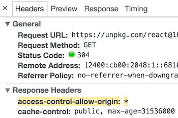

React гибкая библиотека которая может использоваться в различных проектах. Вы можете создавать приложения React с нуля или же добавлять уже в существующий код не переписывая ничего.<!--more-->

В зависимости от вашего проекта вы можете выбрать свой способ установки. React доступен как пакет react в менеджере [npm](https://www.npmjs.com/). А также доступен через CDN.

## **Попробовать React без установки**

Если вам просто интересно попробовать React, вы можете использовать CodePen. Попробуйте начать с [этого примера кода Hello World](http://codepen.io/gaearon/pen/rrpgNB?editors=0010). Вам ничего не нужно устанавливать; вы можете просто изменить код и посмотреть, работает ли он.

Если вы предпочитаете использовать собственный текстовый редактор, вы также можете [загрузить этот HTML-файл](https://raw.githubusercontent.com/reactjs/reactjs.org/master/static/html/single-file-example.html), отредактировать его и открыть его в своем браузере. Код выполняется имеет медленное времени выполнения, поэтому не используйте его на проде.

Если вы хотите полностью развернуть приложение, есть два популярных способа начать работу с React: с помощью Create React App или добавления его в существующее приложение.

## Создание нового приложения

[Create React App](http://github.com/facebookincubator/create-react-app) это лучший способ начать создание нового [SPA-приложения](https://ru.wikipedia.org/wiki/%D0%9E%D0%B4%D0%BD%D0%BE%D1%81%D1%82%D1%80%D0%B0%D0%BD%D0%B8%D1%87%D0%BD%D0%BE%D0%B5_%D0%BF%D1%80%D0%B8%D0%BB%D0%BE%D0%B6%D0%B5%D0%BD%D0%B8%D0%B5) на React.  Команда настраивает среду разработки так, чтобы вы могли использовать новейшие функции JavaScript, обеспечивает хороший опыт разработчика и оптимизирует ваше приложение для production. Вам понадобится Node> = 6 на вашем компьютере.

```
npm install -g create-react-app
create-react-app my-app

cd my-app
npm start
```

Если у вас установлен npm 5.2.0+, вы можете использовать [npx](https://www.npmjs.com/package/npx).

```
npx create-react-app my-app

cd my-app
npm start
```

Create React App не использует бэкэнд логику или базы данных; он просто создает pipeline сборки frontend, поэтому вы можете использовать его с любым бэкэндом, который вы хотите. Команда использует инструменты построения, такие как веб-пакет [Babel](http://babeljs.io/) и [webpack](https://webpack.js.org/), и создает чистый проект React.

Когда вы будете готовы к релизу, запусе`npm run build` приведет к созданию оптимизированной сборки вашего приложения в папке сборки. Вы можете узнать больше о Create React App из [README](https://github.com/facebookincubator/create-react-app#create-react-app-) и [руководства пользователя](https://github.com/facebookincubator/create-react-app/blob/master/packages/react-scripts/template/README.md#table-of-contents).

## Добавляем React в существующее приложение

Вам не нужно переписывать свое приложение, чтобы начать использовать React.

Мы рекомендуем добавлять React в небольшую часть вашего приложения, например отдельный виджет, чтобы вы могли узнать, хорошо ли он вам подходит.

Так как React можно использовать без сборки, мы рекомендуем настроить его так чтобы вы могли быть более продуктивными. Современная сборка проектов состоит из:

- **менеджер пакетов**, такие как [Yarn](https://yarnpkg.com/) или [npm](https://www.npmjs.com/). Это позволяет вам использовать обширную экосистему сторонних пакетов и легко устанавливать или обновлять их.
- **сборщик**,  [webpack](https://webpack.js.org/) или [Browserify](http://browserify.org/). Он позволяет писать модульный код и объединять его в небольшие пакеты для оптимизации времени загрузки.
- **компилятор** такой как [Babel](http://babeljs.io/). Он позволяет писать современный JavaScript-код, который по-прежнему работает в старых браузерах.

## Установка React

> **Note:**
> 
> После установки мы настоятельно рекомендуем настроить процесс создания прод окружения, чтобы убедиться, что вы используете prod версию React.

Рекомендуем использовать  [Yarn](https://yarnpkg.com/) или [npm](https://www.npmjs.com/) для управления front-end зависимостями. Если вы новичок в менеджерах пакетов, то [Yarn](https://yarnpkg.com/en/docs/getting-started) документация - это хорошая отправная точка.

Установка React с Yarn, запустите в консоли:

```
yarn init
yarn add react react-dom
```

Установка React с npm, запустите:

```
npm init
npm install --save react react-dom
```

Как Yarn так npm скачивают пакеты с реестра [npm](http://npmjs.com/).

### Включаем поддержку ES6 и JSX

Мы рекомендуем использовать React с [Babel](http://babeljs.io/), чтобы вы могли использовать ES6 и JSX в своем JavaScript-коде. ES6 - это набор современных функций JavaScript, которые упрощают разработку, а JSX является расширением языка JavaScript, который отлично работает с React.

В [инструкции по настройке Babel](https://babeljs.io/docs/setup/) объясняют, как настроить Babel для многих разных сред сборки. Удостоверьтесь, что вы установили babel-preset-react и babel-preset-envand, чтобы включить их в вашу конфигурацию .babelrc.

### Разработка и Production

По умолчанию React содержит много полезных предупреждений. Эти предупреждения очень полезны в разработке.

**Тем не менее, они делают версию для разработки React более крупной и медленной, поэтому вы должны использовать production версию при развертывании вашего приложения на сервер.**

### Используем CDN

Если вы не хотите использовать npm для управления пакетами, `react` и `react-dom`npm пакеты также доступны в  `umd`, которые хранятся в CDN:

```
<script crossorigin src="https://unpkg.com/react@16/umd/react.development.js"></script>
<script crossorigin src="https://unpkg.com/react-dom@16/umd/react-dom.development.js"></script>
```

Вышеупомянутые версии предназначены только для разработки и не подходят для прода. Минимизированные и оптимизированные прод версии React доступны по адресу:

```
<script crossorigin src="https://unpkg.com/react@16/umd/react.production.min.js"></script>
<script crossorigin src="https://unpkg.com/react-dom@16/umd/react-dom.production.min.js"></script>
```

Чтобы загрузить определенную версию `react` и `react-dom`, замените 16 номером версии которую вы желаете использовать.

Если вы используете Bower, React будет доступен через `react` пакет.

#### Зачем использовать `crossorigin` атрибут?

Если вы используете React из CDN, мы рекомендуем сохранить [`crossorigin`](https://developer.mozilla.org/en-US/docs/Web/HTML/CORS_settings_attributes) атрибут:

```
<script crossorigin src="..."></script>
```

Мы также рекомендуем проверить, что используемый вами CDN устанавливает `Access-Control-Allow-Origin: *` HTTP header:

[](https://reactjs.org/static/89baed0a6540f29e954065ce04661048-c9e27.png)

Это позволит улучшить обработку ошибок в React 16 и более поздних версиях.
