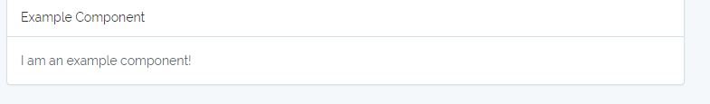
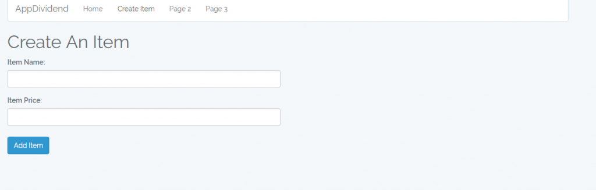

Многим разработчикам Laravel интересно как иcпользовать ReactJs в качестве библиотеки для frontend задач. Также frontend разработчикам интересно как интегрировать из приложение в Laravel. Пройдем путь от установки чистой версии фреймворка до полноценной рабочей версии.

1. Как подключить API Laravel к ReactJS
2. Структуру проекта Laravel и ReactJS.
3. Как использовать Laravel Mix для создания ReactJS Scaffold.

<!--more-->

## Шаг 1: Установка Laravel

Ну первым шагом нам нужно установить Laravel:

```
composer create-project --prefer-dist laravel/laravel ReactJSLaravelTutorial
```

Затем после установки нам нужно запустить команду:

```
php artisan preset react
```

После завершения установки нам нужно установить зависимости JavaScript для нашего проекта. Файл package.json существует, поэтому нам просто нужно ввести следующую команду для получения зависимостей NPM.

```
npm install
```

Подключаемся к БД

```
DB_CONNECTION=mysql
DB_HOST=127.0.0.1
DB_PORT=3306
DB_DATABASE=LaravelReact
DB_USERNAME=root
DB_PASSWORD=mysql
```

И запускаем миграции

```
php artisan migrate
```

## Шаг 2: Установка ReactJS в качестве Frontend для бэкэнда Laravel.

Как мы уже говорили ранее, введите следующую команду для React Preset.

```
php artisan preset react
```

В терминале вы должны увидеть следующее:

```
React scaffolding installed successfully.
Please run “npm install && npm run dev” to compile your new scaffolding.
```

Затем переходим в каталог. ReactJSLaravelTutorial >> resources >> assets >> js .

Папка содержит следующее:

- каталог компонентов
- файл app.js - точка входа в приложение
- файл bootstrap.js

В папке resources > views > есть файл welcome.blade.php в который мы должны добавить следующий код

```
<!-- welcome.blade.php -->

<!doctype html>
<html lang="{{ app()->getLocale() }}">
    <head>
        <meta charset="utf-8">
        <meta http-equiv="X-UA-Compatible" content="IE=edge">
        <meta name="viewport" content="width=device-width, initial-scale=1">
        <title>Laravel</title>
        <link href="{{asset('css/app.css')}}" rel="stylesheet" type="text/css">
    </head>
    <body>
        <div id="example"></div>
        <script src="{{asset('js/app.js')}}" ></script>
    </body>
</html>
```

И запустим следующие комманды

```
npm run dev
```

```
php artisan serve
```

В результате должен заработать локальный север по адресу http://localhost:8080

И после перехода на него мы увидем следующее:



* * *

## Шаг 3: Установим некоторые зависимости, касающиеся reactjs.

Первое, что мы будем устанавливать, это пакет react-router для взаимодействия с маршрутизатором нашего приложения. Поэтому введите следующую команду.

```
npm install react-router@2.8.1
```

Для лучшего удобства я установил старую версию react-router. Затем запустите в терминале следующую команду.

```
npm run watch
```

Команда будет следить за изменениями в папке с ресурсами и автоматически перекомпилировать их в javascript.

Далее создаем структуру проекта для наших нужд.

Сначала скопируйте следующий код и вставьте его в файл App.js.

```
// app.js

require('./bootstrap');
import React from 'react';
import { render } from 'react-dom';
import { Router, Route, browserHistory } from 'react-router';

import Example from './components/Example';

render(<Example />, document.getElementById('example'));
```

Затем изменяем Example.js

```
// Example.js

import React, { Component } from 'react';

export default class Example extends Component {
    render() {
        return (
            <div className="container">
                <div className="row">
                    <div className="col-md-8 col-md-offset-2">
                        <div className="panel panel-default">
                            <div className="panel-heading">Example Component</div>

                            <div className="panel-body">
                                I am an example component!
                            </div>
                        </div>
                    </div>
                </div>
            </div>
        );
    }
}
```

После сохранения файла, Laravel Mix перекомпилирует все наши компоненты и создаст пакетный файл app.js.

Когда вы переключаетесь в браузер и обновите страницу, вы увидите, что ничего не изменилось, но теперь мы работаем через нужные нам компоненты.

Теперь нам нужно создать еще один компонент под именем Master.js внутри папки компонентов.

```
// Master.js

import React, {Component} from 'react';
import { Router, Route, Link } from 'react-router';

class Master extends Component {
  render(){
    return (
      <div className="container">
        <nav className="navbar navbar-default">
          <div className="container-fluid">
            <div className="navbar-header">
              <a className="navbar-brand" href="#">AppDividend</a>
            </div>
            <ul className="nav navbar-nav">
              <li className="active"><a href="#">Home</a></li>
              <li><a href="#">Page 1</a></li>
              <li><a href="#">Page 2</a></li>
              <li><a href="#">Page 3</a></li>
            </ul>
          </div>
      </nav>
          <div>
              {this.props.children}
          </div>
      </div>
    )
  }
}
export default Master;
```

Теперь измените файл app.js и поместите этот компонент в качестве корневого компонента.

```
// app.js

require('./bootstrap');
import React from 'react';
import { render } from 'react-dom';
import { Router, Route, browserHistory } from 'react-router';

import Master from './components/Master';

render(<Master />, document.getElementById('example'));

```

* * *

## Шаг 4: Конфигурация React-router

Создадим еще 3 компонента в папке components

1. CreateItem.js
2. DisplayItem.js
3. EditItem.js

```
// CreateItem.js

import React, {Component} from 'react';

class CreateItem extends Component {
    render() {
      return (
      <div>
        <h1>Create An Item</h1>
        <form>
          <div className="row">
            <div className="col-md-6">
              <div className="form-group">
                <label>Item Name:</label>
                <input type="text" className="form-control" />
              </div>
            </div>
            </div>
            <div className="row">
              <div className="col-md-6">
                <div className="form-group">
                  <label>Item Price:</label>
                  <input type="text" className="form-control col-md-6" />
                </div>
              </div>
            </div><br />
            <div className="form-group">
              <button className="btn btn-primary">Add Item</button>
            </div>
        </form>
  </div>
      )
    }
}
export default CreateItem;
```

и добавим его в App.js

```
// app.js

require('./bootstrap');
import React from 'react';
import { render } from 'react-dom';
import { Router, Route, browserHistory } from 'react-router';

import Master from './components/Master';
import CreateItem from './components/CreateItem';

render(
  <Router history={browserHistory}>
      <Route path="/" component={Master} >
        <Route path="/add-item" component={CreateItem} />
      </Route>
    </Router>,
        document.getElementById('example'));
```

Если вы все сделали правильно и сохраните файл, Laravel Mix перекомпилирует его, и если вы еще не запустили сервер разработки Laravel, пожалуйста, запустите его с помощью php artisan serve

И после того как зайдем на страницу увидем следующее:


и при переходе на http://localhost:8000/add-item



Другие компоненты мы опишем позднее.

* * *

## Шаг 5: Используйте axios для отправки AJAX запроса на сервер разработки Laravel 5.5.

Добавьте события, чтобы получить данные из формы и отправить запрос на сервер.

```
// CreateItem.js

import React, {Component} from 'react';

class CreateItem extends Component {
  constructor(props){
    super(props);
    this.state = {productName: '', productPrice: ''};

    this.handleChange1 = this.handleChange1.bind(this);
    this.handleChange2 = this.handleChange2.bind(this);
    this.handleSubmit = this.handleSubmit.bind(this);
  }
  handleChange1(e){
    this.setState({
      productName: e.target.value
    })
  }
  handleChange2(e){
    this.setState({
      productPrice: e.target.value
    })
  }
  handleSubmit(e){
    e.preventDefault();
    const products = {
      name: this.state.productName,
      price: this.state.productPrice
    }
    let uri = 'http://localhost:8000/items';
    axios.post(uri, products).then((response) => {
      // browserHistory.push('/display-item');
    });
  }

    render() {
      return (
      <div>
        <h1>Create An Item</h1>
        <form onSubmit={this.handleSubmit}>
          <div className="row">
            <div className="col-md-6">
              <div className="form-group">
                <label>Item Name:</label>
                <input type="text" className="form-control" onChange={this.handleChange1}/>
              </div>
            </div>
            </div>
            <div className="row">
              <div className="col-md-6">
                <div className="form-group">
                  <label>Item Price:</label>
                  <input type="text" className="form-control col-md-6" onChange={this.handleChange2}/>
                </div>
              </div>
            </div><br />
            <div className="form-group">
              <button className="btn btn-primary">Add Item</button>
            </div>
        </form>
  </div>
      )
    }
}
export default CreateItem;

```

И так мы можем отправлять запрос на наш сервер, но у нас еще нет ни моделей ни путей для приема запроса.

* * *

## Шаг 6: Конфигурируем наш backend

Следующим шагом будет переход от ReactJS к Laravel и создание бэкэнда для нашего проекта. Мы будем использовать web routes для этого проекта, поэтому нам нужно поместить все наши маршруты в routes >> web.php файл.

Мы будем выполнять операции CRUD c данной сущностью. Итак, сначала давайте определим схему для нее. Затем создадим контроллер и маршруты.

```
php artisan make:model Item -m
```

Команда создаст два файла.

- Файл модели.
- Файл миграции.

Перейдите к файлу миграции database >> migrations >> create\_items\_table и скопируйте в него следующий код.

```
<?php

// create_items_table

use Illuminate\Support\Facades\Schema;
use Illuminate\Database\Schema\Blueprint;
use Illuminate\Database\Migrations\Migration;

class CreateItemsTable extends Migration
{
    /**
     * Run the migrations.
     *
     * @return void
     */
    public function up()
    {
        Schema::create('items', function (Blueprint $table) {
            $table->increments('id');
            $table->string('name');
            $table->integer('price');
            $table->timestamps();
        });
    }

    /**
     * Reverse the migrations.
     *
     * @return void
     */
    public function down()
    {
        Schema::dropIfExists('items');
    }
}
```

И после етого запустите комманду php artisan migrate

Он создает таблицу Item в базе данных.

Теперь нам нужен контроллер:

```
php artisan make:controller ItemController --resource
```

ItemController содержит все функции для CRUD-операций. Нам просто нужно добавить в него код.

```
<?php

// ItemController.php

namespace App\Http\Controllers;

use Illuminate\Http\Request;
use App\Item;

class ItemController extends Controller
{
    /**
     * Display a listing of the resource.
     *
     * @return \Illuminate\Http\Response
     */
    public function index()
    {
        $items = Item::all();
        return response()->json($items);
    }

    /**
     * Show the form for creating a new resource.
     *
     * @return \Illuminate\Http\Response
     */
    public function create()
    {
        //
    }

    /**
     * Store a newly created resource in storage.
     *
     * @param  \Illuminate\Http\Request  $request
     * @return \Illuminate\Http\Response
     */
    public function store(Request $request)
    {
        $item = new Item([
          'name' => $request->get('name'),
          'price' => $request->get('price')
        ]);
        $item->save();
        return response()->json('Successfully added');
    }

    /**
     * Display the specified resource.
     *
     * @param  int  $id
     * @return \Illuminate\Http\Response
     */
    public function show($id)
    {
        //
    }

    /**
     * Show the form for editing the specified resource.
     *
     * @param  int  $id
     * @return \Illuminate\Http\Response
     */
    public function edit($id)
    {
        $item = Item::find($id);
        return response()->json($item);
    }

    /**
     * Update the specified resource in storage.
     *
     * @param  \Illuminate\Http\Request  $request
     * @param  int  $id
     * @return \Illuminate\Http\Response
     */
    public function update(Request $request, $id)
    {
        $item = Item::find($id);
        $item->name = $request->get('name');
        $item->price = $request->get('price');
        $item->save();

        return response()->json('Successfully Updated');
    }

    /**
     * Remove the specified resource from storage.
     *
     * @param  int  $id
     * @return \Illuminate\Http\Response
     */
    public function destroy($id)
    {
      $item = Item::find($id);
      $item->delete();

      return response()->json('Successfully Deleted');
    }
}
```

Нам также необходимо создать защищенное поле $ fillable в файле Item.php, иначе будет получим исключение ‘**mass assignment exception**‘ .

```
<?php

// Item.php

namespace App;

use Illuminate\Database\Eloquent\Model;

class Item extends Model
{
    protected $fillable = ['name', 'price'];
}
```

И добавим путь к нашему ресурсу в routes

```
<?php

/*
|--------------------------------------------------------------------------
| Web Routes
|--------------------------------------------------------------------------
|
| Here is where you can register web routes for your application. These
| routes are loaded by the RouteServiceProvider within a group which
| contains the "web" middleware group. Now create something great!
|
*/

Route::get('/', function () {
    return view('welcome');
});
Route::resource('items', 'ItemController');
```

Теперь, если вы попытаетесь добавить значения в базу данных, может возникнуть следующая проблема.

> **Возможные ошибки**: XMLHttpRequest не может загрузить http: //localhost:8000/items. В запрошенном ресурсе нет заголовка «Access-Control-Allow-Origin». Потому что исходный адрес http://localhost:3000. В ответе код статуса HTTP 500.

Эта ошибка вызвана CORS безопасностью. Когда браузер отправляет запрос другому домену, тот по умолчанию отклоняет запрос.

**Варианты решения**

Мы должны разрешить принимать запрос на стороне сервера Laravel. Поэтому нам нужно одна промежуточная библиотека которая будет слушать каждый запрос к API. Поставив эту библиотеку мы прямо указали Laravel, что мы разрешаем этому запросу получать доступ к нашим ресурсам.

Загрузите пакет CORS для Laravel, чтобы избежать проблемы.

```
composer require barryvdh/laravel-cors
```

Добавьте Cors \\ ServiceProvider в массив serviceProviders в config / app.php

```
Barryvdh\Cors\ServiceProvider::class,

```

Чтобы разрешить CORS для всех маршрутов, добавьте HandleCors в свойство $middleware класса app / Http / Kernel.php:

```
protected $middleware = [
    // ...
    \Barryvdh\Cors\HandleCors::class,
];
```

Вы можете опубликовать конфигурацию, используя следующую команду:

```
php artisan vendor:publish --provider="Barryvdh\Cors\ServiceProvider"
```

Теперь попробуйте еще раз, сохранить данные в базе. Я не установил перенаправление после сохранения данных.

## Шаг 7. Отображение данных в ReactJS Frontend

Сделайте компонент DisplayItem.js внутри папки компонентов.

```
// DisplayItem.js

import React, {Component} from 'react';
import axios from 'axios';
import { Link } from 'react-router';
import TableRow from './TableRow';

class DisplayItem extends Component {
  constructor(props) {
       super(props);
       this.state = {value: '', items: ''};
     }
     componentDidMount(){
       axios.get('http://localhost:8000/items')
       .then(response => {
         this.setState({ items: response.data });
       })
       .catch(function (error) {
         console.log(error);
       })
     }
     tabRow(){
       if(this.state.items instanceof Array){
         return this.state.items.map(function(object, i){
             return <TableRow obj={object} key={i} />;
         })
       }
     }

  render(){
    return (
      <div>
        <h1>Items</h1>

        <div className="row">
          <div className="col-md-10"></div>
          <div className="col-md-2">
            <Link to="/add-item">Create Item</Link>
          </div>
        </div><br />

        <table className="table table-hover">
            <thead>
            <tr>
                <td>ID</td>
                <td>Item Name</td>
                <td>Item Price</td>
                <td>Actions</td>
            </tr>
            </thead>
            <tbody>
              {this.tabRow()}
            </tbody>
        </table>
    </div>
    )
  }
}
export default DisplayItem;
```

Теперь сделайте компонент TableRow.js.

```
// TableRow.js

import React, { Component } from 'react';

class TableRow extends Component {
  render() {
    return (
        <tr>
          <td>
            {this.props.obj.id}
          </td>
          <td>
            {this.props.obj.name}
          </td>
          <td>
            {this.props.obj.price}
          </td>
          <td>
            <button className="btn btn-primary">Edit</button>
          </td>
          <td>
            <button className="btn btn-danger">Delete</button>
          </td>
        </tr>
    );
  }
}

export default TableRow;
```

Зарегистрируйте этот маршрут в нашем приложении.

```
// app.js

import DisplayItem from './components/DisplayItem';

render(
  <Router history={browserHistory}>
      <Route path="/" component={Master} >
        <Route path="/add-item" component={CreateItem} />
        <Route path="/display-item" component={DisplayItem} />
      </Route>
    </Router>,
        document.getElementById('example'));
```

После сохранения данных нам нужно перенаправить пользователя на другой адерс. Поэтому в файле CreateItem.js нам нужно немного изменить код.

```
// CreateItem.js

import {browserHistory} from 'react-router';

axios.post(uri, products).then((response) => {
      browserHistory.push('/display-item');
    });
```

## Шаг 8: Редактирование и обновление данных.

Сделайте компонент EditItem.js внутри папки компонентов.

```
// EditItem.js

import React, {Component} from 'react';
import axios from 'axios';
import { Link } from 'react-router';

class EditItem extends Component {
  constructor(props) {
      super(props);
      this.state = {name: '', price: ''};
      this.handleChange1 = this.handleChange1.bind(this);
      this.handleChange2 = this.handleChange2.bind(this);
      this.handleSubmit = this.handleSubmit.bind(this);
  }

  componentDidMount(){
    axios.get(`http://localhost:8000/items/${this.props.params.id}/edit`)
    .then(response => {
      this.setState({ name: response.data.name, price: response.data.price });
    })
    .catch(function (error) {
      console.log(error);
    })
  }
  handleChange1(e){
    this.setState({
      name: e.target.value
    })
  }
  handleChange2(e){
    this.setState({
      price: e.target.value
    })
  }

  handleSubmit(event) {
    event.preventDefault();
    const products = {
      name: this.state.name,
      price: this.state.price
    }
    let uri = 'http://localhost:8000/items/'+this.props.params.id;
    axios.patch(uri, products).then((response) => {
          this.props.history.push('/display-item');
    });
  }
  render(){
    return (
      <div>
        <h1>Update Item</h1>
        <div className="row">
          <div className="col-md-10"></div>
          <div className="col-md-2">
            <Link to="/display-item" className="btn btn-success">Return to Items</Link>
          </div>
        </div>
        <form onSubmit={this.handleSubmit}>
            <div className="form-group">
                <label>Item Name</label>
                <input type="text"
                  className="form-control"
                  value={this.state.name}
                  onChange={this.handleChange1} />
            </div>

            <div className="form-group">
                <label name="product_price">Item Price</label>
                <input type="text" className="form-control"
                  value={this.state.price}
                  onChange={this.handleChange2} />
            </div>

            <div className="form-group">
                <button className="btn btn-primary">Update</button>
            </div>
        </form>
    </div>
    )
  }
}
export default EditItem;
```

Теперь зарегистрируйте этот маршрут в файле app.js.

```
// app.js

import EditItem from './components/EditItem';

render(
  <Router history={browserHistory}>
      <Route path="/" component={Master} >
        <Route path="/add-item" component={CreateItem} />
        <Route path="/display-item" component={DisplayItem} />
        <Route path="/edit/:id" component={EditItem} />
      </Route>
    </Router>,
        document.getElementById('example'));
```

И также обновим TableRow.js

```
<Link to={"edit/"+this.props.obj.id} className="btn btn-primary">Edit</Link>
```

## Шаг 9: Удаление данных.

```
// TableRow.js

import React, { Component } from 'react';
import { Link, browserHistory } from 'react-router';

class TableRow extends Component {
  constructor(props) {
      super(props);
      this.handleSubmit = this.handleSubmit.bind(this);
  }
  handleSubmit(event) {
    event.preventDefault();
    let uri = `http://localhost:8000/items/${this.props.obj.id}`;
    axios.delete(uri);
      browserHistory.push('/display-item');
  }
  render() {
    return (
        <tr>
          <td>
            {this.props.obj.id}
          </td>
          <td>
            {this.props.obj.name}
          </td>
          <td>
            {this.props.obj.price}
          </td>
          <td>
            <Link to={"edit/"+this.props.obj.id} className="btn btn-primary">Edit</Link>
          </td>
          <td>
          <form onSubmit={this.handleSubmit}>
           <input type="submit" value="Delete" className="btn btn-danger"/>
         </form>
          </td>
        </tr>
    );
  }
}

export default TableRow;
```

Исходный код на GitHub https://github.com/KrunalLathiya/ReactJSLaravel5.5
