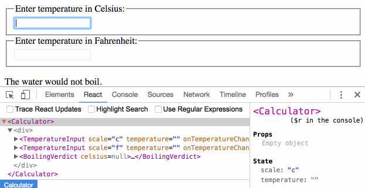

Часто несколько компонентов должны отражать одни и те же изменения данных. Мы рекомендуем переместить состояние каждого до ближайшего общего предка. Давайте посмотрим, как это работает в действии.

<!--more-->

В этом разделе мы создадим калькулятор температуры, который вычисляет, будет ли вода кипеть при данной температуре. Мы начнем с компонента под названием BoilingVerdict. Он принимает температуру в Цельсиях как prop и выводит, достаточно ли кипятить воду:

```
function BoilingVerdict(props) {
  if (props.celsius >= 100) {
    return <p>The water would boil.</p>;
  }
  return <p>The water would not boil.</p>;
}
```

Затем мы создадим компонент под названием Calculator. Он отображает <input>, который позволяет вводить температуру и сохраняет значение в this.state.temperature. Кроме того, он отображает BoilingVerdict для текущего входного значения.

```
class Calculator extends React.Component {
  constructor(props) {
    super(props);
    this.handleChange = this.handleChange.bind(this);
    this.state = {temperature: ''};
  }

  handleChange(e) {
    this.setState({temperature: e.target.value});
  }

  render() {
    const temperature = this.state.temperature;
    return (
      <fieldset>
        <legend>Enter temperature in Celsius:</legend>
        <input
          value={temperature}
          onChange={this.handleChange} />

        <BoilingVerdict
          celsius={parseFloat(temperature)} />

      </fieldset>
    );
  }
}
```

* * *

## Добавление втой input

Наше новое требование состоит в том, что в дополнение к вводу Celsius мы вводили температуру по Фаренгейту, и они синхронизировались. Мы можем начать с извлечения компонента TemperatureInput из калькулятора. Мы добавим к нему шкалу, которая может быть либо «c», либо «f»:

```
const scaleNames = {
  c: 'Celsius',
  f: 'Fahrenheit'
};

class TemperatureInput extends React.Component {
  constructor(props) {
    super(props);
    this.handleChange = this.handleChange.bind(this);
    this.state = {temperature: ''};
  }

  handleChange(e) {
    this.setState({temperature: e.target.value});
  }

  render() {
    const temperature = this.state.temperature;
    const scale = this.props.scale;
    return (
      <fieldset>
        <legend>Enter temperature in {scaleNames[scale]}:</legend>
        <input value={temperature}
               onChange={this.handleChange} />
      </fieldset>
    );
  }
}
```

Теперь нам нужно изменить Калькулятор, чтобы отобразить два отдельных input температуры:

```
class Calculator extends React.Component {
  render() {
    return (
      <div>
        <TemperatureInput scale="c" />
        <TemperatureInput scale="f" />
      </div>
    );
  }
}
```

У нас есть два инпута, но когда вы вводите температуру в один из них, другой не обновляется. Это противоречит нашему требованию: мы хотим что бы они были синхронны. Мы также не можем отображать BoilingVerdict из калькулятора. Калькулятор не знает текущую температуру, потому что он скрыт внутри TemperatureInput.

* * *

## Написание функций преобразования

Во-первых, мы напишем две функции для преобразования от Цельсия к Фаренгейту и обратно:

```
function toCelsius(fahrenheit) {
  return (fahrenheit - 32) * 5 / 9;
}

function toFahrenheit(celsius) {
  return (celsius * 9 / 5) + 32;
}
```

Эти две функции преобразуют числа. Мы напишем еще одну функцию, которая принимает строчную переменную температуры и функцию преобразование в качестве аргументов и возвращает строку. Мы будем использовать его для вычисления значения одного инпут на основе другого инпут. Функция возвращает пустую строку если температура введена не верно и округляет до третьего десятичного знака если верна:

```
function tryConvert(temperature, convert) {
  const input = parseFloat(temperature);
  if (Number.isNaN(input)) {
    return '';
  }
  const output = convert(input);
  const rounded = Math.round(output * 1000) / 1000;
  return rounded.toString();
}
```

Например, tryConvert ('abc', toCelsius) возвращает пустую строку, а tryConvert ('10.22 ', toFahrenheit) возвращает' 50.396 '.

## Теперь переместим состояние некоторых компонентов до ближайшего предка

В настоящее время оба компонента TemperatureInput независимо сохраняют свои значения в своем локальном state:

```
class TemperatureInput extends React.Component {
  constructor(props) {
    super(props);
    this.handleChange = this.handleChange.bind(this);
    this.state = {temperature: ''};
  }

  handleChange(e) {
    this.setState({temperature: e.target.value});
  }

  render() {
    const temperature = this.state.temperature;
    // ...
```

Однако мы хотим, чтобы эти два input синхронизировались друг с другом. Когда мы обновляем вход Celsius, input Fahrenheit должен отражать преобразованную температуру и наоборот.

В React состояние совместного доступа достигается путем перемещения его до ближайшего общего предка компонентов. Это называется «подъем состояния вверх». Мы удалим локальное состояние из параметра TemperatureInput и переместим его в калькулятор.

Если Калькулятор владеет общим состоянием, он становится «источником истины» для текущей температуры на обоих входах. Он может устанавливать им значения, которые согласуются друг с другом. Поскольку props компонентов TemperatureInput поступают из одного и того же исходного компонента калькулятора, два инпут всегда будут синхронизироваться.

Давайте посмотрим, как это работает шаг за шагом. Во-первых, мы заменим this.state.temperature на this.props.temperature в компоненте TemperatureInput. Пока давайте притворимся, что this.props.temperature уже существует, хотя нам нужно будет передать ее из калькулятора в будущем:

```
  render() {
    // Before: const temperature = this.state.temperature;
    const temperature = this.props.temperature;
    // ...
```

Мы знаем, что props доступен только для чтения. Когда температура находилась в локальном состоянии, TemperatureInput мог просто вызвать this.setState(), чтобы изменить его. Однако, теперь, когда температуру получаем от родителя в качестве props, TemperatureInput не контролирует ее.

В React это обычно решается путем создания «контролируемого» компонента. Точно так же, как DOM <input> принимает как значение, так и функцию onChange, так что пользовательский параметр TemperatureInput принимает как температуру, так и onTemperatureChange props из своего родительского калькулятора. Теперь, когда TemperatureInput хочет обновить свою температуру, он вызывает this.props.onTemperatureChange:

```
handleChange(e) {
    // Before: this.setState({temperature: e.target.value});
    this.props.onTemperatureChange(e.target.value);
    // ...
```

> Нет особого значения ни для`temperature`, ни для`onTemperatureChange`, чтобы указать имена в пользовательских компонентах. Мы могли бы назвать их чем-то другим, например назвать их`value` и`onChange`, что является общим соглашением.

Оболочка`onTemperatureChange` будет передаваться вместе с temperature из родительского компонента Calculator. Будет обрабатывать изменение, изменяя его собственное локальное состояние, тем самым повторно отображая инпуты с новыми значениями. Мы очень скоро рассмотрим новую реализацию калькулятора.

Прежде чем погрузиться в изменения Калькулятора, давайте вернем наши изменения в компонент TemperatureInput. Мы удалили из него локальное состояние, и вместо того, чтобы читать this.state.temperature, мы теперь читаем this.props.temperature. Вместо вызова this.setState(), когда мы хотим внести изменения, мы теперь вызываем this.props.onTemperatureChange(), который будет передан калькулятором:

```
class TemperatureInput extends React.Component {
  constructor(props) {
    super(props);
    this.handleChange = this.handleChange.bind(this);
  }

  handleChange(e) {
    this.props.onTemperatureChange(e.target.value);
  }

  render() {
    const temperature = this.props.temperature;
    const scale = this.props.scale;
    return (
      <fieldset>
        <legend>Enter temperature in {scaleNames[scale]}:</legend>
        <input value={temperature}
               onChange={this.handleChange} />
      </fieldset>
    );
  }
}

```

Теперь перейдем к компоненту Калькулятор. Мы будем хранить температуру и текущий инпут в локальном состоянии. Это состояние, которое мы «подняли» от инпутов, будет служить «источником истины» для обоих из них. Это минимальное представление всех данных, которые нам нужно знать, чтобы отображать оба входа. Например, если мы вводим 37 Celsius, состояние компонента Calculator будет:

```
{
  temperature: '37',
  scale: 'c'
}
```

Если позднее мы изменим поле Фаренгейта на 212, состояние Калькулятора будет:

```
{
  temperature: '212',
  scale: 'f'
}
```

Мы могли бы сохранить значение обоих инпутов, но это оказалось ненужным. Достаточно сохранить значение последнего измененного инпута и scale, который он представляет. Затем мы можем вывести значение другого инпут, основываясь только на текущей температуре и scale.

Инпуты остаются синхронны, поскольку их значения вычисляются из одного и того же состояния:

```
class Calculator extends React.Component {
  constructor(props) {
    super(props);
    this.handleCelsiusChange = this.handleCelsiusChange.bind(this);
    this.handleFahrenheitChange = this.handleFahrenheitChange.bind(this);
    this.state = {temperature: '', scale: 'c'};
  }

  handleCelsiusChange(temperature) {
    this.setState({scale: 'c', temperature});
  }

  handleFahrenheitChange(temperature) {
    this.setState({scale: 'f', temperature});
  }

  render() {
    const scale = this.state.scale;
    const temperature = this.state.temperature;
    const celsius = scale === 'f' ? tryConvert(temperature, toCelsius) : temperature;
    const fahrenheit = scale === 'c' ? tryConvert(temperature, toFahrenheit) : temperature;

    return (
      <div>
        <TemperatureInput
          scale="c"
          temperature={celsius}
          onTemperatureChange={this.handleCelsiusChange} />

        <TemperatureInput
          scale="f"
          temperature={fahrenheit}
          onTemperatureChange={this.handleFahrenheitChange} />

        <BoilingVerdict
          celsius={parseFloat(celsius)} />

      </div>
    );
  }
}
```

Теперь, независимо от того, какой инпут вы редактируете, this.state.temperature и this.state.scale в калькуляторе обновляются. Один из инпутов получает значение как есть, поэтому любой пользовательский ввод сохраняется, а другое входное значение всегда пересчитывается на его основе.

Давайте вспомним, что происходит, когда вы редактируете ввод:

- React вызывает функцию, указанную как onChange на DOM <input>. В нашем случае это метод handleChange в компоненте TemperatureInput.
- Метод handleChange в компоненте TemperatureInput вызывает this.props.onTemperatureChange () с новым желаемым значением. Его props, в том числе onTemperatureChange, были переданы его родительским компонентом - калькулятором.
- Когда он был ранее отображен, Калькулятор указал, что onTemperatureChange of Celsius TemperatureInput - это метод handleCelsiusChange калькулятора, а onTemperatureChange of Fahrenheit TemperatureInput - это метод обработки калькулятора FeahrenheitChange. Таким образом, любой из этих двух методов Калькулятора вызывается в зависимости от того, какой инпут мы редактировали.
- Внутри этих методов компонент Calculator вызывает React для повторного рендеринга, вызвав this.setState() с новым значением инпут и текущим scale введенного нами.
- React вызывает метод рендеринга компонента калькулятора, чтобы узнать, как должен выглядеть пользовательский интерфейс. Значения обоих input пересчитываются исходя из текущей температуры и активной шкалы. Здесь выполняется температурное преобразование.
- React вызывает методы визуализации отдельных компонентов TemperatureInput с их новыми props, указанными Калькулятором. Он узнает, как должен выглядеть пользовательский интерфейс.
- React DOM обновляет DOM, чтобы соответствовать требуемым входным значениям. Инпут, который мы только что редактировали, получает его текущее значение, а другой инпут обновляется до нужной температуры после преобразования.

Каждое обновление проходит через те же шаги, поэтому инпуты остаются в синхронны.

## Выученные уроки

Для любых данных, которые изменяются в приложении React, должен быть один «источник истины». Обычно состояние сначала добавляется к компоненту, который ему нужен для рендеринга. Затем, если другие компоненты также нуждаются в этом, вы можете поднять его до ближайшего общего предка. Вместо того, чтобы пытаться синхронизировать состояние между различными компонентами, вы должны полагаться на поток данных сверху вниз.

Подъем состояния включает в себя написание более «шаблонного» кода, чем подходы с двусторонней привязкой, но требуется меньше усилий для поиска и изоляции ошибок. Так как любое состояние «живет» в некотором компоненте, и только этот компонент может его изменить, площадь ошибок значительно уменьшается. Кроме того, вы можете реализовать любую пользовательскую логику для отклонения или преобразования пользовательского ввода.

Если что-то может быть получено либо из props, либо из состояния, оно, вероятно, не должно находиться в состоянии. Например, вместо сохранения как celsiusValue, так и fahrenheitValue мы сохраняем только последнюю отредактированную температуру и ее scale. Значение другого входа всегда можно вычислить из них в методе render(). Это позволяет нам очистить или применить округление к другому полю, не теряя при этом точности ввода.

Когда вы видите что-то не так в пользовательском интерфейсе, вы можете использовать инструменты разработки React для проверки props и перемещения по дереву до тех пор, пока не найдете компонент, ответственный за обновление состояния. Это позволяет отслеживать ошибки в исходном коде:


