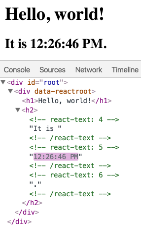

Элементы - это самые маленькие строительные блоки приложений React.

Элемент описывает, что вы хотите видеть на экране:

```
const element = <h1>Hello, world</h1>;
```

В отличие от элементов DOM браузера, элементы React являются обычными объектами и дешевы в создании. React DOM заботится об обновлении HTML DOM для соответствия элементам React.

> **Note**
> 
> Можно перепутать элементы с более широко известной концепцией «компонентов». Мы представим компоненты в следующем разделе. Элементы - это то, из чего компоненты «сделаны», и мы рекомендуем вам прочитать этот раздел, прежде чем продолжать.

## Рендеринг элемента в DOM

предположим, что где-то в вашемHTML файле есть <div>:

```
<div id="root"></div>
```

Мы называем это «корневым» узлом DOM, потому что всем внутри него будет управлять React DOM. Приложения, написанные только с на React, обычно имеют один корневой узел DOM. Если вы интегрируете React в существующее приложение, у вас может быть много больше изолированных корневых узлов DOM.

Чтобы визуализировать элемент React в корневом узле DOM, используйте ReactDOM.render():

```
const element = <h1>Hello, world</h1>;
ReactDOM.render(
  element,
  document.getElementById('root')
);
```

## Обновление DOM елемента

React элементы [неизменяемы](https://ru.wikipedia.org/wiki/%D0%9D%D0%B5%D0%B8%D0%B7%D0%BC%D0%B5%D0%BD%D1%8F%D0%B5%D0%BC%D1%8B%D0%B9_%D0%BE%D0%B1%D1%8A%D0%B5%D0%BA%D1%82) ([иммутабельны](https://en.wikipedia.org/wiki/Immutable_object)). Создав элемент, вы не сможете изменить его дочерние элементы или атрибуты. Элемент похож на один кадр в фильме: он представляет собой пользовательский интерфейс в определенный момент времени.

Насколько нам известно, единственный способ обновить интерфейс - создать новый элемент и передать его в ReactDOM.render().

```
function tick() {
  const element = (
    <div>
      <h1>Hello, world!</h1>
      <h2>It is {new Date().toLocaleTimeString()}.</h2>
    </div>
  );
  ReactDOM.render(
    element,
    document.getElementById('root')
  );
}

setInterval(tick, 1000);
```

> **Note**
> 
> На практике большинство приложений React вызывают только ReactDOM.render() только раз. В следующих разделах мы узнаем, как такой код инкапсулируется в компоненты состояния. Мы рекомендуем вам не пропускать темы, потому что они строятся друг на друге.

## React обновляет только то что необходимо

React DOM сравнивает элемент и его дочерние элементы с предыдущим состоянием и обновляет  DOM там где необходимо желаемое состояние. Вы можете проверить, проверив последний пример с помощью инструментов разработчика:



Несмотря на то, что мы при каждом тике, создаем новый элемент, описывающий DOM, обновляется только часть содержимого которая изменилась.

Исходя из нашего опыта, размышление о том, как пользовательский интерфейс должен выглядеть в данный момент, а не на то, как нужно менять его со временем, устраняет целый ряд ошибок.
