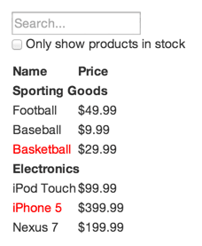
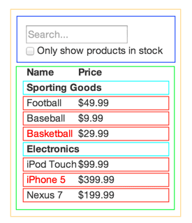

React - это видиние разработчиков facebook на то как строить большие Web приложения на Javasctip. Он хорошо масштабируеться в Facebook и Instagram.

Одна из многих замечательных частей React - это то, как вы думаете о приложениях по мере их создания. В этой статье мы рассмотрим процесс разработки таблицы для поиска данных, используя React

<!--more-->

* * *

## Начнем с мока

Представьте, что у нас уже есть JSON API и макет нашего дизайнера. Макет выглядит так:



Наш JSON API возвращает некоторые данные, которые выглядят так:

```
[
  {category: "Sporting Goods", price: "$49.99", stocked: true, name: "Football"},
  {category: "Sporting Goods", price: "$9.99", stocked: true, name: "Baseball"},
  {category: "Sporting Goods", price: "$29.99", stocked: false, name: "Basketball"},
  {category: "Electronics", price: "$99.99", stocked: true, name: "iPod Touch"},
  {category: "Electronics", price: "$399.99", stocked: false, name: "iPhone 5"},
  {category: "Electronics", price: "$199.99", stocked: true, name: "Nexus 7"}
];
```

* * *

## Шаг 1. Разделим интерфейс на иерархии компонентов

Первое, что вам нужно сделать, это нарисовать прямоугольники вокруг каждого компонента (и подкомпонента) в макете и давть им имена. Если вы работаете с дизайнером, он, возможно, уже сделал это, поэтому поговорите с ними! Имена слоев Photoshop могут оказаться именами ваших компонентов React!

Но откуда вы знаете, каков должен быть его собственный компонент? Просто используйте те же методы для принятия решения  которые используете для создания новой функции или объекта. Одним из таких методов является [принцип единой ответственности](https://ru.wikipedia.org/wiki/%D0%9F%D1%80%D0%B8%D0%BD%D1%86%D0%B8%D0%BF_%D0%B5%D0%B4%D0%B8%D0%BD%D1%81%D1%82%D0%B2%D0%B5%D0%BD%D0%BD%D0%BE%D0%B9_%D0%BE%D1%82%D0%B2%D0%B5%D1%82%D1%81%D1%82%D0%B2%D0%B5%D0%BD%D0%BD%D0%BE%D1%81%D1%82%D0%B8), то есть компонент в идеале должен делать только одно. Если он растет, он должен быть разделен на меньшие подкомпоненты.

Поскольку вы часто показываете модель данных JSON для пользователя, вы обнаружите, что если ваша модель была построена правильно, ваш пользовательский интерфейс (и, следовательно, структура вашего компонента) будет хорошо отображаться. Это связано с тем, что модели пользовательского интерфейса и данных имеют тенденцию придерживаться одной и той же информационной архитектуры, а это означает, что работа по разделению вашего интерфейса на компоненты часто тривиальна. Просто разделите его на компоненты, которые представляют собой ровно одну часть вашей модели данных.



Вы увидите здесь, что у нас есть пять компонентов в нашем простом приложении. Мы выделяем курсивом данные, представляемые каждым компонентом.

1. FilterableProductTable (оранжевый): содержит весь пример
2. SearchBar (синий): получает все входные данные пользователя
3. ProductTable (зеленый): отображает и фильтрует сбор данных на основе пользовательского ввода
4. ProductCategoryRow (бирюзовый): отображает заголовок для каждой категории
5. ProductRow (красный): отображает строку для каждого продукта

Если вы посмотрите на ProductTable, вы увидите, что заголовок таблицы (содержащий метки «Имя» и «Цена») не являются его собственным компонентами. Это вопрос предпочтения, и есть данные, которые нужно выводить в любом случае. В этом примере мы оставили его как часть ProductTable, потому что он является частью процесса сбора данных, который является ответственностью ProductTable. Однако, если этот заголовок становится сложным (т. Е. Если мы будем добавлять возможность для сортировки), было бы разумно сделать его компонентом ProductTableHeader.

Теперь, когда мы определили компоненты в нашем макете, давайте расположим их в иерархии. Это легко. Компоненты, которые появляются в другом компоненте в mock, должны отображаться как дочерние элементы в иерархии:

`FilterableProductTable`

- `SearchBar`
- `ProductTable`
    - `ProductCategoryRow`
    - `ProductRow`

* * *

## Шаг 2: Постройте статическую версию приложения React

<p class="codepen" data-height="265" data-theme-id="0" data-slug-hash="BwWzwm" data-default-tab="js,result" data-user="gaearon" data-embed-version="2" data-pen-title="Thinking In React: Step 2">See the Pen <a href="https://codepen.io/gaearon/pen/BwWzwm/">Thinking In React: Step 2</a> by Dan Abramov (<a href="https://codepen.io/gaearon">@gaearon</a>) on <a href="https://codepen.io">CodePen</a>.</p>
<script async src="https://production-assets.codepen.io/assets/embed/ei.js"></script>

Теперь, когда у вас есть иерархия компонентов, пришло время реализовать ваше приложение. Самый простой способ - создать версию, которая берет вашу модель данных и отображает пользовательский интерфейс, но не имеет интерактивности. Лучше всего отделить эти процессы, потому что для создания статической версии требуется много писать текста, а не думать, а для добавления интерактивности требуется много мышления, а не много ввода. Посмотрим, почему.

Чтобы создать статическую версию вашего приложения, которое отображает вашу модель данных, вы захотите создать компоненты, которые повторно используют другие компоненты и передают данные с помощью prop. Prop - это способ передачи данных от родителя к дочернему компоненту. Если вы знакомы с концепцией состояния, не используйте состояние вообще для создания этой статической версии. Состояние зарезервировано только для интерактивности, то есть данных, которые изменяются с течением времени. Поскольку это статическая версия приложения, вам это не нужно. Вы можете создавать сверху вниз или снизу вверх. То есть вы можете начать с построения компонентов выше в иерархии (то есть начиная с FilterableProductTable) или с нижнего в нем (ProductRow). В более простых примерах, как правило, легче идти сверху вниз, а в более крупных проектах легче идти снизу вверх и писать тесты по мере их создания.

В конце этого шага вы будете иметь библиотеку повторно используемых компонентов, которые отображают вашу модель данных. Компоненты будут иметь только методы render(), поскольку это статическая версия вашего приложения. Компонент в верхней части иерархии (FilterableProductTable) возьмет вашу модель данных в качестве prop. Если вы внесете изменения в базовую модель данных и снова вызовете ReactDOM.render(), пользовательский интерфейс будет обновлен. Легко понять, как обновляется ваш пользовательский интерфейс и где вносить изменения, так как нет ничего сложного. Односторонний поток данных React (также называемый односторонней привязкой) сохраняет модульность и быстродействие.

Просто обратитесь к документам React, если вам нужна помощь в выполнении этого шага.

**Краткая интерлюдия: Prop vs State**

В React: **Prop & State** есть два типа «model» данных. Важно понимать различие между ними; просмотрите [Props](http://thewebland.net/development/javascript/reactjs/komponenty-components-i-svojstva-props-v-react/) и [State](http://thewebland.net/development/javascript/reactjs/sostoyanie-i-zhiznennyj-tsikl-komponenta/), если вы не знаете, в чем разница.

* * *

## Шаг 3. Определение минимально (но полное) представления состояния пользовательского интерфейса

Чтобы сделать интерактивный интерфейс пользователя, вы должны иметь возможность инициировать изменения в своей базовой модели данных. В React это делается просто.

Чтобы правильно создать приложение, сначала нужно подумать о минимальном наборе изменяемого состояния, которое требуется вашему приложению. Основа здесь [DRY: не повторяйте себя](https://ru.wikipedia.org/wiki/Don%E2%80%99t_repeat_yourself). Выясните абсолютное минимальное представление состояния, которое требуется вашему приложению, и вычислите все остальное, что вам нужно по запросу. Например, если вы создаете список TODO, просто сохраняйте массив элементов TODO; не сохраняйте отдельную переменную состояния для счета. Вместо этого, когда вы хотите отобразить количество TODO, просто возьмите длину массива элементов TODO.

Подумайте обо всех частях данных в нашем примере приложения. У нас есть:

- Исходный список продуктов
- Текст поиска, введенный пользователем
- Значение флажка
- Отфильтрованный список продуктов

Давайте рассмотрим каждый из них и выясним, какой из них является state. Просто задайте три вопроса о каждой части данных:

1. Проходит ли он от родителя через prop? Если это так, возможно, это не состояние.
2. Со временем он остается неизменной? Если это так, возможно, это не состояние.
3. Вы можете вычислить его на основе любого другого состояния или prop в своем компоненте? Если это так, это не состояние.

Исходный список продуктов передается как props, поэтому он не является state. Текст поиска и флажок, похоже, находятся в state, так как они меняются со временем и не могут быть вычислены ни с чем. И, наконец, отфильтрованный список продуктов не является состоянием, потому что его можно вычислить, объединив исходный список продуктов с текстом поиска и значением флажка.

Итак, наше состояние:

- Текст поиска, введенный пользователем
- Значение флажка

* * *

## Шаг 4: Определите, где должно хранится состояние

<p data-height="265" data-theme-id="0" data-slug-hash="qPrNQZ" data-default-tab="js,result" data-user="gaearon" data-embed-version="2" data-pen-title="Thinking In React: Step 4" class="codepen">See the Pen <a href="https://codepen.io/gaearon/pen/qPrNQZ/">Thinking In React: Step 4</a> by Dan Abramov (<a href="https://codepen.io/gaearon">@gaearon</a>) on <a href="https://codepen.io">CodePen</a>.</p>
<script async src="https://production-assets.codepen.io/assets/embed/ei.js"></script>

Хорошо, мы определили, что такое минимальный набор состояния приложения. Затем нам нужно определить, какой компонент мутирует или владеет этим состоянием. Помните: Реагирование - это односторонний поток данных по иерархии компонентов. Не может быть сразу понятно, какой компонент должен владеть каким состоянием. Это часто самая сложная часть для новичков, понять, поэтому выполните следующие шаги, чтобы понять это:

Для каждой части вашего приложения:

- Определите каждый компонент, который делает что-то на основе этого состояния.
- Найдите общий компонент владельца (один компонент, прежде всего компоненты, которым требуется состояние в иерархии).
- Либо общий владелец, либо другой компонент выше в иерархии должен хранить state.
- Если вы не можете найти компонент, в котором имеет смысл хранить state, создайте новый компонент просто для хранения состояния и добавьте его где-нибудь в иерархию выше общего компонента.

Давайте рассмотрим стратегию для нашего приложения:

- ProductTable должен фильтровать список продуктов на основе состояния, а SearchBar должен отображать текст поиска и проверенное состояние.
- Общий компонент - FilterableProductTable.
- Это концептуально имеет смысл для текста фильтра и проверенного значения для использования в FilterableProductTable

Круто, поэтому мы решили, что наш state будет находится в FilterableProductTable. Во-первых, добавьте свойство экземпляра this.state = {filterText: '', inStockOnly: false} в конструктор FilterableProductTable, чтобы отразить начальное состояние вашего приложения. Затем передайте filterText и inStockOnly в ProductTable и SearchBar в качестве props. Наконец, используйте props для фильтрации строк в ProductTable и установите значения полей формы в SearchBar. Вы можете посмотреть, как будет выглядеть ваше приложение: установите filterText в «ball» и обновите приложение. Вы увидите, что таблица данных обновлена правильно.

* * *

## Шаг 5: Добавляем обратный поток данных

<p data-height="265" data-theme-id="0" data-slug-hash="LzWZvb" data-default-tab="js,result" data-user="gaearon" data-embed-version="2" data-pen-title="Thinking In React: Step 5" class="codepen">See the Pen <a href="https://codepen.io/gaearon/pen/LzWZvb/">Thinking In React: Step 5</a> by Dan Abramov (<a href="https://codepen.io/gaearon">@gaearon</a>) on <a href="https://codepen.io">CodePen</a>.</p>
<script async src="https://production-assets.codepen.io/assets/embed/ei.js"></script>

Мы создали приложение, которое корректно отображает функцию атрибута и состояния, стекающего по иерархии. Теперь пришло время поддерживать передачу данных другим способом: компонентам формы в глубине иерархии необходимо обновить состояние в FilterableProductTable.

React делает этот поток данных явным, чтобы было легче понять, как работает ваша программа, но для этого требуется немного больше ввода, чем традиционная двусторонняя привязка данных.

Если вы попытаетесь ввести или установить флажок в текущей версии примера, вы увидите, что React игнорирует ваш ввод. Это преднамеренно, так как мы установили, что значение ввода всегда равно состоянию, переданному в FilterableProductTable. Давайте подумаем о том, что мы хотим. Мы хотим убедиться, что всякий раз, когда пользователь меняет форму, мы обновляем состояние, чтобы отображать ввод пользователя. Поскольку компоненты должны обновлять только собственное состояние, FilterableProductTable будет передавать обратные вызовы в SearchBar, которые будут срабатывать при каждом обновлении состояния. Мы можем использовать событие onChange на входах, чтобы получать уведомление об этом. Обратные вызовы, переданные FilterableProductTable, вызовут setState (), и приложение будет обновлено. Хотя это звучит сложно, на самом деле это всего лишь несколько строк кода. И действительно ясно, как ваши данные текут во все стороны в приложении.

* * *

## Вот и все

Надеюсь, это даст вам представление о том, как думать о создании компонентов и приложений с помощью React. Хотя это может быть немного больше, чем вы привыкли, помните, что код читается гораздо больше, чем он написан, и очень легко прочитать этот модульный, явный код. Когда вы начнете создавать большие библиотеки компонентов, вы оцените эту ясность и модульность, и с повторным использованием кода ваши строки кода начнут уменьшаться. :)
