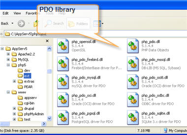
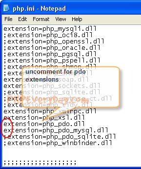
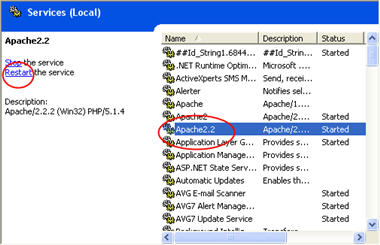

Сейчас, мы активируем расширение PDO.

Для начала проверьте есть ли у вас библиотека или нет. Откройте папку с php5. Для примера app/php5/ext.

Далее откройте файл php.ini. Раскомментируйте строки extension=php\_pdo.dll, extension=php\_pdo\_mysql.dll.

Перезапустите сервис apache. Для windows > Пуск > Панель управления > Обслуживание > Administarive tools > Сервисы

**Предыдуший: [Введение в PDO](http://35.156.110.60/development/php/pdo/pdo-intro/ "PDO: Введение в PHP Data Object")**

**Следующий:**
