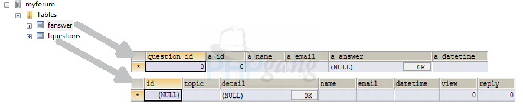
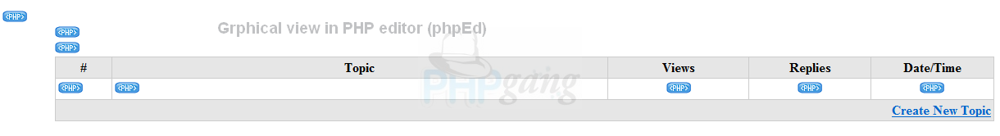
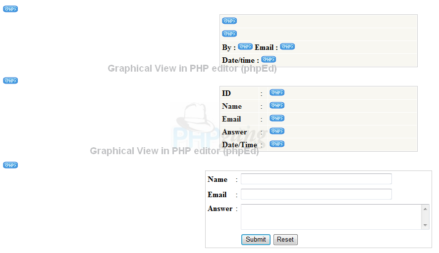

Сегодня я собираюсь показать вам как легко и быстро реализовать скрипт форума для ваших нужд. <!--more-->

**Шаг 1: Файлы** Создадим 5 файлов

1.  new\_topic.php
2.  add\_new\_topic.php
3.  main\_forum.php
4.  view\_topic.php
5.  add\_answer.php

**Шаг 2: База данных**

Создадим базу данных с именем «myforum» и поместим туда 2 таблицы «fquestions» и “fanswer”



```
CREATE DATABASE /*!32312 IF NOT EXISTS*/`myforum` /*!40100 DEFAULT CHARACTER SET latin1 */;

USE `myforum`;

/*Table structure for table `fanswer` */

DROP TABLE IF EXISTS `fanswer`;

CREATE TABLE `fanswer` (
  `question_id` int(4) NOT NULL DEFAULT '0',
  `a_id` int(4) NOT NULL DEFAULT '0',
  `a_name` varchar(65) NOT NULL DEFAULT '',
  `a_email` varchar(65) NOT NULL DEFAULT '',
  `a_answer` longtext NOT NULL,
  `a_datetime` varchar(25) NOT NULL DEFAULT '',
  KEY `a_id` (`a_id`)
) ENGINE=MyISAM DEFAULT CHARSET=latin1;

/*Table structure for table `fquestions` */

DROP TABLE IF EXISTS `fquestions`;

CREATE TABLE `fquestions` (
  `id` int(4) NOT NULL AUTO_INCREMENT,
  `topic` varchar(255) NOT NULL DEFAULT '',
  `detail` longtext NOT NULL,
  `name` varchar(65) NOT NULL DEFAULT '',
  `email` varchar(65) NOT NULL DEFAULT '',
  `datetime` varchar(25) NOT NULL DEFAULT '',
  `view` int(4) NOT NULL DEFAULT '0',
  `reply` int(4) NOT NULL DEFAULT '0',
  PRIMARY KEY (`id`)
) ENGINE=MyISAM AUTO_INCREMENT=2 DEFAULT CHARSET=latin1;
```

 **Шаг 3: КОД ФАЙЛОВ**

файл new\_topic.php


```
<!DOCTYPE html>
<html>
<head>
</head>
<body>
<table width="400" border="0" align="center" cellpadding="0" cellspacing="1" bgcolor="#CCCCCC">
<tr>
<form id="form1" name="form1" method="post" action="add_new_topic.php">
<td>
<table width="100%" border="0" cellpadding="3" cellspacing="1" bgcolor="#FFFFFF">
<tr>
<td colspan="3" bgcolor="#E6E6E6"><strong>Create New Topic</strong> </td>
</tr>
<tr>
<td width="14%"><strong>Topic</strong></td>
<td width="2%">:</td>
<td width="84%"><input name="topic" type="text" id="topic" size="50" /></td>
</tr>
<tr>
<td valign="top"><strong>Detail</strong></td>
<td valign="top">:</td>
<td><textarea name="detail" cols="50" rows="3" id="detail"></textarea></td>
</tr>
<tr>
<td><strong>Name</strong></td>
<td>:</td>
<td><input name="name" type="text" id="name" size="50" /></td>
</tr>
<tr>
<td><strong>Email</strong></td>
<td>:</td>
<td><input name="email" type="text" id="email" size="50" /></td>
</tr>
<tr>
<td>&nbsp;</td>
<td>&nbsp;</td>
<td><input type="submit" name="Submit" value="Submit" /> 
<input type="reset" name="Submit2" value="Reset" /></td>
</tr>
</table>
</td>
</form>
</tr>
</table>
</body>
</html>
```

Файл add\_new\_topic.php

```
<?php

$host="localhost"; // Host name 
$username="root"; // Mysql username 
$password=""; // Mysql password 
$db_name="myforum"; // Database name 
$tbl_name="fquestions"; // Table name 

// Connect to server and select database.
mysql_connect("$host", "$username", "$password")or die("cannot connect"); 
mysql_select_db("$db_name")or die("cannot select DB");

// get data that sent from form 
$topic=$_POST['topic'];
$detail=$_POST['detail'];
$name=$_POST['name'];
$email=$_POST['email'];

$datetime=date("d/m/y h:i:s"); //create date time

$sql="INSERT INTO $tbl_name(topic, detail, name, email, datetime)VALUES('$topic', '$detail', '$name', '$email', '$datetime')";
$result=mysql_query($sql);

if($result){
echo "Successful<BR>";
echo "<a href=main_forum.php>View your topic</a>";
}
else {
echo "ERROR";
}
mysql_close();
?>
```

Файл main\_forum.php



```
<?php

$host="localhost"; // Host name 
$username="root"; // Mysql username 
$password=""; // Mysql password 
$db_name="myforum"; // Database name 
$tbl_name="fquestions"; // Table name 

// Connect to server and select databse.
mysql_connect("$host", "$username", "$password")or die("cannot connect"); 
mysql_select_db("$db_name")or die("cannot select DB");

$sql="SELECT * FROM $tbl_name ORDER BY id DESC";
// OREDER BY id DESC is order result by descending

$result=mysql_query($sql);
?>

<table width="90%" border="0" align="center" cellpadding="3" cellspacing="1" bgcolor="#CCCCCC">
<tr>
<td width="6%" align="center" bgcolor="#E6E6E6"><strong>#</strong></td>
<td width="53%" align="center" bgcolor="#E6E6E6"><strong>Topic</strong></td>
<td width="15%" align="center" bgcolor="#E6E6E6"><strong>Views</strong></td>
<td width="13%" align="center" bgcolor="#E6E6E6"><strong>Replies</strong></td>
<td width="13%" align="center" bgcolor="#E6E6E6"><strong>Date/Time</strong></td>
</tr>

<?php

// Start looping table row
while($rows = mysql_fetch_array($result)){
?>
<tr>
<td bgcolor="#FFFFFF"><?php echo $rows['id']; ?></td>
<td bgcolor="#FFFFFF"><a href="view_topic.php?id=<?php echo $rows['id']; ?>"><?php echo $rows['topic']; ?></a><BR></td>
<td align="center" bgcolor="#FFFFFF"><?php echo $rows['view']; ?></td>
<td align="center" bgcolor="#FFFFFF"><?php echo $rows['reply']; ?></td>
<td align="center" bgcolor="#FFFFFF"><?php echo $rows['datetime']; ?></td>
</tr>

<?php
// Exit looping and close connection 
}
mysql_close();
?>

<tr>
<td colspan="5" align="right" bgcolor="#E6E6E6"><a href="new_topic.php"><strong>Create New Topic</strong> </a></td>
</tr>
</table>
```

Файл view\_topic.php



```
<?php

$host="localhost"; // Host name 
$username="root"; // Mysql username 
$password=""; // Mysql password 
$db_name="myforum"; // Database name 
$tbl_name="fquestions"; // Table name 

// Connect to server and select databse.
mysql_connect("$host", "$username", "$password")or die("cannot connect"); 
mysql_select_db("$db_name")or die("cannot select DB");

// get value of id that sent from address bar 
$id=$_GET['id'];
$sql="SELECT * FROM $tbl_name WHERE id='$id'";
$result=mysql_query($sql);
$rows=mysql_fetch_array($result);
?>

<table width="400" border="0" align="center" cellpadding="0" cellspacing="1" bgcolor="#CCCCCC">
<tr>
<td><table width="100%" border="0" cellpadding="3" cellspacing="1" bordercolor="1" bgcolor="#FFFFFF">
<tr>
<td bgcolor="#F8F7F1"><strong><?php echo $rows['topic']; ?></strong></td>
</tr>

<tr>
<td bgcolor="#F8F7F1"><?php echo $rows['detail']; ?></td>
</tr>

<tr>
<td bgcolor="#F8F7F1"><strong>By :</strong> <?php echo $rows['name']; ?> <strong>Email : </strong><?php echo $rows['email'];?></td>
</tr>

<tr>
<td bgcolor="#F8F7F1"><strong>Date/time : </strong><?php echo $rows['datetime']; ?></td>
</tr>
</table></td>
</tr>
</table>
<BR>

<?php

$tbl_name2="fanswer"; // Switch to table "forum_answer"
$sql2="SELECT * FROM $tbl_name2 WHERE question_id='$id'";
$result2=mysql_query($sql2);
while($rows=mysql_fetch_array($result2)){
?>

<table width="400" border="0" align="center" cellpadding="0" cellspacing="1" bgcolor="#CCCCCC">
<tr>
<td><table width="100%" border="0" cellpadding="3" cellspacing="1" bgcolor="#FFFFFF">
<tr>
<td bgcolor="#F8F7F1"><strong>ID</strong></td>
<td bgcolor="#F8F7F1">:</td>
<td bgcolor="#F8F7F1"><?php echo $rows['a_id']; ?></td>
</tr>
<tr>
<td width="18%" bgcolor="#F8F7F1"><strong>Name</strong></td>
<td width="5%" bgcolor="#F8F7F1">:</td>
<td width="77%" bgcolor="#F8F7F1"><?php echo $rows['a_name']; ?></td>
</tr>
<tr>
<td bgcolor="#F8F7F1"><strong>Email</strong></td>
<td bgcolor="#F8F7F1">:</td>
<td bgcolor="#F8F7F1"><?php echo $rows['a_email']; ?></td>
</tr>
<tr>
<td bgcolor="#F8F7F1"><strong>Answer</strong></td>
<td bgcolor="#F8F7F1">:</td>
<td bgcolor="#F8F7F1"><?php echo $rows['a_answer']; ?></td>
</tr>
<tr>
<td bgcolor="#F8F7F1"><strong>Date/Time</strong></td>
<td bgcolor="#F8F7F1">:</td>
<td bgcolor="#F8F7F1"><?php echo $rows['a_datetime']; ?></td>
</tr>
</table></td>
</tr>
</table><br>

<?php
}

$sql3="SELECT view FROM $tbl_name WHERE id='$id'";
$result3=mysql_query($sql3);
$rows=mysql_fetch_array($result3);
$view=$rows['view'];

// if have no counter value set counter = 1
if(empty($view)){
$view=1;
$sql4="INSERT INTO $tbl_name(view) VALUES('$view') WHERE id='$id'";
$result4=mysql_query($sql4);
}

// count more value
$addview=$view+1;
$sql5="update $tbl_name set view='$addview' WHERE id='$id'";
$result5=mysql_query($sql5);
mysql_close();
?>

<BR>
<table width="400" border="0" align="center" cellpadding="0" cellspacing="1" bgcolor="#CCCCCC">
<tr>
<form name="form1" method="post" action="add_answer.php">
<td>
<table width="100%" border="0" cellpadding="3" cellspacing="1" bgcolor="#FFFFFF">
<tr>
<td width="18%"><strong>Name</strong></td>
<td width="3%">:</td>
<td width="79%"><input name="a_name" type="text" id="a_name" size="45"></td>
</tr>
<tr>
<td><strong>Email</strong></td>
<td>:</td>
<td><input name="a_email" type="text" id="a_email" size="45"></td>
</tr>
<tr>
<td valign="top"><strong>Answer</strong></td>
<td valign="top">:</td>
<td><textarea name="a_answer" cols="45" rows="3" id="a_answer"></textarea></td>
</tr>
<tr>
<td>&nbsp;</td>
<td><input name="id" type="hidden" value="<?php echo $id; ?>"></td>
<td><input type="submit" name="Submit" value="Submit"> <input type="reset" name="Submit2" value="Reset"></td>
</tr>
</table>
</td>
</form>
</tr>
</table>
```

Файл add\_answer.php

```
<?php

$host="localhost"; // Host name 
$username="root"; // Mysql username 
$password=""; // Mysql password 
$db_name="myforum"; // Database name 
$tbl_name="fanswer"; // Table name 

// Connect to server and select databse.
mysql_connect("$host", "$username", "$password")or die("cannot connect"); 
mysql_select_db("$db_name")or die("cannot select DB");

// Get value of id that sent from hidden field 
$id=$_POST['id'];

// Find highest answer number. 
$sql="SELECT MAX(a_id) AS Maxa_id FROM $tbl_name WHERE question_id='$id'";
$result=mysql_query($sql);
$rows=mysql_fetch_array($result);

// add + 1 to highest answer number and keep it in variable name "$Max_id". if there no answer yet set it = 1 
if ($rows) {
$Max_id = $rows['Maxa_id']+1;
}
else {
$Max_id = 1;
}

// get values that sent from form 
$a_name=$_POST['a_name'];
$a_email=$_POST['a_email'];
$a_answer=$_POST['a_answer']; 

$datetime=date("d/m/y H:i:s"); // create date and time

// Insert answer 
$sql2="INSERT INTO $tbl_name(question_id, a_id, a_name, a_email, a_answer, a_datetime)VALUES('$id', '$Max_id', '$a_name', '$a_email', '$a_answer', '$datetime')";
$result2=mysql_query($sql2);

if($result2){
echo "Successful<BR>";
echo "<a href='view_topic.php?id=".$id."'>View your answer</a>";

// If added new answer, add value +1 in reply column 
$tbl_name2="fquestions";
$sql3="UPDATE $tbl_name2 SET reply='$Max_id' WHERE id='$id'";
$result3=mysql_query($sql3);
}
else {
echo "ERROR";
}

// Close connection
mysql_close();
?>
```

 


