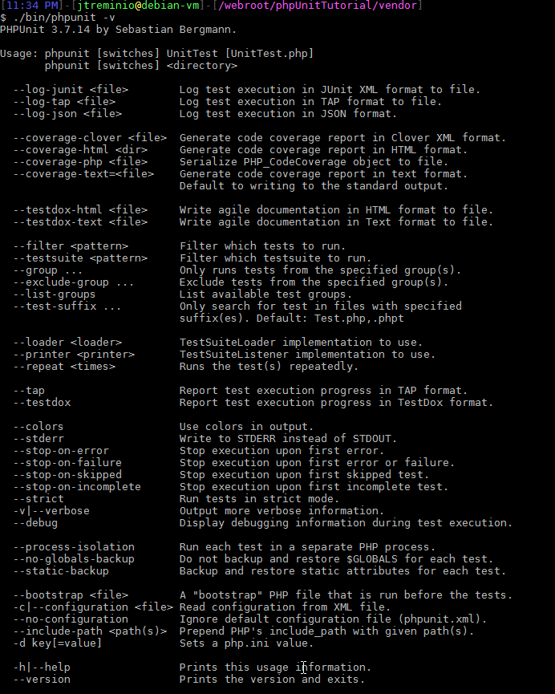
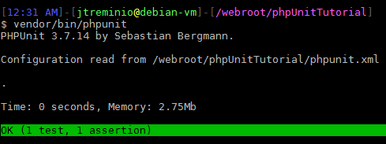

Эта серия познакомит вас с основными концепциями тестирования. Покажет вам, почему использование статики плохо, почему DI (dependency injection) - это хорошо, какая разница между mock и stub (заглушкой).

<!--more-->

Я слегка коснусь [разработки через тестирование](https://ru.wikipedia.org/wiki/%D0%A0%D0%B0%D0%B7%D1%80%D0%B0%D0%B1%D0%BE%D1%82%D0%BA%D0%B0_%D1%87%D0%B5%D1%80%D0%B5%D0%B7_%D1%82%D0%B5%D1%81%D1%82%D0%B8%D1%80%D0%BE%D0%B2%D0%B0%D0%BD%D0%B8%D0%B5) (test-driven development, TDD), но не буду фокусироваться на этом, поскольку считаю, что код должен быть тестируемым, а изучение того, как на самом деле тестировать, - это достаточно сложная задача, название игры этой игры - детские шаги.

Чего не будет в этой серии, - ответов на следующие вопросы: почему вы должны писать тесты, почему тестирование это хорошо, какие преимущества тестирования.

## ПРЕЖДЕ ЧЕМ НАЧАТЬ

Эта серия предполагает, что у вас есть надлежащая среда разработки. Я настоятельно рекомендую использовать виртуальную машину, которая имитирует серверную среду вместо того, ваша ОС и была сервером. Если у вас нет надлежащей настройки среды, не страшно, можно использовать [Docker](http://thewebland.net/development/devops/docker/), Vagrant или любой другой удобный для вас инструмент, в конце концов вашу любимую ОС (противоречивость :D).

## Установка PHPUNIT

Раньше считалось, что лучший способ установки PHPUnit был через PEAR. Теперь, когда Composer пришел и взял корону менеджера пакетов PHP, я предлагаю вам использовать его.

_И если бы я был автором оригинальной статьи, то, оставил бы здесь ссылку на то что такое Composer и PSR-0, но у меня в блоге пока нет таких материалов, так что я предполагаю что, вы уже знаете что такое composer и как его использовать :)_

Все, что требуется для установки PHPUnit - это одна строка в файле composer.json:

```
{
   "require-dev": {
       "phpunit/phpunit": "^6.0"
   }
}
```

И запустить в консоли:

```
composer update --dev
```

Или запустить только команду:

```
composer require phpunit/phpunit
```

Вы также должны установить XDebug. Если вы не используете Xdebug, вам стоит его попробовать и перестать быть пещерным человеком. Это гораздо лучшая альтернатива echo, print\_r и var\_dump, а также позволит использовать потрясающие инструменты отчетов о покрытии кода PHPUnit!

 

## Запуск PHPUnit

./vendor/bin/phpunit. Этот файл, с которым вы в основном будете взаимодействовать, чтобы запустить PHPUnit. Предельно просто - все, что он делает, это ищет автозагрузчик Composer и загружает его.

Чтобы запустить PHPUnit, вы просто выполните ./vendor/bin/phpunit. Это выведет все доступные вам параметры.



## Структура проекта

Поскольку мы используем Composer, нам потребуется некоторое время для правильной настройки нашего проекта. Мы назовем проект phpUnitTutorial и будем использовать его как пространство имен.

Обновите файл composer.json, чтобы он выглядел следующим образом:

```
{
   "require": {
   },
   "require-dev": {
       "phpunit/phpunit": "3.7.14"
   },
   "autoload": {
       "psr-0": {
           "phpUnitTutorial": ""
       }
   }
}
```

Затем запустите composer update. Файлы проекта будут находиться в папке phpUnitTutorial, которая будет находиться на том же уровне, что и папка vendor. Просто создайте пустую папку, чтобы ваша структура папок выглядела так:

```
composer.json
composer.phar
phpUnitTutorial/
vendor/
```

## Настройка phpunit.xml

Запуск PHPUnit будет проходить через ваши тесты с использованием встроенных значений по умолчанию. Вы можете переопределить многие значения по умолчанию в командной строке, но есть лучший способ: файл конфигурации phpunit.xml. Да, да, «XML! :(». Я обычно работают c json, но этот файл довольно безболезнен.

В корне вашего проекта создайте phpunit.xml со следующим содержимым:

```
<?xml version="1.0" encoding="UTF-8"?>
<phpunit colors="true">
   <testsuites>
       <testsuite name="Application Test Suite">
           <directory>./phpUnitTutorial/Test/</directory>
       </testsuite>
   </testsuites>
</phpunit>

```

Это очень простой файл конфигурации, но он устанавливает два важных параметра:

**colors="true"** результаты вашего теста выводятся в цвете, и

**<directory>./phpUnitTutorial/Test/</directory>** говорит PHPUnit, где будут расположены ваши тесты, поэтому вам не придется вручную сообщать об этом каждый раз, когда вы захотите их запустить.

Теперь ваша файловая структура должна выглядеть следующим образом:

```
composer.json
composer.phar
phpUnitTutorial/
phpUnitTutorial/Test/
vendor/
```

Все тесты вашего приложения должны будут находиться в phpUnitTutorial/Test.

## Соглашения

В PHPUnit есть несколько соглашений, которые облегчают жизнь. Не обязательно нужно следовать им, если хотеть сделать что-то по-другому, но для наших целей будем их придерживаться.

### Структура файлов и их имена

Первое соглашение, которое обсудим, это файловая структура и имена файлов.

Тесты должны отражать вашу кодовую базу напрямую, но в пределах собственного каталога, а тестовые файлы должны соответствовать тестируемому файлу с приложением Test. В нашем примере, если бы у нас был следующий код:

```
./phpUnitTutorial/Foo.php
./phpUnitTutorial/Bar.php
./phpUnitTutorial/Controller/Baz.php
```

Структура наших тестов выглядела бы:

```
./phpUnitTutorial/Test/FooTest.php
./phpUnitTutorial/Test/BarTest.php
./phpUnitTutorial/Test/Controller/BazTest.php

```

### Имена классов

Имена классов точно такие же, как имена файлов с “суфиксом” Test.

### Имена тестовых методов

Имена тестовых методов должны начинаться с test в нижнем регистре. Имена методов должны быть описательными для того, что тестируется, и должны включать имя тестируемого метода. Это не место для коротких сокращенных имен методов.

Например, если вы тестируете метод под названием verifyAccount(), и в одном модульном тесте вы хотите проверить, совпадает ли пароль, вы бы назвали ваш testVerifyAccountMatchesPasswordGiven().

Многословие является благом при тестировании, потому что, когда у вас есть неудачный тест, а их может быть много, вы будете благодарны точное значение имени метода, а точное знание того, что не удалось.

### Методы должны быть публичные

PHPUnit не может запускать тесты, которые являются либо защищенными (protected), либо частными(private)  - они должны быть общедоступными(public) (вот он, один из краеугольных камней, почему я начал писать о phpunit). Аналогично, любые методы, которые вы создаете в качестве помощников (helpers), должны быть общедоступными (public). Мы не здесь создаем публичный API, мы просто хотим писать тесты, поэтому не беспокойтесь о видимости.

### Наследование от PHPUnit

Все классы тестов должны наследовать PHPUnit\_Framework\_TestCase или быть наследниками тех классов которые наследуют.

## Первый тест

Наш первый тест будет коротким и глупым, но он представит минимум необходимого.

Создадим файл ./phpUnitTutorial/Test/StupidTest.php

```
<?php

namespace phpUnitTutorial\Test;

class StupidTest extends \PHPUnit_Framework_TestCase
{
   //
}
```

В нем нет ничего особенного но обратите внимание, что мы уже следуем трем соглашениям.

Проверим, что что-то равно true. Утверждения - истинная сила PHPUnit, и я буду освещать их больше в следующих частях этой серии. И так:

```
public function testTrueIsTrue()
{
   //
}
```

 

Теперь, фактический тестовый код. Это так же просто, как кажется:

```
public function testTrueIsTrue()
{
   $foo = true;
   $this->assertTrue($foo);
}

```

из корня проекта запускаем $ vendor/bin/phpunit

И видим желанную зеленую полосу:



Вы запустили один тестовый файл, 1 тест, с одним утверждением.

Поздравляем, теперь вы на один шаг ближе к вступлению в ряды тестера!

 

## Вместо заключения

Установили PHPUnit с помощью Composer, настроили некоторые нормальные значения по умолчанию и даже выполнили свой первый тест.

Вы теперь на один маленький шаг ближе к тому, чтобы стать единым с зеленым баром!

Я понимаю, что первый шаг выглядит бесполезным, но он должен усиливать мысль о том, что тестирование - это не какая-то мифическая концепция высокого уровня, требующая понимания PHD. Это просто говорит код: «Это то, что я ожидаю», и код, дающий вам знать, если вы где-то напортачили.

В следующей части я объясню утверждения (assertion), аннотации, dataProvider, и проведу вас через создание своего первого нетривиального модульного теста!

 

P.S: До недавних пор, в своей деятельности не сталкивался с покрытием кода, именно, unit тестами. Материал в большей степени “для себя”, но очень надеюсь что кому-то еще будет полезно и интересно :)

P.S.S: Оставляйте комментарии если что либо не понятно или я допустил где-то косяк :)

 

Перевод: [https://jtreminio.com/2013/03/unit-testing-tutorial-introduction-to-phpunit/](https://jtreminio.com/2013/03/unit-testing-tutorial-introduction-to-phpunit/)
