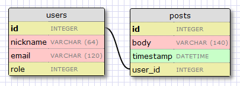
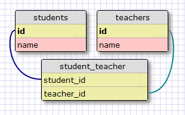
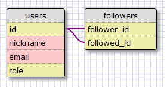

Это Восьмая статья в серии, где я описываю свой опыт написания веб-приложения на Python с использованием микрофреймворка Flask. Цель данного руководства — разработать довольно функциональное приложение-микроблог, которое я за полным отсутствием оригинальности решил назвать microblog.<!--more-->

## Резюме

Так как наше приложение понемногу растет, и к настоящему времени мы затронули большиство тем, которые требуются для завершения приложения. Сегодня мы будем еще немного работать с нашей базой. Каждый пользователь приложения должен иметь возможность выбрать, за какими другими пользователями «следовать», поэтому наша база должна иметь возможность отслеживать, кто и с кем follow. Все социальные приложения имеют эту функцию в той или инной форме. Некоторые это называют Контакты, другие соединения, друзья, читатели. Другие сайты используют ту же идею для реализации игнорирований и разрешений. Мы в свою очередь будем называть их читатели, а делать реализацю не зависимо от названия.

## Design of the 'Follower' feature

До того как мы начнем кодить, давайте задумаемся о функциональности того что мы хотим получить в итоге. И так начнем с наиболее очевидного. Мы хотим что бы наши пользователи легко могли управлять списком follower-ов. Мы также хотим иметь место для запроса, что бы узнать следуют за ним или он за другими. Пользователи будут иметь, на примере  Twitter , возможность на странице другого пользователя видить кнопки «Добавить» или «Удалить!» Последнее требование – єто то, что дано пользователю легко запрашивать сообщения которые принадлежать последующим ему пользователям. Так что, если вы думали, что это будет легко, подумайте еще раз!:)

## **Связи в базе данных**

К сожалению, реляционная база данных не имеет тип списка,но у нас есть таблицы с записями отношений между таблицами. У нас уже есть таблица в нашей базе для представления пользователей, поэотму, стоит продумать надлежащий тип связи, который сможет смоделировать последователей / затем ссылку.Время рассмотреть три типа отношений базы данных:

## **Один к многим**

В предыдущей стать мы уже видели связь один к многим:

[](http://18.185.47.240/wp-content/uploads/2014/07/flask-mega-tutorial-part-iv-2.png)

Два объекта, связанные этим отношением являются пользователи и записи. Мы говорим, что у пользователя есть много записей, и запись имеет только одного автора. Отношение представлено в безе данных с использованием внешнего ключа на «многие». В приведенном выше примере внешний ключ является user\_idполе, добавленное в таблицу записей. Это поле связывает каждый пост с полем автора в таблице пользователей. Довольно ясно, что user\_idобеспечивает прямой доступ к автору данной записи, на как насчет обратной? Для представленого типа отношения мы должны получить список записей, написанных данным пользователем. Оказывается user\_idполе в таблице записие позволяет «получить все записи которіе имеет user\_id”.

## **Многие к многим**

Отношение многие к многим есть более сложным. Для примера, рассмотрим базу данных, которя имеет студентов и преподавателей. Можно сказать, что студент имеет много учителей, и учитель имеет много учеников. Это как два перекрываются один ко многим с обоих концов. Для отношений этого типа мы должны быть в состоянии запросить базу данных и получить список учителей, которые учат студента, и список студентов в классе учителя. Оказывается, это довольно сложно представить, это не может быть сделано путем добавления внешних ключей к существующим таблицам. Представление многие-ко-многим требует использование вспомогательной таблицы с асоциаий таблиц. Вот как база данных будет выглядеть для студентов и преподавателей, например:

[](http://18.185.47.240/wp-content/uploads/2014/07/flask-mega-tutorial-part-viii-1.png)

Хотя это может показаться не просто, таблица ассоциаций сс двумя внешними ключами способна эффективно ответить на многие типы запросов, таких как:

1. Кто учитель студента А?
2. Кто студенты учителя И?
3. Сколько студентов у учителя Е?
4. Сколько учителей у студента А?
5. Есть ли у учителя Т студент А?
6. Является ли студент А учеником у Т?

## **Один к одному**

Представление одни-к-одному есть специальным случаем представления один-ко-многим. При связи один-к-одному каждая запись в одной таблице напрямую связана с отдельной записью в другой таблице. Пример:

1. Для каждого футболиста существует одна соответствующая запись в таблице «Сотрудники»
2. Этот набор данных является дополнительным набором записей для поля «Код сотрудника» в таблице сотрудники.

Даны тип отношений используется не так часто как предыдущие два но также есть случаи, в которых этот тип отношений полезен.

## **Представление** **followers****и** **followed**

Из приведенных выше отношений мы можем легко определить, что собственно модель данных у нас многие-ко-многим, птому что пользователь следует за многими пользователями и пользователь имеет много последователей. Но, мы хотим также представить последователей другим пользователям. Так что мы должны использовать второе соединение многие-к-многи? Второй сбъект отношений также пользователи. Отношения, в которых экземпяры сущности связаны с другими экземплярами того же объекта называется самоссылающиеся отношение, и это именно то, что нам нужно здесь. Диаграмма нашей базы данных с отношением многие-к-многим:

[](http://18.185.47.240/wp-content/uploads/2014/07/flask-mega-tutorial-part-viii-2-1.png)

 

Таблица followers является ассоциативной. Внешние ключи указывают на таблицу пользователя, так мы связываем пользователей для пользователей. Каждая запись в таблице представляет собой связь между followerи followeduser. Как и студенты и преподаватели, например, установка даной связи в нашей базе данных позволяет ответить на вопрос о followed и following, которые нам понадобятся. Довольно просто.

## **Модель базы данных


**

Изменения в нашей модели базы данных не настолько большие. Мы начинаем с добавления таблицы аолседователей (app/models.py):

```
followers = db.Table('followers',
    db.Column('follower_id', db.Integer, db.ForeignKey('user.id')),
    db.Column('followed_id', db.Integer, db.ForeignKey('user.id'))
)
```

 

Это прямая трасляция нашей диаграммы в настоящую базу данных. Обратите внимание, что мы не объявляли эту таблицу в качестве модели, как мы делали для пользователей и записей.Так как это является вспомогательной таблицей, которая не имеет никаких данных кроме внешних ключей, мы используем API, более низкого уровня flask-SQLAlchemyдля того что бы создать таблицу без модели. Далее мы определим связь многие-к-многим в таблице пользователей (app/models.py):

```
class User(db.Model):
    id = db.Column(db.Integer, primary_key = True)
    nickname = db.Column(db.String(64), unique = True)
    email = db.Column(db.String(120), index = True, unique = True)
    role = db.Column(db.SmallInteger, default = ROLE_USER)
    posts = db.relationship('Post', backref = 'author', lazy = 'dynamic')
    about_me = db.Column(db.String(140))
    last_seen = db.Column(db.DateTime)
    followed = db.relationship('User', 
        secondary = followers, 
        primaryjoin = (followers.c.follower_id == id), 
        secondaryjoin = (followers.c.followed_id == id), 
        backref = db.backref('followers', lazy = 'dynamic'), 
        lazy = 'dynamic')
```

 

Установка связей в базе не такая уже тривиальная задача и поэтому она требует неких объяснений. Как мы делали это для отношений одни-ко-многим в предыдущей статье, мы используем функцию db.relationship что бы определить связь. Мы будем привязывать экземпляры пользователей к другим экземплярам пользователей, скажем так, что для пары связанных пользователей в этих отношения левая сторона пользователь Следует за правой стороной пользователя. Мы определим отношения, из левой сущности с именем followed, потому что, когда мы запрашиваем эту связь с левой стороной мы получим список с последующими пользователями. Давайте рассмотрим все аргументы в db.relationship():

1. ‘User’ является правой стороной связи в этом отношении (левая сторона сущности является родительский класс). Так как мы определяем самоссылающееся отношения мы используем тот же класс с обеих сторон.
2. secondary указывает на таблицу ассоциации, которые используются для отношений.
3. Primaryjoinуказывает на состояние,. Которое связывает левая сторона сущности (followeruser) с таблицей ассоциаций. Обратите внимание, что, так как таблица последователи не является моделью появляется немного другой синтаксис что бы добраться до имени поля.
4. Secondaryjoinуказывает на состояние, которое связывает правая сторона сущности (followed user) с таблицей ассоциаций.
5. Backref определяет, как эти отношения будут доступны из правой сущности. Мы сказали, что для данного пользователя запрос сущности последователей возвращает все с правой стороны пользователей, которые имеют целевого пользователя на левой стороне. Обратная ссылка будет называться последователи и вернет все левые боковые сущности пользователей, которые связаны с целевым пользователем в правой части. Дополнительный lazyаргумент указывает на режим выполнения этого запроса. Режим dynamicговорит «не работать, пока специально не просил». Это полезно для повышения производительности, а также потому, что мы сможем принят этот запрос и изменить его, прежде чем он выполнится. Подробнее об этом позже.
6. Lazyпозож на праметр с таким же названием в backref, но оно относится к регулярному запросу вместо ссылки.

Это трудно понять. Мы увидим, как использовать эти запросы в один момент, и тогда все станет яснее. После того как мы создали обновления для базы данных, теперь мы можем генерировать новую миграцию:

```
./db_migrate.py
```

Так мы занесем изменения в базу данных.

## **Добавление и удаление** **«****follows****»**

Для избегания повторного использования коды, мы реализуем «follow» и “unfollow» функционал в модели User что бі не делать єто непосредственно в функции представления. Таким образом, мі можем использовать эту функцию для конкретного применения (ссылающегося на него от просмотра функций), а также из нашего модульного тестированияю В принципе, это всегда лучше, что бы переместить логику нашего приложения от функции представления и в модели, потому что упрощает тестирование. Вы хотите, что бы ваш взгляд функции быть как можно более простым, потому что те, труднне проверить в автоматизированном режиме. Ниже приведен код длля добавления и удаления отношений, определенных в качестве методов модели User (app/models.py)

```
class User(db.Model):
    #...
    def follow(self, user):
        if not self.is_following(user):
            self.followed.append(user)
            return self

    def unfollow(self, user):
        if self.is_following(user):
            self.followed.remove(user)
            return self

    def is_following(self, user):
        return self.followed.filter(followers.c.followed_id == user.id).count() > 0
```

 

Эти методы являются удивительно простыми, благодаря силе SQLAlchemy, который делает много работы под капотом. Мы просто добавляем или удаляем элементы из последующих отношеий,а SQLAlchemyзаботится об управлении таблицей ассоциаций за нас. Методы followи unfollowопределены так, что бы они возвращали объект, когда Trueили Falseкогда метод не сработал. Тогда объект возвращаеться, этот объект должен быть добавлен к сеансу базы данных по их совершению. Метод is\_followingговорит сам за себя своей единой строчке кода. Мы принимаем followed запрос отношения, которое возвращает всех(последователей, а затем) пары, которые имеет наш пользователь в качестве последователя, и мы фильтруем его последовавшего пользователя. Это возможно потому, что followindотношения имеют lazyрежим dynamic, так что вместо того, чтобы быть результатом запроса. Это реальный объект запроса, перед выполнением.   Returnиз фильтра вызывает модифицированый запрос, который должен выполнится. Так мы можем вызвать метод count() в єтом запросе, и теперь запрос будет выполнятся и возвращать количество найденых записей в таблице. Если запрос пройдет то мы узнаем что связь между этими двумя сущностями присутствует. Если мы не вернет, то выдадим ссылку « не существует»

## **Тестирование**

Давайте напишем в уже готовом блоке тестирования:

```
class TestCase(unittest.TestCase):
    #...
    def test_follow(self):
        u1 = User(nickname = 'john', email = 'john@example.com')
        u2 = User(nickname = 'susan', email = 'susan@example.com')
        db.session.add(u1)
        db.session.add(u2)
        db.session.commit()
        assert u1.unfollow(u2) == None
        u = u1.follow(u2)
        db.session.add(u)
        db.session.commit()
        assert u1.follow(u2) == None
        assert u1.is_following(u2)
        assert u1.followed.count() == 1
        assert u1.followed.first().nickname == 'susan'
        assert u2.followers.count() == 1
        assert u2.followers.first().nickname == 'john'
        u = u1.unfollow(u2)
        assert u != None
        db.session.add(u)
        db.session.commit()
        assert u1.is_following(u2) == False
        assert u1.followed.count() == 0
        assert u2.followers.count() == 0
```

После добавления этого теста в рамках тестирования мы можем запустить весь набор тестов с помощью следующей команды:   И в случае если все работает тест должен вернуть pass

```
./tests.py
```

 

## **Запрос****ы к базе данных**

Наша текущая модель базы данных поддерживает большинство требований, что мы перечислили в начале. Лишь то что мы еще не рассмотрели, по факту, есть самое сложное. Наша стартовая страница(индекс) показывает записи которые были написаны всеми пользователями, но когда пользователь входит, нам нужно построить запрос таким образом что бы он возвращал посты всех пользователей за которым он follow. Наиболее очевидным решением является запуск запроса, который даст нам список с followedпользователями, который мы уже можем сделать. Тогда для каждого из возвращаемых пользователей выполнить запрос, что бы получить записи. Как только мы получаем ответ от базы мы объединяем их в единый список и сортируем по дате. Звучит хорошо? Ну, не совсем. Этот подход имеет несколько проблем. Что произойдет, если пользователь followedза тисячю человек? В таком случае нам придется выполнить тысячу запросов к базе данных для того что бы только собрать все сообщения. И теперь мы будем иметь тысячу списков в памяти, которые мы должны объединить и отсортировать. Вторичной проблемой будет то что наша страница ИНДЕКС (в конечном счете) уже с нумерацией страниц, поэтому мы не будем отображать все доступные сообщения, но только, скажем, первые пятдесят, со ссылками, что бы получить следующий или предыдущий набор. Если мы собираемся показать записи, упорядоченные по дате, как мы узнаем, какие их записей являются самыми последними из пятидесяти. Все круги пользователя комбинированные, если мы не получим все записи и если мы не получим все сообщения то как их сортировать? НА самом деле это ужасное решение, которое не очень хорошо масштабируется.   Хотя это сбор и сортировка должно быть сделано так или иначе, наша затея приводит к очень неэффективному процессу. База данных содержит индексы, которые позволяют ему выполнять запросы и сортировку в гораздо более эффективным образом, что мы возможно сделаем с нашей стороны. Так что мы действительно хотим, придумать один запрос к базе данных, который выражает, какую информацию мы хотим получить, а затем мы построим форму запроса к базе данных, которая является наиболее эффективной для получения данных. Вернемся к нашему коду. (fileapp/models.py)

```
class User(db.Model):
    #...
    def followed_posts(self):
        return Post.query.join(followers, (followers.c.followed_id == Post.user_id)).filter(followers.c.follower_id == self.id).order_by(Post.timestamp.desc())
```

 

Попробуем расшифровать этот запрос. Естьтричасти: join,filter & order\_by

## **Joins**

Для понимания оператора join рассмотрим пример. Мы имеем таблицу пользователей

| User |  |
| --- | --- |
| id | nickname |
| 1 | john |
| 2 | susan |
| 3 | mary |
| 4 | david |

Некоторые дополнительные поля в таблице не отображены для того что бы упростить пример Скажем, что пользователь «Джон» следит за пользователями «Сюзан» и «Давид», пользователь «Сьюзан» является «последователем» «Мери» и пользователь «Мария» «следует» «Давид». Данные, представляются в виде:

| followers |  |
| --- | --- |
| follower\_id | followed\_id |
| 1 | 2 |
| 1 | 4 |
| 2 | 3 |
| 3 | 4 |

И наконец, наша таблица записей пользователей содердит один пост от каждого юзера:

| Post |  |  |
| --- | --- | --- |
| id | text | user\_id |
| 1 | post from susan | 2 |
| 2 | post from mary | 3 |
| 3 | post from david | 4 |
| 4 | post from john | 1 |

Здесь есть также поля которые мы не показываем для упрощения примера. Ниже приводится join часть нашего запроса, изолировано от остальной части запроса:

```
Post.query.join(followers, 
    (followers.c.followed_id == Post.user_id))
```

Оператор join вызывает таблицу post. Есть два аргумента, первый это наша таблица followers. Второй условие объединения. Что произойдет. Операция создаст новую временную таблицу с данными из post & followersи объединит в соответствии с данным условием. В этом примере мы хотим что бы поле followed\_idтаблицы followers, соответствовало user\_idтаблицы Post. Для выполнения этого слияния, мы берем каждую запись из таблицы Post(левая сторона) и добавляем поля из записей в таблице followers(правая сторона), которые соответствуют условию. Если нет совпадение, то, запись удаляется. Результатом оператора join будет следующее:

| Post |  |  | followers |  |
| --- | --- | --- | --- | --- |
| id | text | user\_id | follower\_id | followed\_id |
| 1 | post from susan | 2 | 1 | 2 |
| 2 | post from mary | 3 | 2 | 3 |
| 3 | post from david | 4 | 1 | 4 |
| 3 | post from david | 4 | 3 | 4 |

Обратите внимание на то что запись user\_id=1 была удалена, потому что нету followed\_id=1. Так что заметьте что запись user\_id=4 дублируется, это потому что в условии у нас дублируется followed\_id=4.

## **Filters**

Операция присоединения дала нам список сообщений, за которыми следуют кем-то, не уточнив, кто является последователем. Мы заинтересованы только в подмножество этого списка, нам нужны только те сообщения, которые следуют одного конкретного пользователя. Так что мы будем фильтровать эту таблицу пользователем последователь. Фильтр часть запроса, то есть:

```
filter(followers.c.follower_id == self.id)
```

Помните, что запрос выполняется в контексте нашего целевого пользователя, потому что это метод класса пользователя, так self.id в этом контексте является идентификатор пользователя интересующей нас с помощью этого фильтра мы говорим базе данных что мы хотим сохранить только те записи из присоединяемой таблицы, которые имеют нашего пользователя в качестве последователя. Как в нашем примере, если пользователь мы просим о том, один с id = 1, то мы закончим с еще одним временную таблицу:

| Post |  |  | followers |  |
| --- | --- | --- | --- | --- |
| id | text | user\_id | follower\_id | followed\_id |
| 1 | post from susan | 2 | 1 | 2 |
| 3 | post from david | 4 | 1 | 4 |

И это как раз те записи, которые мы хотим!

## **Сортировка**

Последним шагом процесса является сортировка. Часть запроса:

```
order_by(Post.timestamp.desc())
```

Здесь мы говорим, что результаты дожны быть отсортированы по области временных меток в порядке убывания, так что первым результатом будет самая последняя запись. Существует еще одна деталь, то когда пользователь прочитавши все записи должен увидеть свои. Оказывается для решения этой проблемы нам не нужно менять запрос. Просто в базе данных пользователь будет добавлен в качестве последователя сам себе. В заключения нашего долгого рассмотрения, давайте напишем модульный тест для нашего запроса(файл test.py):

```
#...
from datetime import datetime, timedelta
from app.models import User, Post
#...
class TestCase(unittest.TestCase):
    #...
    def test_follow_posts(self):
        # make four users
        u1 = User(nickname = 'john', email = 'john@example.com')
        u2 = User(nickname = 'susan', email = 'susan@example.com')
        u3 = User(nickname = 'mary', email = 'mary@example.com')
        u4 = User(nickname = 'david', email = 'david@example.com')
        db.session.add(u1)
        db.session.add(u2)
        db.session.add(u3)
        db.session.add(u4)
        # make four posts
        utcnow = datetime.utcnow()
        p1 = Post(body = "post from john", author = u1, timestamp = utcnow + timedelta(seconds = 1))
        p2 = Post(body = "post from susan", author = u2, timestamp = utcnow + timedelta(seconds = 2))
        p3 = Post(body = "post from mary", author = u3, timestamp = utcnow + timedelta(seconds = 3))
        p4 = Post(body = "post from david", author = u4, timestamp = utcnow + timedelta(seconds = 4))
        db.session.add(p1)
        db.session.add(p2)
        db.session.add(p3)
        db.session.add(p4)
        db.session.commit()
        # setup the followers
        u1.follow(u1) # john follows himself
        u1.follow(u2) # john follows susan
        u1.follow(u4) # john follows david
        u2.follow(u2) # susan follows herself
        u2.follow(u3) # susan follows mary
        u3.follow(u3) # mary follows herself
        u3.follow(u4) # mary follows david
        u4.follow(u4) # david follows himself
        db.session.add(u1)
        db.session.add(u2)
        db.session.add(u3)
        db.session.add(u4)
        db.session.commit()
        # check the followed posts of each user
        f1 = u1.followed_posts().all()
        f2 = u2.followed_posts().all()
        f3 = u3.followed_posts().all()
        f4 = u4.followed_posts().all()
        assert len(f1) == 3
        assert len(f2) == 2
        assert len(f3) == 2
        assert len(f4) == 1
        assert f1 == [p4, p2, p1]
        assert f2 == [p3, p2]
        assert f3 == [p4, p3]
        assert f4 == [p4]
```

 

Этот тест имеет много кода настройки, но сам тест довольно короткий. Сначала мы проверяем, что число последующих сообщений, возвращаемых для каждого пользователя является ожидаемым. Тогда для каждого пользователя мы проверяем, что правильные сообщения были возвращены и что они пришли в правильном порядке. Обратите внимание на использование метода followed\_posts(). Этот метод возвращает объект запроса, а не результаты. Это подобно тому, как отношение с lazy = dynamic.Это всегда хорошая идея, чтобы вернуть объект запроса всместо результатов, потому что это дает вызывающему абонету выбор добавляя больше полежений в запрос перед его выполенением. Есть несколько методов в объекте запроса, которые вызывают выполнение запроса. Мы видели, что coun() выполняет запрос и возвращает nрезультатов. Мы также использовали first() метод для возврата первого результата и отброса всех остальных, если таковые имеются. В этом тесте мы используем метод all() для получения массива со всеми результатами.

## **Возможные улучшения**

Мы сейчас реализовали все необходимые функции нашей ф-и «follower», но есть способы, чтобы улучшить наш дизаайн и сделать его более гибким. Все соц.сети, которые мы имеем поддерживают подобные способы подключения пользователей, но они имеют больше возможностей для управления обменом информации. Например, мы не избраны, что бы поддержать возможность блокировать пользователей. Это добавило бы еще один слой сложности к нашим вопросам, так как теперь мы должн не только захватить записи пользователей за которыми мы следуем, но мам нужно отфильтровать тех пользователей которые решили блокировать нас. Другой популярной особенностью в социальных сетях является возможность группировать последователей в пользовательские списки, а затем обмениваться контентом с определенными группами. Это также реализация дополнительных отношений и дополнительной сложности в запросах.   У нас не будет этих функций, но если есть достаточный интерес, то можем написать их вместе. Пишите в коменты кому интересно J

## **Связав концы**

Сегодня мы провели внушительную работу. В то время как мы решили все проблемы, связанные с установкой базы данных и запросами, мы не включили новую функциональность нашему приложению. К счастью для нас, нет никаких проблем в этом. Нам просто нужно исправить функции представления и шаблоны для вызова новых методов в модели ЮЗЕРС, когда это необходимо. Так давайте сделаем это, прежде чем мы закроем эту сессию.

## **Собственное наследование** 

Мы решили, что мы будем отмечать всех пользователей как последователей самих себя, так что бы они могли видеть собственные сообщения в ленте. Мы собираемся сделать это в точке, где пользователи получают свои настройки учетных записей, в обработчике after\_loginдля OpenID файл 'приложение / views.py'):

```
@oid.after_login
def after_login(resp):
    if resp.email is None or resp.email == "":
        flash('Invalid login. Please try again.')
        redirect(url_for('login'))
    user = User.query.filter_by(email = resp.email).first()
    if user is None:
        nickname = resp.nickname
        if nickname is None or nickname == "":
            nickname = resp.email.split('@')[0]
        nickname = User.make_unique_nickname(nickname)
        user = User(nickname = nickname, email = resp.email, role = ROLE_USER)
        db.session.add(user)
        db.session.commit()
        # make the user follow him/herself
        db.session.add(user.follow(user))
        db.session.commit()
    remember_me = False
    if 'remember_me' in session:
        remember_me = session['remember_me']
        session.pop('remember_me', None)
    login_user(user, remember = remember_me)
    return redirect(request.args.get('next') or url_for('index'))
```

 

## **Ссылки** **Follow и Unfollow**

КОД Они должны быть понятны, но обратите внимание, как проверяются все ошибки , предотвращение проблем и попытка и предоставление записей пользователю когда ошибка произошла. Теперь у нас есть ф-я представления, поэтому мы можем подключить их.Ссылки появятся на странице профиля каждого пользователя.

```
@app.route('/follow/<nickname>')
@login_required
def follow(nickname):
    user = User.query.filter_by(nickname = nickname).first()
    if user == None:
        flash('User ' + nickname + ' not found.')
        return redirect(url_for('index'))
    if user == g.user:
        flash('You can\'t follow yourself!')
        return redirect(url_for('user', nickname = nickname))
    u = g.user.follow(user)
    if u is None:
        flash('Cannot follow ' + nickname + '.')
        return redirect(url_for('user', nickname = nickname))
    db.session.add(u)
    db.session.commit()
    flash('You are now following ' + nickname + '!')
    return redirect(url_for('user', nickname = nickname))

@app.route('/unfollow/<nickname>')
@login_required
def unfollow(nickname):
    user = User.query.filter_by(nickname = nickname).first()
    if user == None:
        flash('User ' + nickname + ' not found.')
        return redirect(url_for('index'))
    if user == g.user:
        flash('You can\'t unfollow yourself!')
        return redirect(url_for('user', nickname = nickname))
    u = g.user.unfollow(user)
    if u is None:
        flash('Cannot unfollow ' + nickname + '.')
        return redirect(url_for('user', nickname = nickname))
    db.session.add(u)
    db.session.commit()
    flash('You have stopped following ' + nickname + '.')
    return redirect(url_for('user', nickname = nickname))
```

 

```
<!-- extend base layout -->



<table>
    <tr valign="top">
        <td></td>
        <td>
            <h1>User: {{user.nickname}}</h1>
            <p>{{user.about_me}}</p>
            <p><i>Last seen on: {{user.last_seen}}</i></p>
            <p>{{user.followers.count()}} followers | 
            
                <a href="{{url_for('edit')}}">Edit your profile</a>
            
                <a href="{{url_for('follow', nickname = user.nickname)}}">Follow</a>
            
                <a href="{{url_for('unfollow', nickname = user.nickname)}}">Unfollow</a>
            
            </p>
        </td>
    </tr>
</table>
<hr>

    


```

 

В стоке мы имели ссылку «edit» мы мейчас покажем количество последователей пользователя, а затем один из трех возможных связей:

1. Если профиль принадлежит вошедшему в систему пользователя, то ссылка «Изменить» будет показана.
2. Еще, если пользователь в данный момент не следует то появится ссылка «Следить»
3. В другом месте, «Отписатся»

В этот момент вы можете запустить приложение, создать несколько пользователей, войдя с различных аккаунтов OpenIDи поиграться с подписками. Все, что осталось, показать записи пользователей на главной странице, но мы все еще не имеем важной части головоломки, прежде чем мы сможем это сделать, придется подождать до следующей главы.

## **Заключительные слова**

Сегодня мы реализовали основной кусок нашего приложения. Рассмотрели тему отношений в базе данных. В следующей статье мы будем смотреть на увлекательный мир нумерации страниц, и мы будем, наконец, подключать сообщения из базы данных для вывода. Еще раз спасибо за то что читаете мой учебник. Увидимся в следующий раз! Мигель
