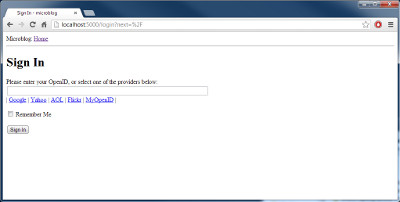
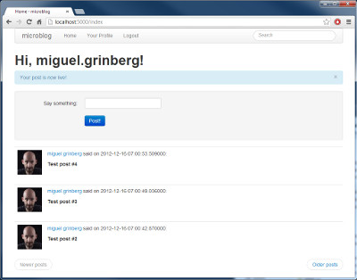
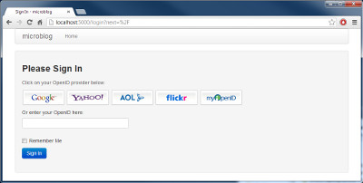

Это двенадцатая статья в серии, где я описываю свой опыт написания веб-приложения на Python с использованием микрофреймворка Flask.  
  
Цель данного руководства — разработать довольно функциональное приложение-микроблог, которое я за полным отсутствием оригинальности решил назвать`microblog`.<!--more-->

## Краткое повторение

Если вы играли с нашим микроблогом, то вы заметили что он выглядит не лучшим образом. До сих пор мы использовали базовые шаблоны, без какой-либо стилизации. Это было полезно, потому что мы не хотели отвлекаться от написания кода, чтобы делать красивый HTML.  
  
Мы усердно трудились, кодируя логику до текущего момента, поэтому сейчас мы сделаем перерыв и посмотрим как мы можем сделать наше приложение чуточку красивей для наших пользователей.  
  
Эта статья будет немного отличаться от предыдущих, потому что написание привлекательного HTML\\CSS это обширная тема, которая выходит за рамки нашей серии. Здесь не будет подробного HTML или CSS, мы просто обсудим основные принципы и идеи как подходить к этой задаче.

## Как мы это делаем?

  
  
Трудности написания кода ничто по сравнению с тем как веб-дизайнеры создают красивые шаблоны, которые хорошо выглядят в ряде браузеров, каждый из которых с причудами, ошибками и собственным мнением. И в наше время ситуация усугубляется тем, что сайты, помимо браузеров, должны хорошо выглядеть еще и ограниченных в ресурсах браузерах телефонов и планшетов.  
  
К сожалению, изучение HTML, CSS и JavaScript и борьба с уникальными особенностями каждого браузера это задача неопределенных размеров. У нас реально нет времени (или интереса) чтобы это делать. Мы просто хотим сделать наше приложение лучше без дополнительных усилий.  
  
Итак, как мы можем выполнить эту задачу в таких условиях?

## Введение в Bootstrap

  
  
Наши хорошие друзья из Twitter выпустили веб-фреймворк с открытым исходным кодом, называемый Bootstrap, который может быть нашим выигрышным билетом.  
  
Bootstrap это коллекция CSS и Javascript утилит, для большинства типов веб-страниц. Если вы хотите увидеть преимущества, которые мы получим разрабатывая с этим фреймворком, вот несколько примеров.  
  
Вот несколько вещей в которых Bootstrap хорош:

- Одинаковое отображение в разных браузерах
- Отработка размеров экрана планшетов, телефонов и настольных браузеров
- Настраиваемые layouts
- Полностью стилизованная панель навигации
- Полностью стилизованные формы
- И еще много всего...

## Прикручиваем Bootstrap к нашему приложению

  
  
Прежде чем мы сможем добавить Bootstrap в наше приложение мы должны установить CSS, Javascript и изображения входящие во фреймворк в место, в котором наш веб-сервер сможет их найти.  
  
В приложениях Flask статичные файлы хранятся в каталоге `app/static`. Веб-сервер знает что искать файлы стоит в этом каталоге, когда в URL есть префикс `/static`.  
  
Для примера, если мы положим файл с именем `image.png` в каталог `/app/static`, тогда в HTML шаблоне мы можем показать изображение с помощью такого тега:

```

```

Мы установим Bootstrap таким образом:

```
/app
    /static
        /css
            bootstrap.min.css
            bootstrap-responsive.min.css
        /img
            glyphicons-halflings.png
            glyphicons-halflings-white.png
        /js
            bootstrap.min.js
```

Теперь мы загрузим фреймворк указав в секции `HEAD` нашего базового шаблона следующие инструкции:

```
<!DOCTYPE html>
<html lang="en">
  <head>
    ...
    <link href="/static/css/bootstrap.min.css" rel="stylesheet" media="screen">
    <link href="/static/css/bootstrap-responsive.css" rel="stylesheet">
    <script src="http://code.jquery.com/jquery-latest.js"></script>
    <script src="/static/js/bootstrap.min.js"></script>
    <meta name="viewport" content="width=device-width, initial-scale=1.0">
    ...
  </head>
  ...
</html>
```

Тэги `link` и `script` загружают CSS и Javascript файлы предоставляемые фреймворком.  
  
Обратите внимание, что один из требуемых файлов это jQuery, который используется некоторыми плагинами Bootstrap.  
  
Тэг `meta` включает «Резиновый» режим, который позволяет масштабировать страницу для компьютеров, планшетов и телефонов.  
  
С учетом изменений в нашем `base.html` мы готовы начинать внедрять Bootstrap, который потребует незначительного изменения в наших шаблонах.  
  
Изменения, которые потребуется сделать:

- Поместить всё содержимое страницы в одну колонку с «резиновыми» возможностями.
- Адаптировать все формы для использования стилей Bootstrap.
- Заменить нашу панель навигации панелью Navbar
- Конвертировать наши ссылки «previous» и «next» на кнопки `Pager`
- Использовать стили уведомлений Bootstrap для мигающих сообщений.
- Использовать стилизованные изображения для представления провайдеров OpenID в форме логина.

Мы не будем обсуждать как сделать эти изменения, т.к. они довольно просты. Интересующиеся могут посмотреть diff на GitHub с изменениями.   
  
Справка Bootstrap поможет вам в попытке проанализировать новые шаблоны нашего приложения.  
  

## Заключение

Сегодня мы давали обещание не писать ни строчки кода, и сдержали обещание. Все улучшения мы производили в файлах шаблонов.  
  
Чтобы дать представление о масштабах трансформации, ниже представлено несколько скриншотов.

  

 

 

В следующей части мы увидим как улучшить форматирование даты и времени в нашем приложении.  
  
Miguel
