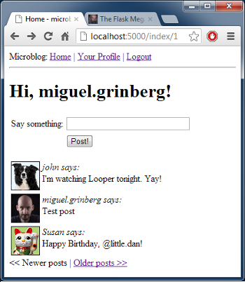

Это девятая статья в серии, где я описываю свой опыт написания веб-приложения на Python с использованием микрофреймворка Flask.  
  
Цель данного руководства — разработать довольно функциональное приложение-микроблог, которое я за полным отсутствием оригинальности решил назвать `microblog`<!--more-->

## Краткое повторение

  
  
В предыдущей статье мы внесли все необходимые изменения в базу данных, для поддержки парадигмы «подписчики», в которой пользователи могут отслеживать посты других пользователей.  
  
Сегодня мы, опираясь на то, что мы сделали в прошлый раз, доведем наше приложение до ума, чтобы оно принимало и доставляло настоящий контент для наших пользователей. Сегодня мы попрощаемся с последним из наших фейковых объектов!

## Представление сообщений в блоге

Давайте начнем с чего-то простого. Домашняя страница должна иметь пользовательскую форму для новых постов.  
Сначала мы определим объект формы с одним полем `(файл app/forms.py)`:

```
class PostForm(Form):
    post = TextField('post', validators = [Required()])
```

Далее, мы добавим форму в шаблоны `(файл app/templates/index.html)`:

```
<!-- extend base layout -->



<h1>Hi, {{g.user.nickname}}!</h1>
<form action="" method="post" name="post">
    {{form.hidden_tag()}}
    <table>
        <tr>
            <td>Say something:</td>
            <td>{{ form.post(size = 30, maxlength = 140) }}</td>
            <td>
            
            <span style="color: red;">[{{error}}]</span><br>
            
            </td>
        </tr>
        <tr>
            <td></td>
            <td><input type="submit" value="Post!"></td>
            <td></td>
        </tr>
    </table>
</form>

<p>
  {{post.author.nickname}} says: <b>{{post.body}}</b>
</p>


```

Ничего сверхъестественного, как вы можете заметить. Мы просто добавляем еще одну форму, так же как мы делали раньше.  
  
И напоследок функция представления, которая связывает все вместе `(файл app/views.py)`:

```
from forms import LoginForm, EditForm, PostForm
from models import User, ROLE_USER, ROLE_ADMIN, Post

@app.route('/', methods = ['GET', 'POST'])
@app.route('/index', methods = ['GET', 'POST'])
@login_required
def index():
    form = PostForm()
    if form.validate_on_submit():
        post = Post(body = form.post.data, timestamp = datetime.utcnow(), author = g.user)
        db.session.add(post)
        db.session.commit()
        flash('Your post is now live!')
        return redirect(url_for('index'))
    posts = [
        { 
            'author': { 'nickname': 'John' }, 
            'body': 'Beautiful day in Portland!' 
        },
        { 
            'author': { 'nickname': 'Susan' }, 
            'body': 'The Avengers movie was so cool!' 
        }
    ]
    return render_template('index.html',
        title = 'Home',
        form = form,
        posts = posts)
```

Давайте рассмотрим изменения которые мы сделали в этой функции, шаг за шагом:  
  

- Сначала мы импортируем классы `Post` и `PostForm`
- Мы принимает POST-запросы с обоих маршутов, связаных с функцией представления `index()`, здесь мы будем принимать новые посты.
- Прежде чем пост сохранится в базу он попадает в эту функцию. Когда мы попадаем в эту функцию через GET, всё происходит как и раньше.
- Шаблон теперь получает дополнительный аргумент, форму, которую он рендерит в текстовые поля.

  
И напоследок, перед тем как мы продолжим. Обратите внимание, что перед записью нового поста в базу мы делаем это:

```
return redirect(url_for('index'))
```

Мы можем с легкостью пропустить этот редирект и перейти к рендерингу. Возможно это даже будет эффективней. Потому что все что делает этот редирект, на самом деле, это возвращает нас в эту же самую функцию.  
  
Итак, почему редирект? Рассмотрим что происходит, когда пользователь пишет пост в блог, публикует его и жмет кнопку «Обновить». Что делает команда «Обновить»? Браузер повторно отправляет предыдущий запрос.  
  
Без редиректа, последний был POST-запрос, который отправил форму, поэтому действие «Обновить» повторно пошлет этот запрос, в результате чего мы получим второй пост, идентичный первому. Это плохо.  
  
Но с редиректом мы заставим браузер выдает еще один запрос после отправки формы. Это простой GET-запрос, и теперь кнопка «Обновить» будет просто еще раз загружать страницу, вместо повторной отсылки формы.  
  
Этот простой трюк позволяет избежать вставки дубликатов сообщения, если пользователь случайно обновляет страницу, после публикации поста.

## Отображение сообщений в блоге

Переходим к самому интересному. Мы собираемся вытащить из базы посты и отобразить их.  
  
Если вы помните, несколько статей назад, мы сделали пару фейковых постов и мы показывали их на нашей главной странице долгое время. Эти фейковые объекты были созданы явным образом в функции представления в виде списка Python:

```
posts = [
        { 
            'author': { 'nickname': 'John' }, 
            'body': 'Beautiful day in Portland!' 
        },
        { 
            'author': { 'nickname': 'Susan' }, 
            'body': 'The Avengers movie was so cool!' 
        }
    ]
```

Но в последней статье мы создали запрос, которых позволяет на получить все сообщения от людей на которых подписан пользователь, так что мы можем просто заменить вышеуказанные строки `(файл app/views.py)`:

```
 posts = g.user.followed_posts().all()
```

 

Теперь, когда вы запустите приложение, вы увидите посты из базы данных!  
  
Метод `followed_post` класса `User` возвращает объект `query` sqlalchemy который сконфигурирован чтобы вытащить интересущие нас сообщения. Вызвав метод `all()` на этом объекте мы получим все посты в виде листа, так что в конечном счете мы будем работать с привычной нам структурой. Они так похожи, что шаблон ничего не заметит.  
  
Сейчас вы можете поиграть с нашим приложением. Не стесняйтесь. Вы можете создать несколько пользователей, подписать их на других пользователей, и, наконец, опубликовать несколько сообщений, чтобы видеть как каждый пользователь видит свою ленту.

## Пагинация

Наше приложение выглядит лучше чем когда-либо, но есть проблема. Мы показывает все сообщения на домашней странице. Что случится, если пользователь окажется подписан на несколько тысяч человек? Или миллион? Как вы можете представить, выборка и обработка такого большого списка будет крайне неэффективна.  
  
Вместо этого, мы будем показывать потенциально большое количество постов разбив на страницы.  
  
Flask-SQLAlchemy поставляется с очень хорошей поддержкой пагинации. Если, например, мы хотим получить первые три поста от отслеживаемых пользователей, мы можем сделать так:

```
 posts = g.user.followed_posts().paginate(1, 3, False).items
```

Метод `paginate` вызывается на любом объекте `query`. Он принимает три аргумента:  
  

- Номер страницы, начиная с 1
- количество элементов на страницу,
- и флаг error. Если флаг выставлен в True, когда происходит выход за пределы списка, клиенту возвращается ошибка 404.
- В противном случает будет возвращен пустой список вместо ошибки.

  
  
Метод `paginate` возвращает объект Pagination. Члены этого объекта содержат список элементов запрошеной страницы. В объекте Pagination есть и другие полезные вещи, но их мы рассмотрим чуть позже.  
  
Давайте подумаем, как мы можем реализовать пагинацию в нашей функции представления index(). Мы можем начать с добавления элемента конфигурации нашего приложения, который определяет сколько элементов на странице мы будем показывать.

```
# pagination
POSTS_PER_PAGE = 3
```

Это хорошая идея, хранить глобальные настройки приложения, которые могут влиять на поведение, в одном месте.  
  
В финальном приложении мы, конечно, будем использовать число больше 3, но для тестирования удобней работать с небольшим количеством.  
  
Далее, давайте решим сейчас как будут выглядеть URL с запросом страницы. Мы видели раньше что Flask позволяет принимать аргументы в маршрутах, так что мы можем добавить суффикс, который укажет на нужную страницу:

```
http://localhost:5000/         <-- page #1 (default)
http://localhost:5000/index    <-- page #1 (default)
http://localhost:5000/index/1  <-- page #1
http://localhost:5000/index/2  <-- page #2
```

Такой формат URL может быть легко реализован с помощью дополнительного маршрута в нашем представлении `(файл app/views.py)`:

```
from config import POSTS_PER_PAGE

@app.route('/', methods = ['GET', 'POST'])
@app.route('/index', methods = ['GET', 'POST'])
@app.route('/index/<int:page>', methods = ['GET', 'POST'])
@login_required
def index(page = 1):
    form = PostForm()
    if form.validate_on_submit():
        post = Post(body = form.post.data, timestamp = datetime.utcnow(), author = g.user)
        db.session.add(post)
        db.session.commit()
        flash('Your post is now live!')
        return redirect(url_for('index'))
    posts = g.user.followed_posts().paginate(page, POSTS_PER_PAGE, False).items
    return render_template('index.html',
        title = 'Home',
        form = form,
        posts = posts)
```

Наш новый маршрут дергает аргумент с номером страницы и объявляет его как целое число. Нам также нужно добавить этот аргумент в функцию `index()` и выставить значение по уполчанию, потому что два из трех маршрутов не используют этот аргумент, и для них он будет использоваться со значением по умолчанию.  
  
Сейчас, когда у нас есть номер страницы, мы можем его легко подключить к нашему запросу `followed_posts`, вместе с переменной `POSTS_PER_PAGE`, которую мы определили ранее.  
  
Обратите внимание, как легко проходят эти изменения, и как мало изменяется код. Мы пытаемся писать каждую часть приложения, не пытаясь предполагать как работают другие части, что позволяет нам строить модульные и надежные приложения, которые легко тестировать.  
  
Сейчас вы можете испытать пагинацию, вводя URL с разными номерами строк в адресную строку браузера. Убедитесь что доступно более трех постов, которые вы видите на странице.

## Навигация по страницам

Теперь нам нужно добавить ссылки с помощью которых пользователь сможет перемещаться к следующей/предыдущей странице, и к счастью для нас Flask-SQLAlchemy сделает большую часть работы.  
  
Мы собираемся начать внеся небольшие изменения в функцию представления. В нашей текущей версии мы используем пагинацию следующим образом:

```
posts = g.user.followed_posts().paginate(page, POSTS_PER_PAGE, False).items
```

Делая это, мы только сохраняем элементы объекта Pagination, возвращаемого методом paginate. Но этот объект предоставляет несколько очень полезных возможностей, так что мы будем хранить весь объект целиком `(файл app/views.py)`:

```
posts = g.user.followed_posts().paginate(page, POSTS_PER_PAGE, False)
```

Чтобы копменсировать это изменение, мы должны изменить шаблон `(файл app/templates/index.html)`:

```
<!-- posts is a Paginate object -->

<p>
  {{post.author.nickname}} says: <b>{{post.body}}</b>
</p>


```

Что нам дает объект Paginate в шаблоне. Вот методы объекта, которые мы будем использовать:  
  

- has\_next: True есть есть хоть одна страница после текущей
- has\_prev: True если есть хоть одна страница перед текущей
- next\_num: номер следующей страницы
- prev\_num: номер предыдущей страницы

С их помощью мы можем сделать следующее `(файл app/templates/index.html)`:

```
<!-- posts is a Paginate object -->

<p>
  {{post.author.nickname}} says: <b>{{post.body}}</b>
</p>

<a href="{{ url_for('index', page = posts.prev_num) }}"><< Newer posts</a><< Newer posts | 
<a href="{{ url_for('index', page = posts.next_num) }}">Older posts >></a>Older posts >>
```

Теперь у нас есть две ссылки. Вначале мы покажем ссылку «Newer posts», которая отправит нас к предыдущей странице, к новым постам. С другой стороны «Older posts» отправит нас на следующую страницу, к более старым постам.  
  
Но, когда мы находимся на первой странице, ссылка на предыдущую страницу нам не нужна. Такой случай легко отследить по методу posts.has\_prev, который вернет False. В этом случае мы показываем текст ссылки, но без самой ссылки. Ссылка не следующую страницу обрабатывается таким же образом.

## Реализация подшаблона Post

Ранее, в статье, в которой мы добавляли аватар, мы определим подшаблон с HTML кодом рендеринга одиночного поста. Мы сделали этот шаблон, чтобы избавиться от дублирования кода, если захотим рендерить посты на разных страницах.  
  
Настало время реализации этого подшаблона на главной странице Это будет так же просто, как и большинство вещей, которые мы делаем сегодня `(файл app/templates/index.html)`:

```
<!-- posts is a Paginate object -->

    

```

Удивительно, да? Мы просто заменили старый код рендеринга на include нашего шаблона. Таким образом мы получим более хорошую версию рендеринга, с аватаром пользователя.  
  
Вот скриншот главной страницы в текущем состоянии:



## Страница с профилем пользователя

 

Сейчас мы закончили с главной страницей. Мы также включили сообщения в профиле пользователя, но не все, а только владельца профиля. Чтобы быть последовательными мы должны изменить страницу профиля, чтобы он соответствовал главной странице.

Изменения аналогичны тем, которые мы сделали на главной странице. Вот краткий список того, что нам нужно сделать:

- добавить дополнительный маршрут, который принимает номер страницы
- добавить аргумент с номером страницы в функцию представления и присвоить ему 1
- заменить фейковые посты настоящими из базы и разбить их на страницы
- обновить шаблон для использования объекта pagination

Это обновления функции представления (файл app/views.py):

```
@app.route('/user/<nickname>')
@app.route('/user/<nickname>/<int:page>')
@login_required
def user(nickname, page = 1):
    user = User.query.filter_by(nickname = nickname).first()
    if user == None:
        flash('User ' + nickname + ' not found.')
        return redirect(url_for('index'))
    posts = user.posts.paginate(page, POSTS_PER_PAGE, False)
    return render_template('user.html',
        user = user,
        posts = posts)
```

`Обратите внимание, что эта функция уже имеет аргумент (никнейм пользователя), поэтому мы добавим номер страницы как второй аргумент.`  
  
Изменения в шаблоне тоже довольно просты `(файл app/templates/user.html)`:

```
<!-- posts is a Paginate object -->

    

<a href="{{ url_for('user', nickname = user.nickname, page = posts.prev_num) }}"><< Newer posts</a><< Newer posts | 
<a href="{{ url_for('user', nickname = user.nickname, page = posts.next_num) }}">Older posts >></a>Older posts >>
```

 

## Заключительные слова

  
Ниже я выкладываю обновленную версию приложения `microblog` во всеми изменениями, сделанными в этой статье.  
  
Скачать [microblog-0.9.zip.](https://github.com/miguelgrinberg/microblog/archive/v0.9.zip)  
  
Как всегда, базы данных нет, вы должны создать ее самостоятельно. Если вы следите за этой серией статей, вы знаете как это делать. Если же нет, то вернитесь к статье о базе данных, чтобы узнать.  
  
Как всегда, я благодарю за то что следите за мной. Я надеюсь увидеть вас в следующей статье.

 

