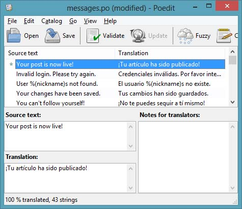

Темами сегодняшней статьи являются Интернационализация и Локализация, сокращенно I18n и L10n. Мы хотели бы сделать наш microblog доступным как можно большему числу людей, поэтому мы не должны забывать что много людей в мире не владеют английским языком, или, возможно, владеют, но предпочитают свой родной язык.  
<!--more-->

Чтобы сделать наше приложение доступным для иностранных посетителей, мы будем использовать расширение [Flask-Babel](http://packages.python.org/Flask-Babel/), которое представляет собой простой в использовании фреймворк для перевода приложения на различные языки.  
  
Если вы еще не установили Flask-Babel, то пришло время это сделать. Для пользователей Linux и Mac:

```
flask/bin/pip install flask-babel
```

 

И для пользователей Windows:

```
flask\Scripts\pip install flask-babel
```

**Настройка**

Flask-Babel инициализируется простым созданием экземпляра класса Babel и передачей в него нашего основного приложения Flask (файл app/\_\_init\_\_.py):

```
from flask.ext.babel import Babel
babel = Babel(app)
```

 

Мы также должны решить, какие языки мы будем поддерживать в нашем приложении. Давайте начнем с поддержки испанского языка, т. к. у нас под рукой имеется переводчик с этого языка(Ваш покорный слуга), но не переживайте — в будущем будет достаточно просто добавить поддержку и других языков языков. Список поддерживаемых языков мы поместим в наш конфигурационный файл (файл config.py):

```
# -*- coding: utf-8 -*-
# ...
# available languages
LANGUAGES = {
    'en': 'English',
    'es': 'Espa?ol'
}
```

 

Словарь LANGUAGES содержит ключи представляющие собой коды поддерживаемых языков, а значения — названия языков. Здесь мы используем короткие версии кодов, но при необходимости также могут быть использованы полные коды, указывающие язык и регион. Например, если мы захотим поддерживать Британский и Американский вариации английского языка по отдельности, мы сможем добавить 'en-US' и 'en-GB' в наш словарь.  
  
Обратите внимание, что т. к. слово Espa?ol содержит символ не входящий в базовый набор ascii символов, мы должны добавить строку-комментарий coding в начало файла, чтобы сообщить интерпретатору python что мы используем кодировку UTF-8, а не ascii (в которой, естественно, отсутствует символ ?).  
  
Следующим шагом в настройке, будет создание функции, которую будет использовать Babel для определения того, какой язык использовать (файл app/views.py):

```
from app import babel
from config import LANGUAGES

@babel.localeselector
def get_locale():
    return request.accept_languages.best_match(LANGUAGES.keys())
```

Эта функция, обёрнутая декоратором localeselector, будет вызываться перед каждым запросом, давая нам шанс выбрать язык для генерации ответа. Для начала мы применим очень простой подход, мы будем читать содержимое заголовка Accept-Languages, пришедшего от браузера вместе с http запросом и будем выбирать максимально подходящий язык из нашего списка поддерживаемых языков. На деле, это еще проще чем кажется — метод best\_match сделает всю работу за нас.  
  
Заголовок Accept-Languages в большинстве браузеров по умолчанию содержит язык, установленный основным в ОС, но все браузеры предоставляют пользователю возможность выбрать другие языки. Пользователь даже может указать список языков, с указанием приоритета (веса) каждого языка. В качестве примера рассмотрим сложный заголовок Accept-Languages:

```
Accept-Language: da, en-gb;q=0.8, en;q=0.7
```

Этот заголовок сообщает нам, что предпочитаемым языком пользователя является датский (вес = 1.0), далее идет Британский английский (вес = 0.8) и последним вариантом идет просто английский язык (без указания региона) (вес = 0.7).  
  
И последним шагом в настройке, будет конфигурационный файл Babel, который подскажет Babel где искать тексты для перевода, содержащиеся в нашем коде и шаблонах (файл babel.cfg):

```
[python: **.py]
[jinja2: **/templates/**.html]
extensions=jinja2.ext.autoescape,jinja2.ext.with_
```

Первые две строки сообщают Babel паттерны имен файлов для наших файлов с кодом на python и шаблонов соответственно. Третья строка сообщает Babel расширения, которые необходимо активировать, и благодаря которым становится возможным поиск подлежащего переводу текста в шаблонах Jinja2. 
  

#### **Отмечаем текст для перевода**

  
Приступаем к самому утомительному этапу этой задачи. Мы должны пересмотреть весь наш код и шаблоны и отметить все английские предложения, подлежащие переводу так, чтобы Babel смог их найти. Для примера, взгляните на этот фрагмент кода функции after\_login:

```
if resp.email is None or resp.email == "":
    flash('Invalid login. Please try again.')
    redirect(url_for('login'))
```

Здесь у нас имеется flash сообщение, которые мы хотели бы перевести. Чтобы отметить этот текст для Babel, мы просто передадим строку в функцию gettext():

```
from flask.ext.babel import gettext
# ...
if resp.email is None or resp.email == "":
    flash(gettext('Invalid login. Please try again.'))
    redirect(url_for('login'))
```

 

В шаблоне мы поступим похожим образом, но тут у нас есть альтернативный вариант — использовать функцию \_(), которая по сути является псевдонимом для всё той же функции gettext(). Например, слово Home в ссылке из нашего базового шаблона:

```
<li><a href="{{ url_for('index') }}">Home</a></li>
```

может быть отмечено для перевода следующим образом:

```
<li><a href="{{ url_for('index') }}">{{ _('Home') }}</a></li>
```

К сожалению, не весь текст который мы хотели бы перевести, так прост как представленный выше. В качестве более сложного примера, рассмотрим следующий фрагмент кода из нашего шаблона post.html:

```
<p><a href="{{url_for('user', nickname = post.author.nickname)}}">{{post.author.nickname}}</a> said {{momentjs(post.timestamp).fromNow()}}:</p>
```

Здесь предложение, которое мы бы хотели перевести имеет следующую структуру: "<nickname> said <when>". Весьма заманчиво отметить для перевод только лишь слово «said», но мы не можем быть на 100% уверены, что порядок следования имени и времени в предложении, будет одинаковым в различных языках. Правильным решением тут будет отметить всё предложение целиком для перевода, используя заполнители (placeholders) для имени и времени, так, чтобы переводчик мог изменить порядок следования при необходимости. Ситуация, кроме того, усложняется еще и тем, что компонент name является ссылкой!  
  
Не существует простого и красивого варианта решения этой задачи. Функция gettext поддерживает зполнители (placeholders) используя синтаксис %(name) и это всё, что мы можем сделать. Вот простой пример применения заполнителей в гораздо более простой ситуации:

```
gettext('Hello, %(name)s', name = user.nickname)
```

Переводчик должен знать, что здесь имеются заполнители и их не нужно касаться. Понятно, что имя заполнителя (то, что находится между «%(« и «)s») не должно переводиться, иначе мы просто потеряем истинное значение переменной.  
Но вернемся к нашему шаблону поста. Вот как мы отметим текст подлежащий переводу:

```
% autoescape false %}
<p>{{ _('%(nickname)s said %(when)s:', nickname = '<a href="%s">%s</a>' % (url_for('user', nickname = post.author.nickname), post.author.nickname), when = momentjs(post.timestamp).fromNow()) }}</p>

```

Текст, который увидит переводчик для этого примера:

```
%(nickname)s said %(when)s:
```

Что вполне неплохо. Значение переменных nickname и when это то, что составляет основную сложность переводимого предложения, но они передаются как дополнительные аргументы в функцию \_() и не видимы переводчику.  
Заполнители nickname и when содержат в себе много чего. В частности, для nickname мы должны создать целую гиперссылку, т. к. мы хотим чтобы имя пользователя было ссылкой на его профиль.  
  
Т.к. заполнитель nickname содержит в себе html, мы должны отключить автоэкранирование при рендеринге, в противном случае Jinja2 отрендерит наши html элементы как экранированный текст. Однако, запрос на рендеринг строки без экранирования заслуженно считается угрозой безопасности, это очень небезопасно рендерить текст введенный пользователем без экранирования.  
  
Текст, который будет присвоен заполнителю when безопасен, т. к. это текст полностью сгенерированный нашей функцией momentjs(). Значение, которое попадет на место заполнителя nickname, однако, происходит из поля nickname нашей модели User, который, в свою очередь, берется из базы данных, куда попадает из веб формы, заполненной пользователем. Если кто-то зарегистрируется в нашем приложении с ником, содержащим html разметку или javascript, а затем мы отрендерим этот ник неэкранированным, то это можно считать приглашение ко взлому. Конечно же, мы хотим избежать этого, поэтому мы проведем осмотр и удалим все потенциальные риски.  
  
Наиболее разумное решение — ограничить возможность атак, путём ограничения набора символов допустимых для использования в нике. Мы начнем с создания функции, которая бедет преобразовывать некорректные имена пользователей в корректные (файл app/models.py):

```
import re

class User(db.Model):
    #...
    @staticmethod
    def make_valid_nickname(nickname):
        return re.sub('[^a-zA-Z0-9_\.]', '', nickname)
```

Здесь мы просто удаляем из ника все символы не являющиеся буквами, цифрами, точкой или знаком подчеркивания.  
Когда пользователь регистрируется на сайте, мы получаем его(её) ник от провайдера OpenID, и преобразовываем его, в случае необходимости, в корректный вид (файл app/views.py):

```
@oid.after_login
def after_login(resp):
    #...
    nickname = User.make_valid_nickname(nickname)
    nickname = User.make_unique_nickname(nickname)
    user = User(nickname = nickname, email = resp.email, role = ROLE_USER)
    #...
```

Кроме того, в форме редактирования профиля, где пользователь может изменить свой ник, мы должны расширить валидацию проверкой нового ника на наличие недопустимых символов (file app/forms.py):

```
class EditForm(Form):
    #...
    def validate(self):
        if not Form.validate(self):
            return False
        if self.nickname.data == self.original_nickname:
            return True
        if self.nickname.data != User.make_valid_nickname(self.nickname.data):
            self.nickname.errors.append(gettext('This nickname has invalid characters. Please use letters, numbers, dots and underscores only.'))
            return False
        user = User.query.filter_by(nickname = self.nickname.data).first()
        if user != None:
            self.nickname.errors.append(gettext('This nickname is already in use. Please choose another one.'))
            return False
        return True
```

При помощи таких, довольно простых, мер, мы исключили возможность атаки при рендеринге ника на странице без экранирования.   
  

#### **Извлечение текста подлежащего переводу**

  
Я не буду перечислять здесь все необходимые изменения для отметки всего текста в коде и в шаблонах. Интересующиеся читатели могут изучить [страницу изменений](https://github.com/miguelgrinberg/microblog/commit/cac572cb0e427654edd3ac599f6197f1f6ee29f6) на GitHub.  
Давайте представим, что мы нашли весь, требующий перевода текст, и обернули его в вызовы gettext() или \_(). Что дальше?  
Теперь мы запустим pybabel для извлечения всего текста в отдельный файл:

```
flask/bin/pybabel extract -F babel.cfg -o messages.pot app
```

Пользователи Windows, используйте эту команду:

 

```
flask\Scripts\pybabel extract -F babel.cfg -o messages.pot app
```

 

Команда extract утилиты pybabel читает полученный конфигурационный файл, затем сканирует весь код и файлы шаблонов в указанных при вызове команды папках(в нашем случае только app) и когда находит текст, отмеченный для перевода, копирует его в файл messages.pot.  
Файл messages.pot представляет собой шаблонный файл, содержащий весь требующий перевода текст. Этот файл используется как образец для создания языковых файлов.

#### **Генерация справочника языка**

  
Следующим этапом является создание перевода для нового языка. Как мы и собирались, добавим поддержку испанского языка (код языка es). Вот команда, которая добавит испанский язык к поддерживаемым нашим приложением языкам:

```
flask/bin/pybabel init -i messages.pot -d app/translations -l es
```

pybabel, запущенный с параметром init принимает .pot файл к качестве входного значения и создает справочник нового языка в каталоге указанном в параметре -d для языка указанного в параметре -l. По умолчанию, Babel ожидает найти переводы в каталоге translations на одном уровне с каталогом шаблонов (templates), значит там мы их и создадим.  
  
После запуска приведенной выше команды будет создан каталог app/translations/es. Внутри будет создан еще один каталог LC\_MESSAGES, а внутри него файл messages.po. Команда может быть запущена несколько раз с разными кодами языков, для добавления поддержки этих языков.  
  
Файл messages.po, создаваемый в каждом языковом каталоге использует формат, являющийся де-факто стандартом для языковых переводов, тот самый формат который используется утилитой [gettext](http://www.gnu.org/software/gettext/). Существует много приложений для работы с .po файлами. Для нужд перевода мы будем использовать poedit, т. к. это одно из наиболее популярных приложений, являющееся кроме того кросс-платформенным.  
  
Если вы не собираетесь останавливаться, и решите совершить-таки перевод — скачайте poedit по [этой ссылке](http://www.poedit.net/). Использовать это приложение весьма просто. Ниже приведен скриншот окна программы после перевода всего текста на испанский язык:

В верхней части окна расположен текст в оригинале и на языке перевода. Внизу слева расположено окно, в которое переводчик вносит перевод.

После окончания перевода и сохранения его в файл messages.po, осталось сделать последний шаг:

```
flask/bin/pybabel compile -d app/translations
```

 

pybabel запущенный с параметром compile просто читает содержимое .po файла и сохраняет скомпилированную версию как .mo файл в том же каталоге. Этот файл содержит переведенный текст в оптимизированном виде, который может быть использован нашим приложением.  
  
Перевод готов к использованию. Чтобы проверить его, вы можете указать испанский язык предпочитаемым в настройках вашего браузера, или, если не хотите заморачиваться с настройками браузера, вы можете просто всегда возвращать «es»(код испанского языка) из функции localeselector (file app/views.py):

```
@babel.localeselector
def get_locale():
    return "es" #request.accept_languages.best_match(LANGUAGES.keys())
```

Теперь, после перезапуска сервера, при каждом вызове функции gettext() или \_() вместо английского текста, будет отдаваться перевод определяемый языком, который возвращает функция localeselector.  
  

#### **Обновление перевода**

  
Что если мы создадим messages.po неполным, т. е. если часть текста подлежащего переводу не будет в нем представлена? Ничего страшного не произойдет, просто текст не имеющий перевода будет отображаться на английском языке…  
  
Что произойдет, если мы пропустим некоторый текст на английском языке в нашем коде или в шаблонах? Все строки, которые не обернуты в вызов функции gettext() или \_() просто будут отсутствовать в файлах перевода, а следовательно Babel не будет обращать на них внимание и они останутся на английском. Как только мы заметим пропущенный текст, мы можем обернуть его в вызов функции gettext(), а затем запустить следующие команды для обновления файлов перевода:

```
flask/bin/pybabel extract -F babel.cfg -o messages.pot app
flask/bin/pybabel update -i messages.pot -d app/translations
```

Команда extract идентична использованной нами ранее, она просто генерирует обновленный файл messages.pot с новым текстом. Вызов update принимает новый файл messages.pot и добавляет новый текст во все файлы перевода найденные в каталоге указанном в параметре -d.  
  
Когда messages.po фвйлы во всех каталогах будут обновлены, мы можем снова запустить poedit для перевода новых текстов, а затем повторить команду pybabel compile чтобы сделать перевод новых текстов доступным нашему приложению.  
  

#### **Перевод moment.js**

  
Теперь, когда мы добавили испанский перевод для всего текста найденного в нашем коде и в шаблонах, мы можем запустить приложение чтобы проверить как это выглядит в реальности.  
  
И тут же мы замечаем, что все метки времени остались на английском языке. Библиотека moment.js, которую мы использовали для отображения дат и времени ничего не знает о нашем желании поддерживать еще какай-то язык.  
  
Почитав [документацию](http://momentjs.com/docs/#/i18n/loading-into-browser/) к moment.js мы обнаруживаем, что существует приличный список поддерживаемых языков и что нам просто нужно скачать еще один javascript файл с требуемым языком. Таким образом, мы просто скачиваем испанскую версию с сайта moment.js и помещаем его в каталог static/js с именем moment-es.min.js. Тут мы следуем соглашению именования файлов библиотеки moment.js по шаблону moment-<код\_языка>.min.js, чтобы иметь возможность выбрать требуемый файл динамически.  
  
Чтобы иметь возможность выбора какой javascript файл загружать, мы должны передать код языка в шаблон. Наиболее простой способ — добавить код языка в глобальную переменную g, подобно тому, как добавляется информация о пользователе (file app/views.py):

```
@app.before_request
def before_request():
    g.user = current_user
    if g.user.is_authenticated():
        g.user.last_seen = datetime.utcnow()
        db.session.add(g.user)
        db.session.commit()
        g.search_form = SearchForm()
    g.locale = get_locale()
```

И теперь когда нам в шаблоне доступен код языка, мы можем загрузить требуемый moment.js в нашем базовом шаблоне (файл app/templates/base.html):

```

<script src="/static/js/moment-{{g.locale}}.min.js"></script>

```

Заметьте, что здесь присутствуте условие, т. к. если мы отображаем английскую версию сайта, то у нас все тексты находятся в нужном виде после загрузки первого moment.js.  
  

#### **Ленивые вычисления**

  
Если мы продолжим работать с испанской версией сайта какое-то время, мы заметим еще одну проблему. Когда мы разлогиниваемся на сайте, а затем пытаемся войти снова, мы видим flash сообщение, гласящее «Please log in to access this page.» на английском языке. Откуда это сообщение? К несчастью, это не мы отображаем это сообщение, оно принадлежит и выводится сторонним расширением Flask-Login.  
  
Flask-Login позволяет пользователю настроить это сообщение, и мы собираемся воспользоваться этой возможностью но не для изменения сообщения, а для его перевода. Итак, первая попытка (file app/\_\_init\_\_.py):

```
from flask.ext.babel import gettext
lm.login_message = gettext('Please log in to access this page.')
```

Но это не работает. Функция gettext должна использоваться в контексте запроса, чтобы выдать переведенное сообщение. Если мы вызываем эту функцию вне запроса, она просто отдаст нам текст по умолчанию, а это английская версия…  
  
Для случаев вроде этого, Flask-Babel предоставляет другую функцию lazy\_gettext, которая не ищет перевод немедленно как gettext() и \_(), а вместо этого откладывает поиск до момента использования строки. А вот как правильно настроить это сообщение (file app/\_\_init\_\_.py):

```
from flask.ext.babel import lazy_gettext
lm.login_message = lazy_gettext('Please log in to access this page.')
```

И наконец, при использовании lazy\_gettext мы должны проинформировать команду pybabel extract что функция lazy\_gettext также применяется для оборачивания текста подлежащего переводу. Это можно сделать при помощи параметра -k:

```
flask/bin/pybabel extract -F babel.cfg -k lazy_gettext -o messages.pot app
```

Итак после создания очередного messages.pot, мы обновляем языковые каталоги (pybabel update), переводим добавленный текст (poedit) и снова компилируем переводы (pybabel compile).  
  
И теперь мы можем сказать, что наше приложение полностью интернационализировано!

#### **Shortcuts**

Поскольку команды pybabel довольно длинные и труднозапоминаемые, мы закончим эту статью небольшими скриптами, призванными упростить наиболее сложные задачи из увиденных нами ранее.  
Скрипт для добавления языка в каталог переводов (файл tr\_init.py):

 

```
#!flask/bin/python
import os
import sys
if sys.platform == 'win32':
    pybabel = 'flask\\Scripts\\pybabel'
else:
    pybabel = 'flask/bin/pybabel'
if len(sys.argv) != 2:
    print "usage: tr_init <language-code>"
    sys.exit(1)
os.system(pybabel + ' extract -F babel.cfg -k lazy_gettext -o messages.pot app')
os.system(pybabel + ' init -i messages.pot -d app/translations -l ' + sys.argv[1])
os.unlink('messages.pot')
```

 

Скрипт для обновления справочника новым текстом из исходных кодов и шаблонов (файл tr\_update.py):

```
#!flask/bin/python
import os
import sys
if sys.platform == 'win32':
    pybabel = 'flask\\Scripts\\pybabel'
else:
    pybabel = 'flask/bin/pybabel'
os.system(pybabel + ' extract -F babel.cfg -k lazy_gettext -o messages.pot app')
os.system(pybabel + ' update -i messages.pot -d app/translations')
os.unlink('messages.pot')
```

Скрипт для компиляции справочника (файл tr\_compile.py):

```
#!flask/bin/python
import os
import sys
if sys.platform == 'win32':
    pybabel = 'flask\\Scripts\\pybabel'
else:
    pybabel = 'flask/bin/pybabel'
os.system(pybabel + ' compile -d app/translations')
```

Эти скрипты должны превратить работу с переводом в простую задачу.  
  

#### **Заключение**

  
Сегодня мы реализовали аспект нашего приложения, который часто выпадает из поля зрения разработчика. Пользователи предпочитают иметь дело с родным языком, т.ч. мы сможем обеспечить перевод на то количество языков, какое количество переводчиков мы сможем найти. Users want to work in their native language, so being able to publish our application in as many languages as we can find translators for is a huge accomplishment.  
  
В следующей статье мы рассмотрим то, что является пожалуй наиболее сложной задачей в области I18n и L10n — автоматический перевод генерируемого пользователем контента в режиме реального времени. И мы используем это в качестве предлога для добавления некоторой Ajax магии в наше приложение.  
  
Вот ссылка на последнюю версию microblog, включая полный перевод на испанский:  
  
Скачать [microblog-0.14.zip.](https://github.com/miguelgrinberg/microblog/archive/v0.14.zip)  
  
Или, если Вам так больше нравится, вы можете найти исходный код на [GitHub](https://github.com/miguelgrinberg/microblog/tree/v0.14).  
  
Miguel

 

 

 


