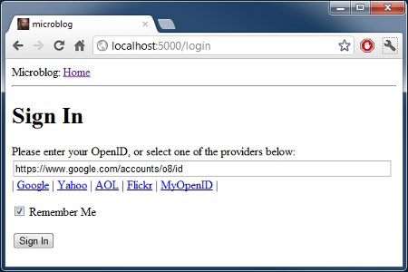

Это третья статья в серии, где я описываю свой опыт написания веб-приложения на Python с использованием микрофреймворка Flask.  
  
Цель данного руководства — разработать довольно функциональное приложение-микроблог.<!--more-->

## Краткое повторение

В предыдущей части мы определили простой шаблон для домашней страницы и использовали мнимые объекты в качестве прототипов вещей, которых у нас еще нет. К примеру пользователи или записи.  
  
В этой статье мы собираемся заполнить один из пробелов, которые есть в нашем приложении. Мы рассмотрим работу с формами.  
  
Формы являются одними из самых основных блоков в любом веб-приложении. Использование форм позволит пользователям оставлять записи в блоге, а также логиниться в приложение.  
  
Чтобы следовать этой части, ваше приложение микроблога должно быть таким, каким мы оставили его в конце предыдущей. Пожалуйста, убедитесь, что прилолжение установлено и работает.

## Конфигурация

Для обработки форм мы будем использовать расширение `Flask-WTF`, которое является оберткой `WTForms` и прекрасно интегрируется с Flask приложениями.  
  
Многие расширения Flask требуют некоторой настройки, поэтому мы создадим файл конфигурации внутри нашей корневой папки microblog, так что он будет легко доступен для изменения, если понадобится. Вот с чего мы начнем (файл config.py):

```
CSRF_ENABLED = True
SECRET_KEY = 'you-will-never-guess'
```

Все просто, это две настройки, которые нужны нашему расширению `Flask-WTF`. `CSRF_ENABLED` активирует предотвращение поддельных межсайтовых запросов. В большинстве случаев вы захотите включить эту опцию, что сделает ваше приложение более защищенным.  
  
`SECRET_KEY` нужен только тогда, когда включен `CSRF`. Он используется для создания криптографического токена, который используется при валидации формы. Когда вы пишете свое приложение, убедитесь, что ваш секретный ключ сложно подобрать.  
  
Теперь у нас есть конфиг, и мы должны сказать Flask'у прочесть и использовать его. Мы сможем сделать это сразу после того, как объект приложения Flask создан. (файл app/\_\_init\_\_.py):

```
from flask import Flask

app = Flask(__name__)
app.config.from_object('config')

from app import views
```

 

## Форма входа

В `Flask-WTF` формы представлены в виде объектов подкласса от класса `Form`. Подкласс форм просто определяет поля форм как переменные в классе.  
  
Мы создадим форму логина, которая будет использоваться вместе с системой идентификации. Механизм входа, который мы будем поддерживать в нашем приложении, не стандартного типа имя пользователя/пароль, — мы будем использовать OpenID в качестве логинов. Преимущество OpenID в том, что авторизация пройдена у провайдера OpenID, поэтому нам не нужно проверять пароли, что сделает наш сайт более защищенным для наших пользователей.  
  
OpenID логин требует только одну строку под названием OpenID. Также мы закинем чекбокс 'Запомнить меня' в форму, чтобы пользователь мог установить cookie в свой браузер, который будет помнить их логин, когда они вернутся.  
  
Напишем нашу первую форму (файл app/forms.py):

```
from flask.ext.wtf import Form
from wtforms import TextField, BooleanField
from wtforms.validators import Required

class LoginForm(Form):
    openid = TextField('openid', validators = [Required()])
    remember_me = BooleanField('remember_me', default = False)
```

Уверен, что класс говорит сам за себя. Мы импортировали класс `Form` и два класса полей, который нам понадобятся, `TextField`и `BooleanField`.  
  
Импортированный `Required` — это валидатор, функция, которая может быть прикреплена к полю, для выполнения валидации данных отправленных пользователем. Валидатор `Required` просто проверяет, что поле не было отправлено пустым. В `Flask-WTF`есть много валидаторов, мы будем использовать несколько новых в будущем.

## Шаблоны форм

  
Еще нам нужен HTML шаблон, который содержит форму. Хорошей новостью будет то, что класс `LoginForm`, который мы только что создали, знает как отдавать поля формы в HTML, поэтому нам просто нужно сконцентрироваться на макете. Вот наш шаблон логина: (файл app/templates/login.html):

```
<!-- extend from base layout -->



<h1>Sign In</h1>
<form action="" method="post" name="login">
    {{form.hidden_tag()}}
    <p>
        Please enter your OpenID:<br>
        {{form.openid(size=80)}}<br>
    </p>
    <p>{{form.remember_me}} Remember Me</p>
    <p><input type="submit" value="Sign In"></p>
</form>

```

Обратите внимание, что мы снова используем шаблон `base.html` через оператор наследования, расширяя его. Мы будем делать так со всеми нашими шаблонами, обеспечивая согласование макета на всех страницах.  
  
Есть несколько интересных отличий между обычной HTML формой и нашим шаблоном. Шаблон ожидает экземпляр класса формы, который мы только что назначили в аргументе шаблона `form`. Мы позаботимся об отправке этого аргумента шаблона в будущем, когда напишем функцию представления, которая отдает этот шаблон.  
  
Параметр шаблона `form.hidden_tag()` будет заменен скрытым полем для предотвращения CSRF, включенное в нашем файле настроек. Это поле должно быть во всех ваших формах, если CSRF включен.  
  
Поля нашей формы отданы объектом формы, вы просто должны обращаться к аргументу `{{form.field_name}}` в том месте шаблона, где должно быть вставлено поле. Некоторые поля могут принимать аргументы. В нашем случае, мы просим форму создать наше поле openid с шириной в 80 символов.  
  
Так как мы не определили кнопку отправки в классе формы, мы должны определить её как обычное поле. Поле отправки не несет каких-либо данных, поэтому нет нужды определять его в классе формы.

## Представления форм

  
Последним шагом перед тем, как мы сможем увидеть нашу форму, будет написание функции представления, которая отдает шаблон.  
  
На самом деле это весьма просто, так как мы должны всего лишь передать объект формы в шаблон. вот наша новая функция представления (файл app/views.py):

```
from flask import render_template, flash, redirect
from app import app
from forms import LoginForm

# функция представления index опущена для краткости

@app.route('/login', methods = ['GET', 'POST'])
def login():
    form = LoginForm()
    return render_template('login.html', 
        title = 'Sign In',
        form = form)
```

Мы импортировали наш класс `LoginForm`, создали его экземпляр и отправили в шаблон. Это все что нужно для того, чтобы отрисовать поля формы.  
  
Не будем обращать внимания на импорт `flash` и `redirect`. Мы используем их чуть позже.  
  
Еще одно нововведение — это аргументы метода в декораторе `route`. Здесь мы говорим Flask, что функция представления принимает `GET` и `POST` запрос. Без этого представление будет принимать только `GET` запросы. Мы хотим получать `POST` запросы, которые будут отдавать форму с веденными пользователем данными.  
  
На этой стадии вы можете запустить приложение и посмотреть на вашу форму в браузере. После запуска откройте адрес, который мы связали с функцией представления login: [http://localhost:5000/login](http://localhost:5000/login)  
  
Мы еще не запрограммировали ту часть, которая принимает данные, поэтому нажатие на кнопку submit не принесет никакого эффекта.  
  
Получение данных формы  
Еще одна область, где `Flask-WTF` облегчает нашу работу — обработка отправленных данных. Это новая версия нашей функции представления `login`, которая валидирует и сохраняет данные формы (файл app/views.py):

```
@app.route('/login', methods = ['GET', 'POST'])
def login():
    form = LoginForm()
    if form.validate_on_submit():
        flash('Login requested for OpenID="' + form.openid.data + '", remember_me=' + str(form.remember_me.data))
        return redirect('/index')
    return render_template('login.html', 
        title = 'Sign In',
        form = form)
```

Метод `validate_on_submit` делает весь процесс обработки. Если вы вызвали метод, когда форма будет представлена пользователю (т.е. перед тем, как у пользователя будет возможность ввести туда данные), то он вернет `False`, в таком случае вы знаете, что должны отрисовать шаблон.  
  
Если `validate_on_submit` вызывается вместе как часть запроса отправки формы, то он соберет все данные, запустит любые валидаторы, прикрепленные к полям, и если все в порядке вернет `True`, что указывает на валидность данных. Это означает, что данные безопасны для включения в приложение.  
  
Если как минимум одно поле не проходит валидацию, тогда функция вернет `False` и это снова вызовет отрисовку формы перед пользователем, тем самым дав возможность исправить ошибки. Позже мы научимся показывать сообщения об ошибке, когда не проходит валидация.  
  
Когда `validate_on_submit` возвращает `True`, наша функция представления вызывает две новых функции, импортированных из Flask. Функция `Flash` — это быстрый способ отображения сообщения на следующей странице, представленной пользователю. В данном случае мы будем использовать это для отладки до тех пор, пока у нас нет инфраструктуры, необходимой для логирования, вместо этого мы просто будем выводить сообщение, которое будет показывать отправленные данные. Также `flash`чрезвычайно полезен на продакшн сервере для обеспечения обратной связи с пользователем.  
  
Flash сообщения не будут автоматически появляться на нашей странице, наши шаблоны должны отображать сообщени в том виде, который подходит для макета нашего сайта. Мы добавим сообщения в базовый шаблон, так что все наши шаблоны наследуют эту функциональность. Это обновленный шаблон base (файл app/templates/base.html):

```
<html>
  <head>
    
    <title>{{title}} - microblog</title>
    
    <title>microblog</title>
    
  </head>
  <body>
    <div>Microblog: <a href="/index">Home</a></div>
    <hr>
    
    
    <ul>
    
        <li>{{ message }} </li>
    
    </ul>
    
    
    
  </body>
</html>
```

Надеюсь способ отображения сообщений не требует пояснений.  
  
Другая новая функция, которую мы использовали в нашем представлении login — `redirect`. Эта функция перенаправляет клиентский веб-браузер на другую страницу, вместо запрашиваемой. В нашей функции представления мы использовали редирект на главную страницу, разработанную в предыдущих частях. Имейте в виду, что flash сообщения будут отображены даже если функция заканчивается перенаправлением.  
  
Прекрасное время для того, чтобы запустить приложение и проверить как работают формы. Попробуйте отправить форму с пустым полем openid, чтобы увидеть как валидатор `Required` останавливает процесс передачи.

## Улучшение валидации полей

С приложением в его текущем состоянии, переданные с неверными данными формы не будут приняты. Вместо этого форма снова будет отдана пользователю для исправления. Это именно то, что нам нужно.  
  
Что мы пропустили, так это уведомления пользователя о том, что именно не так с формой. К счастью, `Flask-WTF` также облегчает эту задачу.  
  
Когда поле не проходит валидацию `Flask-WTF` добавляет наглядное сообщение об ошибке в объект формы. Эти сообщения доступны в шаблоне, так что нам просто нужно добавить немного логики для их отображения.

Это наш шаблон login с сообщениями валидации полей (файл app/templates/login.html):

```
<!-- extend base layout -->



<h1>Sign In</h1>
<form action="" method="post" name="login">
    {{form.hidden_tag()}}
    <p>
        Please enter your OpenID:<br>
        {{form.openid(size=80)}}<br>
        
        <span style="color: red;">[{{error}}]</span>
        <br>
    </p>
    <p>{{form.remember_me}} Remember Me</p>
    <p><input type="submit" value="Sign In"></p>
</form>

```

Единственное изменение, которое мы сделали — добавили цикл, отрисовывающий любые добавленные валидатором сообщения об ошибках справа от поля openid. Как правило, любые поля имеющие прикрепленные валидаторы будут иметь ошибки, добавленные как `form.errors.имя_поля`. В нашем случае иы используем `form.errors.openid`. Мы отображаем эти сообщения в красном цвете, чтобы обратить на них внимание пользователя.

#### Взаимодействие с OpenID

  
На деле, мы будем сталкиваться с тем, что много людей даже не знают, что у них уже есть парочка OpenID. Не слишком известно, что ряд крупных поставщиков услуг в интернете поддерживает OpenID аутентификацию для их пользователей. Например, если у вас есть аккаунт в Google, то с ним у вас есть и OpenID. Так же как и в Yahoo, AOL, Flickr и множестве других сервисов.  
  
Чтобы облегчить пользователю вход на наш сайт с одним из часто используемых OpenID, мы добавим ссылки на часть из них, чтобы пользователю не нужно было вводить OpenID вручную.  
  
Начнем с определения списка OpenID провайдеров, которых мы хотим представить. Мы можем сделать это в нашем файле конфигурации (файл config.py):

```
OPENID_PROVIDERS = [
    { 'name': 'Google', 'url': 'https://www.google.com/accounts/o8/id' },
    { 'name': 'Yahoo', 'url': 'https://me.yahoo.com' },
    { 'name': 'AOL', 'url': 'http://openid.aol.com/<username>' },
    { 'name': 'Flickr', 'url': 'http://www.flickr.com/<username>' },
    { 'name': 'MyOpenID', 'url': 'https://www.myopenid.com' }]
```

Теперь посмотрим как мы используем этот список в нашей функции представления login:

```
@app.route('/login', methods = ['GET', 'POST'])
def login():
    form = LoginForm()
    if form.validate_on_submit():
        flash('Login requested for OpenID="' + form.openid.data + '", remember_me=' + str(form.remember_me.data))
        return redirect('/index')
    return render_template('login.html', 
        title = 'Sign In',
        form = form,
        providers = app.config['OPENID_PROVIDERS'])
```

Тут мы получаем настройки путем их поиска по ключу в `app.config`. Дальше список добавляется в вызов `render_template` как аргумент шаблона.  
  
Как вы догадались, нам нужно сделать еще один шаг, чтобы покончить с этим. Сейчас нам нужно указат как мы хотели бы отображать ссылки на этих провайдеров в нашем шаблоне login (файл app/templates/login.html):

```
<!-- extend base layout -->



<script type="text/javascript">
function set_openid(openid, pr)
{
    u = openid.search('<username>')
    if (u != -1) {
        // openid requires username
        user = prompt('Enter your ' + pr + ' username:')
        openid = openid.substr(0, u) + user
    }
    form = document.forms['login'];
    form.elements['openid'].value = openid
}
</script>
<h1>Sign In</h1>
<form action="" method="post" name="login">
    {{form.hidden_tag()}}
    <p>
        Please enter your OpenID, or select one of the providers below:<br>
        {{form.openid(size=80)}}
        
        <span style="color: red;">[{{error}}]</span>
        <br>
        |
        <a href="javascript:set_openid('{{pr.url}}', '{{pr.name}}');">{{pr.name}}</a> |
        
    </p>
    <p>{{form.remember_me}} Remember Me</p>
    <p><input type="submit" value="Sign In"></p>
</form>

```

Шаблон получился несколько длинным в связи со всеми этими изменениями. Некоторые OpenID включают в себя имена пользователей, для них у нас должно быть немного javascript магии, которая запрашивает имя пользователя, а затем создает OpenID. Когда пользователь кликает на ссылку OpenID провайдера и (опционально) вводит имя пользователя, OpenID для этого провайдера вставляется в текстовое поле.

[](http://18.185.47.240/wp-content/uploads/2014/06/28e47442e5989eec16bfc7158009255d.jpg)

_скриншот нашей страницы входа после нажатия на ссылку Google OpenID_

## Заключительные слова

  
Хотя мы добились большого прогресса с нашими формами логина, в действительности мы не сделали ничего для входа пользователей в нашу систему. Все что мы сделали имело отношение к GUI процесса входа. Это потому, что прежде чем мы сможем сделать реальные логины, нам нужно иметь базу данных, где мы можем записывать наших пользователей.   
  
В следующей части мы мы поднимем и запустим нашу базу данных, чуть позже мы завершим нашу систему входа, так что следите за обновлениями следующих статей.

Взято: http://habrahabr.ru/post/194062/


