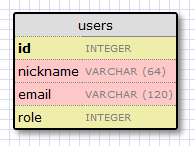

Это четвертая статья в серии, где я описываю свой опыт написания веб-приложения на Python с использованием микрофреймворка Flask.  
  
Цель данного руководства — разработать довольно функциональное приложение-микроблог<!--more-->

## Краткое повторение

В предыдущей части мы создали нашу форму входа в комплекте с представлением и валидацией.  
  
В этой статье мы намереваемся создать нашу базу данных и поднять ее, чтобы мы могли записывать туда наших пользователей.  
  
Чтобы следовать этой части, ваше приложение микроблога должно быть таким, каким мы оставили его в конце предыдущей. Пожалуйста, убедитесь, что прилолжение установлено и работает.

## Запуск Python скриптов из командной строки

В этой части мы собираемся написать несколько скриптов, которые упростят управление нашей базой данных. Прежде чем мы приступим, давайте рассмотрим как же выполняются Python скрипты из командной строки.  
  
Если вы пользователь Linux или OS X, то скриптам нужно дать права на исполнение:

```
chmod a+x script.py
```

У скрипта есть shebang линия (_**Прим. перев.:**В Unix, если первыми двумя байтами исполняемого файла являются "#!", ядро обрабатывает файл как сценарий, а не как машинный код. Слово после "!" (т.е. все до первого пробела) используется в качестве пути к интерпретатору._), которая определяет какой интерпретатор должен быть использован. Скрипт с выданными правами на исполнение и shebang линией может быть легко запущен так:

```
./script.py <аргументы>
```

а Windows, однако, это не сработает, и вместо этого вы должны передать скрипт как аргумент выбранному интерпретатору Python:

```
flask\Scripts\python script.py <аргументы>
```

Чтобы избежать необходимости вводить путь к интерпретатору, вы можете добавить вашу директорию microblog\\flask\\Scripts в системный PATH, убедившись что он \[путь к интерпретатору\] написан до вашего постоянного интерпретатора.  
  
Впредь в этом руководстве для краткости будет использоваться синтаксис Linux/OS X. Если вы пользователь Windows, то не забывайте соответствующе изменять синтаксис.

## Базы данных во Flask

Для управления нашим приложением мы будем использовать расширение `Flask-SQLAlchemy`. Это расширение предоставляет собой обертку для проекта `SQLAlchemy`, который является ORM или Объектно-реляционным отображением (англ. Object-relational mapping).  
  
ORM позволяет приложениям БД работать с объектами вместо таблиц или SQL. Операции выполняются над объектами, а потом прозрачно транслируются в команды БД при помощи ORM. Фактически это означает, что мы не будем изучать SQL в этом руководстве, а позволим Flask-SQLAlchemy говорить на SQL за нас.

## Миграции

Большинство руководств, которые я видел, затрагивают создание и использование БД, но не рассматриваются должным образом проблемы обновления базы из-за роста приложения. Обычно все это кончается удалением старой базы и созданием новой каждый раз, когда вам нужно провести обновление, теряя все данные. И если данные не могут быть легко воссозданы, то вам, возможно, придется написать скрипты экспорта и импорта самостоятельно.  
  
К счастью, у нас есть вариант куда лучше.  
  
Мы собираемся использовать `SQLAlchemy-migrate`, чтобы отслеживать для нас обновление БД. Это добавит немного работы, чтобы запустить базу, но это малая цена для того, чтобы никогда не беспокоиться о ручной миграции базы данных.  
  
Хватит теории, пора приступать!

## Конфигурация

Для нашего маленького приложения мы будем использовать `sqlite`. Эти базы данных — самый подходящий выбор для маленьких приложений, так как каждая база хранится в отдельном файле.  
  
У нас есть парочка пунктов, которые мы добавим в файл конфигурации (файл config.py):

```
import os
basedir = os.path.abspath(os.path.dirname(__file__))

SQLALCHEMY_DATABASE_URI = 'sqlite:///' + os.path.join(basedir, 'app.db')
SQLALCHEMY_MIGRATE_REPO = os.path.join(basedir, 'db_repository')
```

`SQLALCHEMY_DATABASE_URI` необходим для расширения `Flask-SQLAlchemy`. Это путь к файлу с нашей базой данных.  
  
`SQLALCHEMY_MIGRATE_REPO` — это папка, где мы будем хранить файлы `SQLAlchemy-migrate.`  
  
Наконец, когда мы инициализируем наше приложение, нам также понадобится инициализировать нашу БД. Вот наш обновленный init файл (файл app/\_\_init\_\_.py):

```
from flask import Flask
from flask.ext.sqlalchemy import SQLAlchemy

app = Flask(__name__)
app.config.from_object('config')
db = SQLAlchemy(app)

from app import views, models
```

Обратите внимание на два изменение, которые мы сделали в нашем init скрипте. Теперь мы создаем объект `db`, который будет нашей базой данных, и мы также импортируем новый модуль под названием `models`. Мы напишем этот модуль дальше.

## Модель базы данных

Данные, которые мы будем хранить в нашей базе данных, будут представлены набор классов, которые упоминаются в качестве базы данных моделей. Слой ORM сделает необходимые переводы, чтобы соотнести объекты, созданные из этих классов, со строками в надлежащей таблицы базы данных.  
  
Давайте начнем с создания модели, которая будет описывать наших пользователей. Используя [WWW SQL Designer tool](http://ondras.zarovi.cz/sql/demo), я сделал следующие диаграммы, чтобы изобразить таблицу наших пользователей:



Поле `id` обычно для всех моделей, оно используется как первичный ключ. Каждый пользователь в базе данных будет соотнесен с уникальным значением `id`, хранящимся в этом поле. К счастью, это делается за нас автоматически, нам просто нужно предоставить поле `id`.  
  
Поля `nickname` и `email` определены как строки (или `VARCHAR` на жаргоне баз данных), и у них определена максимальная длина, что позволит нашей базе данных оптимизировать использование места.  
  
Поле `role` — это целое число, которое мы будем использовать для отслеживания того, кто из пользователей администраторы, а кто нет.  
  
Теперь мы определились с тем, какой хотим видеть нашу таблицу. Перевести все это в код достаточно просто (файл app/models.py):

```
from app import db

ROLE_USER = 0
ROLE_ADMIN = 1

class User(db.Model):
    id = db.Column(db.Integer, primary_key = True)
    nickname = db.Column(db.String(64), index = True, unique = True)
    email = db.Column(db.String(120), index = True, unique = True)
    role = db.Column(db.SmallInteger, default = ROLE_USER)

    def __repr__(self):
        return '<User %r>' % (self.nickname)
```

Класс `User`, который мы только что создали, содержит несколько полей, определенных как переменные класса. Поля созданы как экземпляры класса `db.Column`, который принимает тип поля как аргумент, плюс другие опциональные аргументы что позволяет нам, например, указывать какие поля уникальны и индексированы.  
  
Метод `__repr__` говорит Python как выводить объекты этого класса. Мы будем использовать его для отладки

## Создание базы данных

Мы покончили с конфигурацией и моделью, теперь мы готовы создать файл с нашей базой данных. Пакет `SQLAlchemy-migrate`поставляется с инструментами командной строки и API для создания баз данных, которые позволят легко обновляться в будущем, что мы и будем делать. Я нахожу инструменты командной строки местами неудобными в использовании, поэтому вместо них я написал свой набор маленьких Python скриптов, которые вызывают API миграций.  
  
Вот скрипт, который создает базу данных (файл db\_create.py):

```
#!flask/bin/python
from migrate.versioning import api
from config import SQLALCHEMY_DATABASE_URI
from config import SQLALCHEMY_MIGRATE_REPO
from app import db
import os.path
db.create_all()
if not os.path.exists(SQLALCHEMY_MIGRATE_REPO):
    api.create(SQLALCHEMY_MIGRATE_REPO, 'database repository')
    api.version_control(SQLALCHEMY_DATABASE_URI, SQLALCHEMY_MIGRATE_REPO)
else:
    api.version_control(SQLALCHEMY_DATABASE_URI, SQLALCHEMY_MIGRATE_REPO, api.version(SQLALCHEMY_MIGRATE_REPO))
```

Отмечу, что скрипт полностью универсален. Все специфические пути импортированы из конфигурационного файла. Когда вы начнете свой собственный проект, то можете просто копировать скрипт в папку нового приложения, и он сразу будет рабочим.  
  
Чтобы создать базу данных, вам нужно просто запустить скрипт (помните, что если вы на Windows, то команда слегка отличается):

```
./db_create.py
```

После ввода команды вы получите новый файл `app.db`. Это пустая база данных sqlite, изначально поддерживающая миграции. У вас также есть директория `db_repository` с несколькими файлами внутри. В этом месте `SQLAlchemy-migrate` хранит свои файлы с данными. Замечу, что не пересоздаем репозиторий, если он уже создан. Это позволит нам воссоздать базы данных из существующего репозитория, если понадобится.

## Наша первая миграция

Теперь мы определили нашу модель, которую можем встроить в нашу базу данных. Мы рассмотрим любые изменения в структуре базы данных приложения миграции, так что это наше первое, которое приведет нас от пустой базы данных к базе, которая может хранить пользователей.  
  
Чтобы запустить миграцию я использую другой вспомогательный скрипт (файл db\_migrate.py):

```
#!flask/bin/python
import imp
from migrate.versioning import api
from app import db
from config import SQLALCHEMY_DATABASE_URI
from config import SQLALCHEMY_MIGRATE_REPO
migration = SQLALCHEMY_MIGRATE_REPO + '/versions/%03d_migration.py' % (api.db_version(SQLALCHEMY_DATABASE_URI, SQLALCHEMY_MIGRATE_REPO) + 1)
tmp_module = imp.new_module('old_model')
old_model = api.create_model(SQLALCHEMY_DATABASE_URI, SQLALCHEMY_MIGRATE_REPO)
exec old_model in tmp_module.__dict__
script = api.make_update_script_for_model(SQLALCHEMY_DATABASE_URI, SQLALCHEMY_MIGRATE_REPO, tmp_module.meta, db.metadata)
open(migration, "wt").write(script)
api.upgrade(SQLALCHEMY_DATABASE_URI, SQLALCHEMY_MIGRATE_REPO)
print 'New migration saved as ' + migration
print 'Current database version: ' + str(api.db_version(SQLALCHEMY_DATABASE_URI, SQLALCHEMY_MIGRATE_REPO))
```

Скрипт выглядит сложным, но на самом деле он делает немного. Способ создания миграции `SQLAlchemy-migrate` состоит в сравнении структуры нашей базы данных (полученной из файла `app.db`) и структуры нашей модели (полученной из файла`models.py`). Различия между ними записываются как скрипт миграции внутри репозитория. Скрипт миграции знает как применить миграцию или отменить ее, таким образом всегда будет возможно обновить или «откатить» формат базы данных.  
  
Пока у меня не было проблем с автоматической генерацией миграций вышеупомянутым скриптом, я мог наблюдать, что временами трудно определить, просто сравнивая старый и новый формат, какие изменения были сделаны. Для упрощения работы`SQLAlchemy-migrate` в определении изменений, я никогда не переименовываю существующие поля, ограничивая изменения добавлением/удалением моделей или полей, меняю типы созданных полей. И я всегда осматриваю сгенерированный скрипт миграции, чтобы удостовериться в его правильности.  
  
Само собой разумеется, что вам никогда не следует пытаться мигрировать вашу базу, не имея резервной копии, на случай если что-то пойдет не так. Также никогда не запускайте миграцию впервые на базе в продакшне, всегда убеждайтесь, что миграция работает правильно, на на базе разработчика.  
  
Так что давайте двинемся вперед и запишем нашу миграцию:

```
./db_migrate.py
```

И скрипт выведет:

```
New migration saved as db_repository/versions/001_migration.py
Current database version: 1
```

Сценарий показывает где был сохранен скрипт миграции, а также выводит текущую версию базы данных. У пустой бд была версия 0, после миграции с включением пользователей у нас версия 1.

## Апргейд и даунгрейд базы данных

Теперь вам может быть интересно почему так важно проходить через дополнительные хлопоты в записи миграций бд.  
  
Представьте, что у вас есть приложение на вашем рабочем компьютере, и еще у вас использующаяся копия, развернутая на продакшн сервере.  
  
Скажем, для следующего релиза вашего приложения, вы должны ввести изменение в ваши модели, например нужно добавить новую таблицу. Без миграций вам нужно было бы выяснить как изменить формат вашей бд на рабочем компьютере, потом опять на вашем сервере, и это потребовало бы много работы.  
  
Если у вас есть поддержка миграций бд, когда вы готовы выпустить новую версию приложения на ваш продакшн сервер, то вам нужно просто записать новую миграцию, скопировать скрипты миграции на ваш сервер и запустить простой скрипт, который применяет ваши изменения. Обновление бд может быть сделано этим маленьким Python скриптом (файл db\_upgrade.py):

```
#!flask/bin/python
from migrate.versioning import api
from config import SQLALCHEMY_DATABASE_URI
from config import SQLALCHEMY_MIGRATE_REPO
v = api.db_version(SQLALCHEMY_DATABASE_URI, SQLALCHEMY_MIGRATE_REPO)
api.downgrade(SQLALCHEMY_DATABASE_URI, SQLALCHEMY_MIGRATE_REPO, v - 1)
print 'Current database version: ' + str(api.db_version(SQLALCHEMY_DATABASE_URI, SQLALCHEMY_MIGRATE_REPO))
```

Этот скрипт понизит базу данных на одну ревизию. Вы можете запускать его множество раз, чтобы откатиться на несколько ревизий.

## Связи БД

Реляционные базы данных хороши в хранении связей между элементами данных. Рассмотрим случай, в котором пользователь пишет пост в блог. У него будет запись в таблице пользователей, и пост будет добавлен в таблицу постов. Наиболее эффективный способ записать кто написал данный пост — связать две родственные записи.  
  
После того, как установлена связь между пользователем и постом, есть два типа запросов, которые нам могут понадобиться. Самый тривиальный, когда у вас есть пост и нужно знать кто из пользователей его написал. Чуть более сложный вопрос является обратным этому. Если у вас есть пользователь, то вам может понадобиться получить все написанные им записи.`Flask-SQLAlchemy` поможет нам с обоими типами запросов.  
  
Расширим нашу бд для хранения постов, чтобы мы могли увидеть связи в действии. Для этого мы вернемся к нашему инструменту дизайна бд и создадим таблицу записей:

[](http://18.185.47.240/wp-content/uploads/2014/06/aa3cff63d109e4418fab6fda82f958ed.png)

В нашей таблице записей будут: id, текст записи и дата. Ничего нового. Но поле `user_id` заслуживает объяснения.  
  
Мы решили, что хотим связать пользователей и записи, которые они пишут. Способ осуществления — добавление поля в пост, которое содержит id пользователя, написавшего его. Этот id называется внешний ключ (англ. foreign key). Наш инструмент проектирования бд показывает внешние ключи как связь между ключем и полем id, на которое он ссылается. Этот вид связи называется один-ко-многим (англ. one-to-many), один пользователь пишет много постов.  
  
Давайте изменим нашу модель, чтобы отразить эти изменения (app/models.py):

```
from app import db

ROLE_USER = 0
ROLE_ADMIN = 1

class User(db.Model):
    id = db.Column(db.Integer, primary_key = True)
    nickname = db.Column(db.String(64), unique = True)
    email = db.Column(db.String(120), unique = True)
    role = db.Column(db.SmallInteger, default = ROLE_USER)
    posts = db.relationship('Post', backref = 'author', lazy = 'dynamic')

    def __repr__(self):
        return '<User %r>' % (self.nickname)

class Post(db.Model):
    id = db.Column(db.Integer, primary_key = True)
    body = db.Column(db.String(140))
    timestamp = db.Column(db.DateTime)
    user_id = db.Column(db.Integer, db.ForeignKey('user.id'))

    def __repr__(self):
        return '<Post %r>' % (self.body)
```

Мы добавили класс `Post`, который будет представлять записи в блоге, написанные пользователями. Поле `user_id` в классе Post будет инициализировано как внешний ключ, так что `Flask-SQLAlchemy` знает, что это поле будет связано с пользователем.  
  
Заметьте, что мы также добавили новое поле `posts` в класс `User`, которое выполнено как в поле `db.relationship`. Фактически это не поле бд, так что его нет на нашей диаграмме. Для связи один-ко-многим поле `db.relationship` обычно определено на стороне «один». С помощью этой связи, мы получаем `user.posts` пользователя, который дает нам список всех записей пользователя. Первый аргумент `db.relationship` указывает на класс «многим» в этой связи. Аргумент `backref` определяет поле, которое будет добавленно к объектам класса «многим», указывающее на объект «один». В нашем случае это узначает, что мы можем использовать `post.author` для получения экземпляра `User`, которым эта запись была создана. Не беспокойтесь, если эти детали не имеют для вас смысла, мы увидим примеры в конце этой статьи.

Давайте запишем другую миграцию с этим изменением. Просто запустим:

```
./db_migrate.py
```

И скрипт вернет:

```
New migration saved as db_repository/versions/002_migration.py
Current database version: 2
```

Не нужно записывать каждое маленькое изменение в модели бд как отдельную миграцию, обычно миграция записывается в точках релиза. Тут мы делаем миграций больше чем нужно только чтобы показать как работает система миграций.

## Время запуска

Мы потратили много времени на определение нашей бд, но еще не видели как она работает. Пока в нашем приложении нет кода бд, будем использовать нашу новую базу в интерпретаторе Python.  
  
Запустим Python. На Linux или OS X:

```
flask/bin/python
```

Или на Windows:

```
flask\Scripts\python
```

Пишем следующее:

```
>>> from app import db, models
>>>
```

Это вызовет нашу бд и модели в память.  
  
Создадим нового пользователя:

```
>>> u = models.User(nickname='john', email='john@email.com', role=models.ROLE_USER)
>>> db.session.add(u)
>>> db.session.commit()
>>>
```

Изменения в бд делаются в контексте текущей сессии. Множественные изменения могут быть собраны в сессии, и как только все они зарегистрированы, вы можете оформить один `db.session.commit()`, который автоматически запишет все изменения. Если во время работы в сессии есть ошибка, вызов `db.session.rollback()` вернет бд в состояние до запуска сессии. Если ни commit, ни rollback не будут вызваны, то система по умолчанию откатит сессию. Сессии гарантируют, что база данных никогда не останется в несогласованном состоянии.

Добавим другого пользователя:

```
>>> u = models.User(nickname='susan', email='susan@email.com', role=models.ROLE_USER)
>>> db.session.add(u)
>>> db.session.commit()
>>>
```

Теперь мы можем запросить всех наших пользователей:

```
>>> users = models.User.query.all()
>>> print users
[<User u'john'>, <User u'susan'>]
>>> for u in users:
...     print u.id,u.nickname
...
1 john
2 susan
>>>
```

Для этого мы использовали пользовательский запрос, доступный для всех моделей класса. Обратите внимание, как для нас был автоматически установлен пользовательский id.  
  
Вот еще вариант запросов. Если мы знаем id пользователя, мы можем найти данные этого пользователя следующим образом:

```
>>> u = models.User.query.get(1)
>>> print u
<User u'john'>
>>>
```

  
Теперь добавим запись в блог:

```
>>> import datetime
>>> u = models.User.query.get(1)
>>> p = models.Post(body='my first post!', timestamp=datetime.datetime.utcnow(), author=u)
>>> db.session.add(p)
>>> db.session.commit()
```

Тут мы устанавливаем нашу дату во временной зоне UTC. Все временные метки, хранящиеся в нашей бд, будут в UTC. У нас могут быть пользователи со всего мира и нужно использовать единые еденицы времени. В будущем руководство покажет как отображать время в пользовательском часовом поясе.  
  
Вы, возможно, заметили, что мы не установили поле `user_id` в классе `Post`. Вместо этого мы храним объект `User` внутри нашего поля `author`. Это виртуальное поле было добавлено Flask-SQLAlchemy для помощи со связями, мы определили имя этого поля в аргументе backref в db.relationship нашей модели. С этой информацией слой ORM будет знать как заполнять для нас user\_id.  
  
Для завершения этой сессии, давайте посмотрим на еще несколько запросов к базе данных, что мы можем сделать:

```
# получаем все записи пользователя
>>> u = models.User.query.get(1)
>>> print u
<User u'john'>
>>> posts = u.posts.all()
>>> print posts
[<Post u'my first post!'>]

# получаем автора каждой записи
>>> for p in posts:
...     print p.id,p.author.nickname,p.body
...
1 john my first post!

# пользователь без записей
>>> u = models.User.query.get(2)
>>> print u
<User u'susan'>
>>> print u.posts.all()
[]

# получаем всех пользователей в обратном алфавитном порядке
>>> print models.User.query.order_by('nickname desc').all()
[<User u'susan'>, <User u'john'>]
>>>
```

Документация Flask-SQLAlchemy — лучшее место для изучения многих опций, доступных для запросов к бд.  
  
Перед тем как закончить, давайте удалим тестовых пользователей и созданные записи, чтобы начать с чистой бд в следующей главе:

```
>>> users = models.User.query.all()
>>> for u in users:
...     db.session.delete(u)
...
>>> posts = models.Post.query.all()
>>> for p in posts:
...     db.session.delete(p)
...
>>> db.session.commit()
>>>
```

 

## Заключение

Это долгое руководство. Мы научились основам работы с бд, но еще не встроили ее в наше приложение. В следующей части мы применим все, что узнали о базах данных, на практике, когда рассмотрим нашу систему входа.

Взято с: habrahabr.ru/post/196810/


