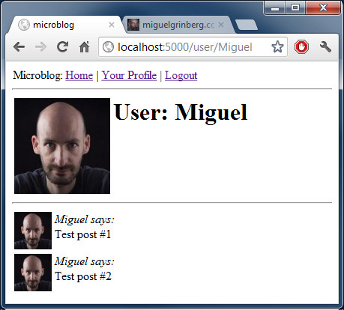
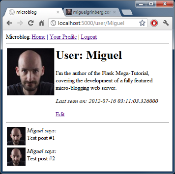

Это шестая статья в серии, где я буду документировать мой опыт написания веб-приложения на Python, используя микрофреймворк Flask.  
  
Цель данного руководства — разработать довольно функциональное приложение-микроблог, которое я за полным отсутствием оригинальности решил назвать microblog.<!--more-->

### Краткое повторение

В прошлой статье мы создали систему авторизации, сейчас пользователи могут авторизоваться на сайте используя OpenID.  
  
Сегодня мы будем работать с профилем пользователя. Сперва, создадим страницу профиля, на которой будет показываться информация о пользователе, и его постах, так же мы научимся показывать аватарку. А потом мы создадим форму редактирования личных данных.

### Страница профиля.

На самом деле, создание страницы профиля не требует никаких новых концепций. Мы просто создадим новое представление и_HTML_\-шаблон к ней.  
  
Функция в представлении. (файл _app.views.py_):

```
@app.route('/user/<nickname>')
@login_required
def user(nickname):
    user = User.query.filter_by(nickname = nickname).first()
    if user == None:
        flash('User ' + nickname + ' not found.')
        return redirect(url_for('index'))
    posts = [
        { 'author': user, 'body': 'Test post #1' },
        { 'author': user, 'body': 'Test post #2' }
    ]
    return render_template('user.html',
        user = user,
        posts = posts)
```

Декоратор _app.route_ будет немного отличаться от тех что мы использовали.  
Метод имеет параметр с именем _nickname_. Так же нужно добавить параметр во вью-функцию с тем же именем. Когда клиент запрашивает _URL /user/miguel_ , функция в представлении должна вызываться с параметром _nickname = 'miguel'_.  
  
Реализация функции должна пройти без сюрпризов. Сперва мы попробуем загрузить пользователя из базы данных, используя_nickname_ который мы приняли в качестве аргумента. Если это не сработает, то сделаем перенаправление на главную страницу с сообщением об ошибке, так же как мы делали в предыдущей главе.  
  
Как только у нас появится пользователь, мы вызываем _render\_template_, вместе с тестовым сообщением. Обращаю ваше внимание, что на странице пользователя нужно показываться только сообщения этого пользователя, поэтому нужно правильно заполнить поле _author_.  
  
Наш первоначальный шаблон выглядит достаточно просто (файл _app/templates/user.html_):

```
<!-- extend base layout -->



<h1>User: {{user.nickname}}!</h1>
<hr>

<p>
  {{post.author.nickname}} says: <b>{{post.body}}</b>
</p>


```

Мы закончили со страницей профиля, но на неё нигде нет ссылки. Что бы пользователю было легко добраться до своего профиля, мы добавим ссылку на него в верхней панели навигации (файл _app/templates/base.html_ ):

```
<div>Microblog:
        <a href="{{ url_for('index') }}">Home</a>
        
        | <a href="{{ url_for('user', nickname = g.user.nickname) }}">Your Profile</a>
        | <a href="{{ url_for('logout') }}">Logout</a>
        
    </div>
```

Обращаю ваше внимание, что в функцию _url\_for_ мы добавили обязательный параметр _nickname_.  
  
Посмотрим что у нас получилось. Нажав на _You Profile_ мы должны перейти на страницу пользователя. Так как у нас нет ни одной ссылки на страницы других пользователей, вам придётся ввести URL вручную, что бы посмотреть на профиль другого пользователя. Например, наберите `http://localhost:5000/user/miguel` что бы посмотреть профиль пользователя _Miguel_.  
  

### Аватарки.

Сейчас наши страницы с профилем, достаточно унылые. Давайте добавим аватарку, что бы сделать их более интересными.  
  
Теперь напишем метод, который будет возвращать аватарку, и положим его в класс (_app/models.py_):

```
from hashlib import md5
# ...
class User(db.Model):
    # ...
    def avatar(self, size):
        return 'http://www.gravatar.com/avatar/' + md5(self.email).hexdigest() + '?d=mm&s=' + str(size)
```

Метод _avatar_ вернёт путь до аватарки, сжатой до указанных размеров.  
  
_Gravatar_ поможет сделать это очень легко. Вам просто нужно создать MD5-хэш от емейла, а затем добавить его в специально сформированный _URL_, который был выше. После хэша добавим в _URL_ другие параметры. _d=mm_ указывает, что нужно вернуть изображение по умолчанию, когда пользователь не имеет _Gravatar_ аккаунт. Параметр _mm_ возвращает изображение с серым силуэтом человека. Параметр _s = N_ указывает до каких размеров следует масштабировать аватарку.  
  
Документация для [Gravatar](https://ru.gravatar.com/site/implement/images).  
  
Теперь класс User знает как вернуть изображение, мы можем добавить его на страницу профиля (файл app/templates/user.html):

```
<!-- extend base layout -->



<table>
    <tr valign="top">
        <td></td>
        <td><h1>User: {{user.nickname}}</h1></td>
    </tr>
</table>
<hr>

<p>
  {{post.author.nickname}} says: <b>{{post.body}}</b>
</p>


```

Примечательно, что класс _User_ отвечает за возвращение аватарки, и если в один прекрасный момент мы решили что _Gravatar_ не то что мы хотим, мы просто перепишем метод _avatar_, так что он будет возвращать другой путь (даже те которые укажем на нашем собственном сервере), все наши шаблоны будут представлены с новыми аватарками автоматически.  
Мы добавили аватарку в верхнюю часть страницы профиля, но в нижней части страницы у нас есть сообщения, рядом с которыми хорошо бы показывать аватарку маленького размера. Для страницы профиля мы, конечно, будем показывать ту же самую аватарку для всех сообщений, но потом, когда мы переведём эту функциональность на главную страницу мы будем иметь каждое сообщение украшенное аватаркой автора сообщения, и это будет действительно хорошо.  
Для показа аватарки для поста мы внесём небольшие изменения в шаблон (файл _app/templates/user.html_):

```
<!-- extend base layout -->



<table>
    <tr valign="top">
        <td></td>
        <td><h1>User: {{user.nickname}}</h1></td>
    </tr>
</table>
<hr>

<table>
    <tr valign="top">
        <td></td><td><i>{{post.author.nickname}} says:</i><br>{{post.body}}</td>
    </tr>
</table>


```

Теперь наш профиль будет выглядеть так:

[](http://18.185.47.240/wp-content/uploads/2014/06/db71679724b935c209406cf32e73c7d7.png)

### Повторное использование подшаблонов ( sub-template)

Мы разработали страницу профиля, что бы показывать сообщения написанные пользователем. Наша главная страница, также показывает сообщения, но любого пользователя. Теперь у нас есть два вида шаблонов которые будут показывать сообщения написанные пользователями. Мы могли бы просто скопировать/вставить часть шаблона, которая отвечает за отображение сообщения, но это не самая лучшая идея, потому что когда нужено будет внеси изменения в дизайн сообщения, мы должны помнить о всех шаблонах которые умеют отображать сообщения.  
  
Вместо этого мы создадим подшаблон который будет генерировать сообщениея, потом просто подключим подшаблон так где он нужен (файл /app/templates/post.html):

```
<table>
    <tr valign="top">
        <td></td><td><i>{{post.author.nickname}} says:</i><br>{{post.body}}</td>
    </tr>
</table>
```

Для начала, мы создадить, подшаблон сообщения, который ничем не отличается от обычного шаблона. Берём _HTML_\-код для показа сообщения из нашего шаблона.  
  
Потом вызовем подшаблон из нашего шаблона используя _Jinja2_ командой _include_ (файл _app/templates/user.html_):

```
<!-- extend base layout -->



<table>
    <tr valign="top">
        <td></td>
        <td><h1>User: {{user.nickname}}</h1></td>
    </tr>
</table>
<hr>

    


```

Как только мы сделаем работающую главную страницу, мы будем ссылать на тот же подшаблон, пока мы не готовы к этому, поэтому оставим для следующей главы.

### Более интересные профили

Теперь когда у нас есть хорошая страница профиля, нам не хватает информации для показа. Пользователи любят добавлять на свои страницы немного информации о себе, поэтому мы дадим им эту возножость, и так же будем отображать на странице профиля. Ещё будем отслеживать когда пользователь заходил последний раз най сайт и тоже будем показывать на странице профиля.  
  
Что бы сделать задуманное, мы должны изменить базу данных. Нужно добавить два новых поля для нашего класса _User_ (файл app/models.py):

```
class User(db.Model):
    id = db.Column(db.Integer, primary_key = True)
    nickname = db.Column(db.String(64), unique = True)
    email = db.Column(db.String(120), index = True, unique = True)
    role = db.Column(db.SmallInteger, default = ROLE_USER)
    posts = db.relationship('Post', backref = 'author', lazy = 'dynamic')
    about_me = db.Column(db.String(140))
    last_seen = db.Column(db.DateTime)
```

Каждый раз когда мы изменяем базу данных, мы создаём новую миграцию. Помните как в части про базы данных мы прошли через муки для настройки миграционной системы БД. Теперь мы пожинаем плоды этих усилий. Для добавления новых полей в нашу БД, просто выполняем сценарий:

- ./db\_migrate.py

И получаем ответ:

- New migration saved as db\_repository/versions/003\_migration.py
- Current database version: 3

И наши два новых поля добавлены в БД. Не забыли, что если вы на Windows то путь запуска скрипта разные.  
Если мы не имеем миграционной системы, вам необходимо редактировать БД в ручную, или хуже того, удалить её и создать заново.  
  
Теперь давайте изменим шаблон профиля, с учетом этих полей (файл _app/templates/user.html_):

```
<!-- extend base layout -->



<table>
    <tr valign="top">
        <td></td>
        <td>
            <h1>User: {{user.nickname}}</h1>
            <p>{{user.about_me}}</p>
            <p><i>Last seen on: {{user.last_seen}}</i></p>
        </td>
    </tr>
</table>
<hr>

    


```

Как вы могли заметить, мы используем _Jijna2_ что бы показывать эти поля, потому что мы будем их показывать, только когда в них есть данные.  
  
Сейчас два новых поля пустые для всех пользователей, так что ничего не отобразится.  
  
Поле _Last\_seen_ легко поддерживать. Помните, как в [предыдущей главе](http://35.156.110.60/python/flask/mega-tutorial-flask-part-5-login/ "Мега-Учебник Flask, Часть 5: Авторизация пользователей") мы создали обработчик _before\_request_. Хорошее место для добавления времени входа пользователя (файл _app/views.py_):

```
from datetime import datetime
# ...
@app.before_request
def before_request():
    g.user = current_user
    if g.user.is_authenticated():
        g.user.last_seen = datetime.utcnow()
        db.session.add(g.user)
        db.session.commit()
```

Если вы войдёте на ваше страницу профиля, то увидите когда последний раз заходили на сайт и каждый раз, обновляя страницу, время будет обновлятся, потому что каждый раз, когда браузер делает запрос breforerequest, обработчик будет обновлять время в БД.  
  
Обратите внимание, что мы пишем время в стандартном часовом поясе _UTC_. Мы обсуждали это в предыдущей главе, что мы пишем все временные метки в _UTC_, что бы они соответствовали друг другу. Есть побочный эффект, время на странице профиля то же отображается в _UTC_. Мы исправим это в одной из следующих глав, которая будет посвещенна временным меткам.  
  
Теперь нужно выделить место, для показа поля «обо мне», и правильней было бы разместить его в странице редактирования профиля.

### Редактирование профиля.

Добавить форму редактирования профиля на удивление легко. Начнём с создания веб-формы (файл _app/forms.py_):

```
from flask.ext.wtf import Form
from wtforms import TextField, BooleanField, TextAreaField
from wtforms.validators import Required, Length

class EditForm(Form):
    nickname = TextField('nickname', validators = [Required()])
    about_me = TextAreaField('about_me', validators = [Length(min = 0, max = 140)])
```

И шаблон (файл _app/templates/edit.html_):

```
<!-- extend base layout -->



<h1>Edit Your Profile</h1>
<form action="" method="post" name="edit">
    {{form.hidden_tag()}}
    <table>
        <tr>
            <td>Your nickname:</td>
            <td>{{form.nickname(size = 24)}}</td>
        </tr>
        <tr>
            <td>About yourself:</td>
            <td>{{form.about_me(cols = 32, rows = 4)}}</td>
        </tr>
        <tr>
            <td></td>
            <td><input type="submit" value="Save Changes"></td>
        </tr>
    </table>
</form>

```

И наконец напишем функцию обработчик (файл _app/views.py_):

```
from forms import LoginForm, EditForm

@app.route('/edit', methods = ['GET', 'POST'])
@login_required
def edit():
    form = EditForm()
    if form.validate_on_submit():
        g.user.nickname = form.nickname.data
        g.user.about_me = form.about_me.data
        db.session.add(g.user)
        db.session.commit()
        flash('Your changes have been saved.')
        return redirect(url_for('edit'))
    else:
        form.nickname.data = g.user.nickname
        form.about_me.data = g.user.about_me
    return render_template('edit.html',
        form = form)
```

Так же добавим ссылку на него со страницы профиля пользователя, что бы можно было легко добраться до редактирования (файл _app/templates/user.html_):

```
<!-- extend base layout -->



<table>
    <tr valign="top">
        <td></td>
        <td>
            <h1>User: {{user.nickname}}</h1>
            <p>{{user.about_me}}</p>
            <p><i>Last seen on: {{user.last_seen}}</i></p>
            <p><a href="{{url_for('edit')}}">Edit</a></p>
        </td>
    </tr>
</table>
<hr>

    


```

Мы используем условные операторы, что убедится что ссылки на редактировния профиля не появлялись когда вы читаете чужой профиль.  
  
Вот так выглядит новый скриншот страницы пользователя, с небольшим описанием о себе.

[](http://18.185.47.240/wp-content/uploads/2014/06/5324c91b661b79609e9cfd761dc99e4f.png)

##### Заключение… и домашнее задание!

  
Мы проделали большую работу с профилем пользователя, не так ли?  
Но у нас есть одна неприятная ошибка и мы должны её исправить.  
  
Сможете её найти?  
  
Подсказка. Мы допустили ошибку в предыдущей главе, когда делали авторизацию. И сегодня мы написали новый кусок кода, который имеет ту же ошибку.  
  
Попробуйте её найти, и если найдёте, то не стесняйтесь и пишите в комментариях. Я обьясню ошибку и как её исправть в следующей главе.  
  
Как всегда вот ссылка для загрузки приложения с сегодняшними изменениями.  
  
Я не включил базу данных в архив. Если у вас есть база данных предыдущей главы, просто положите её в нужное место и запустите _db\_upgrade.py_. Ну а если у вас нет предыдущей базы данных, слздайте новую с помощью _db\_create.py_.  
  
Спасибо что читаете мой учебник.  
Надеюсь увидеть вас в следующем выпуске.  
  
P.S. Автор оригинала статьи [Miguel Grinberg](http://blog.miguelgrinberg.com/post/the-flask-mega-tutorial-part-vi-profile-page-and-avatars)

Взято с: http://habrahabr.ru/post/223375/


