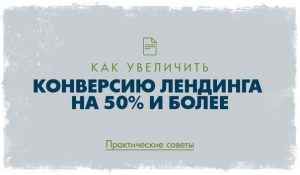

Чтобы сделать landing page(лендинг) продающим нужно очень хорошо продумать важнейшую его часть - **ОФФЕР** - Выгодное предложение. <!--more--> **Оффер** — это основа продаж, реальная ценность для аудитории. Это стержень Вашего коммерческого предложения, от которого, как говорил Аль Капоне, человек не в состоянии отказаться. К слову, в переводе с английского слово offer означает “выгодное предложение”. Именно наличие сильного оффера отличает хорошее коммерческое предложение от посредственного.

Вне зависимости от того, что Вы продаете: товары, услуги или себя как специалиста, у Вас должен быть оффер. И не столько потому что здесь так написано, сколько потому что отклик на Ваше предложение будет выше. Теперь давайте рассмотрим, как правильно составить оффер на вашей посадочной странице.

Вы наверняка замечали, что услуги копирайтинга сейчас оцениваются в очень широком диапазоне. Кто-то берет $5 за текст, а кто-то $2 000. Текст в обоих случаях состоит из одних и тех же букв, но подходы к его созданию и, что самое важное, оффер сильно отличаются. И вот каким образом.

Дешевый текст всегда продается как текстовая масса, которая не несет особой ценности для покупателя. Полноценный продающий текст продается не как текст, а как ценность, которую он несет. Этой ценностью чаще всего становится результат — продажи или решение другой коммерческой задачи. За счет этого разница в цене получается просто огромная.

Другими словами, чтобы составить классный оффер, Вам нужно показать реальную ценность того, что Вы продаете. Для этого подойдет вот эта универсальная формула:

Вы предлагаете аудитории ценность (выгоду) за счет товара или услуги. Это и есть оффер. Продажа не товаров и услуг, а ЦЕННОСТИ, которую они несут.

**Сравните три подхода:

** Подход А: Я предлагаю Вам услуги копирайтинга (Я предлагаю Вам написать продающий текст). Подход Б: Я предлагаю Вам увеличить продажи более чем на на 20% за счет продающих текстов. С гарантией.

Видите? Ценность при подходе Б более высокая. И за нее люди готовы платить в разы больше. Хотя текст в обоих случаях может быть один и тот же.

## Особенности создания офферов для различных областей

Оффер может отличаться в зависимости от ниши, но неизменными остаются две вещи:

- Простота
- Привлекательность
- Все остальное меняется, как декорации.

## Оффер на услуги

С услугами все более-менее понятно (см. предыдущие два подхода). Единственный важный нюанс — всегда помните, кому Вы делаете предложение. Если это владелец предприятия, то его интересует прибыль. Если это менеджер, то его интересует карьера, уважение руководства и т.д. Поэтому всегда учитывайте тип людей, которые воспринимают Вашу информацию, и ценности, актуальные для них.

К примеру, если Вы предлагаете бухгалтерский или кадровый аутсорсинг, покажите экономический эффект от Ваших услуг:

- экономию денег на персонале
- оргтехнике
- налогах
- аренде и т.п.

Если Вы оказываете услуги конечным потребителям (сегмент B2C), то оперируйте теми ценностями, которые для людей важны:

- здоровье,
- дети,
- деньги,
- секс,
- безопасность
- и т.д.

## Оффер на товары

В случае с товарами подход аналогичен, только здесь можно внести большую конкретику. Предположим, Вы занимаетесь поставками станков с ЧПУ. С одной стороны, Вы можете предлагать станки как станки или станки как способ ускорить производственный процесс. Но с другой стороны, Вы можете перевести это “ускорение процесса” в реальные деньги для предприятия, и строить на этом свой оффер.

Например: Увеличьте прибыль производства на $2000 за счет модернизации всего одного станка. Не забывайте, что если Ваша аудитория снабженцы, то они очень любят “награду” за свою работу. И для них это куда большая ценность, чем рост прибыли предприятия.

В сегменте B2C самый популярный оффер на товар — это скидка: Sony Playstation 3 со скидкой 50%! Скидки работают, но нужно помнить одну важную вещь: когда Вы делаете скидку даже 5%, Вы теряете в прибыли гораздо больше.

Смотрите.

Допустим, товар стоит 100 у.е. (для простоты расчетов). Предположим, Ваша чистая прибыль от продажи товара составляет 20%. Себестоимость товара не меняется и всегда равна 80 у.е. Ваша 20%-я прибыль: 20 у.е. с каждой продажи.

Предположим, Вы делаете скидку 5%. Т.е. отдаете товар за 95 у.е. Себестоимость та же, Ваша прибыль уже составляет 95-80=15 у.е. Другими словами, снижая цену на 5%, Вы теряете 25% в прибыли. Вот почему лучше не понижать цену, а повышать ценность. Об этом чуть ниже.

## Джоб оффер

Когда Вы предлагаете кому-то работу, покажите соискателю реальную ценность, которую он ищет. Кого-то интересуют деньги, кого-то возможности, связи и т.д.

Справедливо и обратное: когда Вы предлагаете свои услуги, покажите ценность Вашей работы. Сравните два подхода:

Подход №1: Я хочу работать у вас менеджером по продажам. Подход №2: Я собираюсь поднять планку выполнения плана продаж на новый уровень, работая у вас менеджером.

Работа одна и та же, но формат преподнесения сильно отличается. Зарплата, кстати, тоже сильно отличается. Кроме того, во втором случае у соискателя сильная позиция, а в первом — слабая.

## Усиление оффера

Если бы мы были монополистами, то все было бы проще, но у большинства из нас есть конкуренты, которые предлагают те же самые товары или услуги. В таком случае оффер усиливается дополнениями:

- Доп. бесплатными товарами (iPhone + комплект ПО на сумму $500)
- Доп. услугами (доставка, шины + шиномонтаж по цене шин и т.д.)
- Гарантиями (Пицца за 30 минут или бесплатно)

Усиление оффера — самый простой и быстрый способ отстроиться от конкурентов. Суть остается той же: что-то очень выгодное и привлекательное, что не оставляет аудиторию равнодушной.

Реальная ценность. Оффер как часть стратегии продаж

Многие используют сверхпривлекательный оффер, даже в убыток себе, чтобы затем компенсировать это продажей основных продуктов.

**Наглядные примеры:**

- Бесплатная консультация
- Бесплатная диагностика
- Бесплатный пробник
- Очень большая скидка на какой-то один продукт или на пакет продуктов (дразнилка)
- Бесплатная полезная информация и т.д.

Выстраивая таким образом последовательность касаний, можно здорово поднять продажи. Да, это потребует каких-то затрат, но дополнительная прибыль покроет их с лихвой.

## Резюме

Главное, что нужно взять из этой статьи для повышения конверсии лендинга:  предлагать всегда нужно ЦЕННОСТЬ, а не сам товар. Товар, как правило, всегда один и тот же, а вот ценность можно увеличивать. Тогда Вы сможете зарабатывать на тех же продуктах и услугах больше. Это особенно удобно, когда Вы не можете конкурировать по цене и не хотите снижать цену. В таком случае просто добавьте ценность и постройте на ней свой оффер. И продажи пойдут, даже если Ваша цена будет выше, чем у конкурентов.
