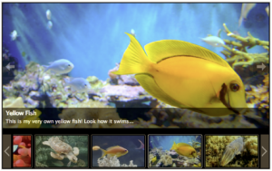
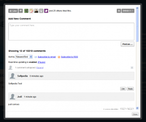

WordPress считается лучшей платформой для веб-сайтов. Все, как опытные пользователи, так и новички, любят эту платформу за простоту и эффективность в использовании.

Это стало возможным, преимущественно, благодаря наличию множества плагинов, которые предназначены для облегчения и оптимизации работы. Мы создали выборку лучших, по нашему скромному мнению, плагинов, в количестве 3-х штук, доступных Вам. Благодаря им Вы сможете все, или почти все...

**1\. Плагин WPAdverts для WordPress**

После нескольких месяцев разработки, рассмотрения лучших вариантов под WordPress и бета-тестирования, дабы гарантировать лучшие результаты, команда, ответственная за создание WPJobBoard и WPHelpDesk представила еще один продукт: WPAdverts, под WordPress Classified Plugin. Именитость разработчиков уже является достаточной причиной включить его в свой WordPress-арсенал как можно скорее. WPAdverts был создан благодаря многолетнему опыту и новейшим разработкам, как обратная связь для Ваших клиентов.

В результате получился легкий, модульный и гибкий продукт, установить который можно в один клик, как в существующем, так и в новом блоге. После этого, вы можете настроить шорт-коды, как Вы сочтете нужным, и Вы уже готовы, чтобы плавно запустить свой удивительный Adverts, не получив каких-либо проблем, так как Adverts предназначен для работы и совместного использования со всеми версиями тем WordPress, и это при наличии постоянных обновлений, предлагая своим пользователям уникальный опыт просмотра.

Плагин вполне оправдывает свою цену.

**2\. Плагин Tribulant Slideshow Gallery

**

Изображениями можно управлять! Правильная галерея может выгодно подчеркнуть дизайн Вашего сайта, отразив его лучшие стороны. Если вы используете веб-сайт и хотите привлечь внимание посетителей, лучшим и самый простым способом станет добавление гладкого, плавномерного и красивого слайд-шоу, созданного на JavaScript Tribulant. Этот плагин только для WordPress.

Tribulant Slideshow Gallery использует библиотеку JQuery для воспроизведения слайд-шоу, в то время как установленный JavaScript будет использоваться для предотвращения помех от сторонних модулей или тем. Не стесняйтесь подойти к вопросу творчески и добавить свои собственные изображения для создания слайдов, а также установить нужную скорость, интервал и размер для всех добавленных элементов. Самое лучшее в этом то, что Вам нужно добавить всего лишь одну строку кода для интеграции Tribulant Slideshow Gallery в Вашей теме WordPress.

**3\. Плагин Disqus Comment System для WordPress**

Считаете ли вы, что стандартная система комментирования WordPress работает хорошо, но Вам хотелось бы получить от нее большего? Вы хотели бы улучшить статистику комментирования вашего сайта, а также добавлять комментарии в режиме реального времени для вашего сайта?

Если Вы ответили утвердительно на все эти вопросы, то пришло время узнать о Disqus. Disqus предлагает интегрированную основу, которая обладает простым, легким и интуитивно понятным дизайном и работает с практически со всеми платформами. Если Вы в данный момент находитесь на WordPress, Tumblr, Blogger, Squarespace и т.д., Вы можете легко импортировать все существующие комментарии, а также экспортировать их в любой момент времени.

Невероятно эффективный встроенный спам-фильтр всегда будет на страже, но если Вы хотите еще больше обезопасить себя, Вы можете активировать ряд дополнительных функций, предлагаемых Disqus, например премодерацию, черные списки, белые списки и так далее. В дополнение ко всему этому, у Вас будет доступ к агрегированным комментариям, упоминаниям в социальных сетях и помощи технической поддержки, которая тщательно документирует все о Disqus.

Следите за нами! Скоро будет продолжение... Все это — результат нашего кропотливого исследования. А Вы какие плагины любите и используете?
