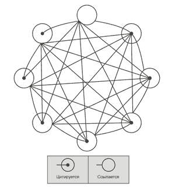
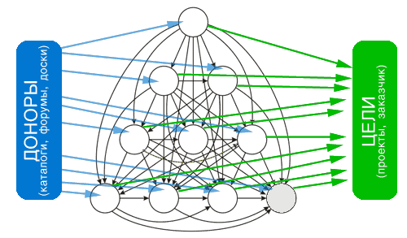
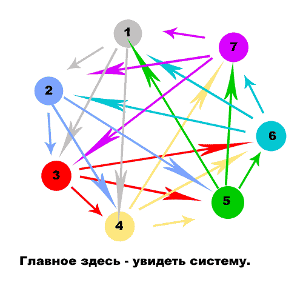

**Сателлит** (от ла. _satelles_ - спутник) – это вспомогательный сайт, созданный с целью продвижения основного сайта (или его раздела) в поисковых системах. Как правило, сателлит является узкотеманическим сайтов, что облегчает его продвижение, в отличие от основного, тематика которого может быть более широкой.<!--more-->

1. Что такое сателит?
2. Как создать свою сеть сателитов
3. Схемы перелинковки сателитов

Для продвижения основного сайта одного сателлита обычно недостаточно, поэтом создаются целые сети сателлитов с качественной внешней и внутренней перелинковкой. Нередко сателлиты создаются для того, чтобы полностью или частично оккупировать топ-10 поисковой выдачи или просто для продажи прямых ссылок.

## 2\. Как создать свою сеть сателитов

Для начала нам нужно определить с **тематикой сателлитов**. Помните, что одна тема может иметь несколько ответвлений. Например, возьмём строительную тематику. Сателлит может содержать информацию о стройматериалах, строительных магазинах, советах по строительству и т.д. Тема одна, но вариантов много. Главное, чтобы каждая из выбранных тематик позволила достичь требуемой конверсии.

Следующим нашим шагом будет **покупка домена и хостинга**. Желательно, чтобы домен был старше 3-х месяцев, т.к. новые домены банятся чаще. В противном случае, придётся _выстаивать_ домены, не вводя их в сеть сателлитов. Несколько сложнее обстоят дела с хостингом. На каждые 2-3 сателлита должны быть разные IP-адреса. В противном случае повышается вероятность схлопотать бан в поисковых системах.

Для создания сайтов сателлитов, можно использовать разные **CMS**. Лично я рекомендую самый простой CMS Цимус, понятный и неплохо заточенный под поисковые системы.

Если всё выше перечисленное выполнено, можно приступать к плавному **наполнению сайта контентом**. Напомню, что с темой мы уже определились. Гораздо сложнее с контентом. Лучше всего если это будет уникальный контент, но обычно довольствуются рерайтом или сканом, не опубликованной ещё в сети, книги. Осталось лишь подобрать ключевые слова, равномерно и без фанатизма распределить их по текстам и организовать перелинковку.

Для начала я рекомендовал бы организовать внутреннюю перелинковку страниц каждого из сателлитов и только после того, как они наберут вес, создавать сеть и донат основного сайта. При этом, на каждой из страниц должно быть не более трёх, ну в крайнем случае пяти, ссылок.

## 3\. Схемы перелинковки сателитов

Рассмотрим наиболее распространённые схемы перелинковки сетей сателлитов:

- Схема «**кольцо**» - достаточно эффективна и проста, но легко распознаётся поисковыми системами.

- Схема "**Елочка**" - Отличная схема для прокачки основного сайта. Примечание: для прокачки с сателитов не используйте сквозные ссылки, лучше воспользоваться основными разделами сателлита и ставить ссылку на разделы сайта-акцептора в контексте описания раздела или отдельным блоком.

- **Естественная схема перелинковки -** Для этой схемы перелинковки нет жестких схем и ограничений. В этом и прелесть этого метода - он естественный. Разберем этот прием более подробно:Составьте список всех своих сателитов, отсортировав по признакам ( тематика, наличие каталога ссылок, ПР, ТиЦ, наличие сайта в DMOZ или YACA, уникальность контента и прочие )Исходя из списка наиболее подходящих сайтов и начинайте перелинковку сетки. Для ПС это будут естественные и качественные ссылки.
    
    Преимущество у этой схемы большое - плавное распределение веса идет естественным путем.

 

Напоследок хотелось бы сказать пару слов об оптимальном расположение ссылок при продвижение сайта и при накачки сетки стелитов.

1\. В сателлитах очень полезно выделять несколько основных разделов. Четко тематических, с внешними ссылками на эти разделы и хорошей линковкой внутри сайта. Ссылки на тематические разделы сайта-акцептора будут естественным образом на порядок выше. 2. Приятным дополнением послужат ссылки в контексте статей, разделов сателита. 3. Никогда не прячьте ссылки, будь то запихивание блока ссылок в подвал сайта, стили ссылок при котором не понятно где текст, а где ссылка, скрытие ссылок из вида с помощью visible: none; 4. Статьи на сателлитах с уместной и органичной ссылкой в виде упоминания "...а вот здесь самые лучшие услуги..." или "...я видел здесь www.site.ru" никогда еще не вредили.

 

P.S.: Регистрирую сателиты всегда помните что они не должны лежать на одном IP, все должны иметь разный дизайн и на свех сателитах должен быть разный уникальный контент.

 

По материалам: найдено в сети :)
