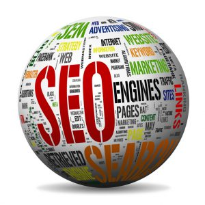
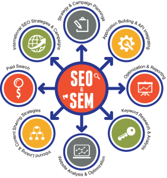

В данной статье мы расскажем Вам про основы основ продвижения любого сайта, а именно — про СЕО. Если Вы хотите привлекать при помощи сайта больше клиентов и людей, ради возможности заработать конечно, без оптимизации никуда!

Ваше желание можно реализовать! Самое важное и необходимое – показать клиенту свой ресурс в Топ-е поиска. Но чтобы ресурс находился в первой десятке, руководствуйтесь основными понятиями в СЕО, а также учитесь пользоваться всеми инструментами.

**Кратко о главном, как понять «СЕО»?**

SEO (Search Engine Optimization), если переводить дословно, «СЕО» означает метод продвижения при помощи поисковиков, а так же оптимизацию под машинный поиск.

Более высокая позиция продвигаемого ресурса в выдаче поисковика - значит увеличивается шанс, что клиент посетит именно Ваш сайт, поскольку около 90% заходят на первые три результата выдачи поисковой системы, чем дальше — тем меньший процент – к 10-му сайту на первой странице по результату поиска приходят только 30-60% потенциальных клиентов.

Еще менее популярной считают вторую страницу результатов поиска. К ней приходит лишь 10-15% заинтересованной аудитории. Из этого и вывод, самым желанным местом в поисковой выдаче является ТОП 10. Если у Вас конкурентная тематика и ничего уникального Вы не придумали — у Вас будут конкуренты, которые уже там, на желанном месте. Как же тогда быть? Все занято и шансов нет? Выход есть! Это конечно СЕО!

**От рассказов к практике!**

Оптимизация поискового типа имеет в себе такие направления:

Главным направлением СЕО считается внутренняя оптимизация. Она включает в себя труд над каждой мелочью, коррекцию неисправностей, редактирование и изменение текстового наполнения, переработка и чистка кода Html всех записей на сайте, использование правил внутренней перелинковки и многое другое.

Продвижение в Google-поиске и Yandex-поиске отличаются, что значит необходимость учитывать это перед первым шагом. Мало того, очень важны Ваши навыки, знания и умения подстроить сайт под изменчивые алгоритмы самых популярных поисковиков.

Второе направление - это внешняя СЕО оптимизация сайта. Оно включает в себя все работы вне сайта и наращивание ссылочной массы. Целое направление от внешних ресурсов и переходов по ссылкам может уже вывести Ваш сайт в топ.

Третье направление — поддержка настоящего состояния сайта, проведение аналитики и наблюдение за конкурентами. Нужно учитывать все факторы и постоянно проводить работу над образованием ссылочной массы. Только так Вы получите действительно стоящий результат.

**А  что Вы можете сказать о Сео?**
