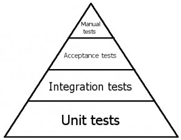

## Что такое PHPUnit

**PHPUnit** - это фреймворк модульного тестирования на языке программирования PHP. Построен на архитектуре xUnit, а именно SUnit которая стала популярна в JUnit. PHPUnit был создан [Себастьяном Бергманном, и его разработка размещена на GitHub](https://github.com/sebastianbergmann/phpunit).

**Идея:**

PHPUnit основан на идее, что разработчики должны быстро находить ошибки в своем, только что написаном, коде и утверждать, что регрессия кода не произошла в других частях базы кода. PHPUnit использует утверждения для проверки того, что поведение конкретного компонента - или «единицы» - тестируется, как следует.

## Зачем нужен PHPUnit:

Цель модульного тестирования состоит в том, чтобы изолировать каждую часть программы и показать, что отдельные части работают как ожидаеться. Модульный тест предоставляет строгий письменный контракт, который должен удовлетворять часть кода. В результате модульные тесты обнаруживают проблемы в начале цикла разработки.

PHPUnit может выводить результаты тестирования в нескольких разных форматах, включая JUnit XML и TestDox.

[(с) Wikipedia](https://en.wikipedia.org/wiki/PHPUnit)

****

**Модульное тестирование** ([англ.](https://ru.wikipedia.org/wiki/%D0%90%D0%BD%D0%B3%D0%BB%D0%B8%D0%B9%D1%81%D0%BA%D0%B8%D0%B9_%D1%8F%D0%B7%D1%8B%D0%BA "Английский язык") unit testing) — процесс в [программировании](https://ru.wikipedia.org/wiki/%D0%9F%D1%80%D0%BE%D0%B3%D1%80%D0%B0%D0%BC%D0%BC%D0%B8%D1%80%D0%BE%D0%B2%D0%B0%D0%BD%D0%B8%D0%B5 "Программирование"),

позволяющий проверить на корректность единицы [исходного кода](https://ru.wikipedia.org/wiki/%D0%98%D1%81%D1%85%D0%BE%D0%B4%D0%BD%D1%8B%D0%B9_%D0%BA%D0%BE%D0%B4 "Исходный код"), наборы из одного

или более программных модулей вместе с соответствующими управляющими данными, процедурами использования и обработки.

Идея состоит в том, чтобы писать тесты для каждой нетривиальной функции или метода. Это позволяет достаточно быстро проверить, не привело ли очередное изменение кода к _[регрессии](https://ru.wikipedia.org/wiki/%D0%A0%D0%B5%D0%B3%D1%80%D0%B5%D1%81%D1%81%D0%B8%D0%BE%D0%BD%D0%BD%D0%BE%D0%B5_%D1%82%D0%B5%D1%81%D1%82%D0%B8%D1%80%D0%BE%D0%B2%D0%B0%D0%BD%D0%B8%D0%B5 "Регрессионное тестирование")_, то есть к появлению ошибок в уже оттестированных местах программы, а также облегчает обнаружение и устранение таких ошибок.

[(c) Wikipedia](https://ru.wikipedia.org/wiki/Модульное_тестирование)

Содержание:

- 1\. [Установка PHPUnit](http://thewebland.net/development/php/phpunit/phpunit-installation/)
    - Требования
    - PHP Archive (PHAR)
        - Windows
        - Проверка релизов PHPUnit PHAR
    - Composer
    - Необязательные пакеты
- 2\. [Написание тестов на PHPUnit](http://thewebland.net/development/php/phpunit/pishem-testy-s-pomoshhyu-phpunit/)
    - Зависимости тестов
    - Провайдеры данных
    - Тестирование исключений
    - Тестирование ошибок PHP
    - Тестирования вывода
    - Вывод ошибки
        - Крайние случаи
- 3\. [Исполнитель тестов командной строки](http://thewebland.net/development/php/phpunit/komandnaya-stroka-v-phpunit/)
    - Опции командной строки
    - TestDox
- 4\. [Фикстуры](http://thewebland.net/development/php/phpunit/fikstury-v-phpunit/)
    - Больше setUp() чем tearDown()
    - Разновидности
    - Совместное использование фикстур
    - Глобальное состояние
- 5\. [Организация тестов](http://thewebland.net/development/php/phpunit/organizatsiya-testov-v-phpunit/)
    - Составление набора тестов с помощью файловой системы
    - Составление набора тестов с помощью конфигурации XML
- 6\. [Рискованные тесты](http://thewebland.net/development/php/phpunit/riskovannye-testy-phpunit/)
    - Бесполезные тесты
    - Непреднамеренно покрытый код
    - Вывод во время выполнения теста
    - Тайм-аут выполнения теста
    - Манипуляция глобальным состоянием
- 7. [Неполные и пропущенные тесты](http://thewebland.net/development/php/phpunit/nepolnye-i-propushhennye-testy/)
    - Неполные тесты
    - Пропущенные тесты
    - Пропуск тестов с помощью @requires
- 8\. [Тестирование базы данных](http://thewebland.net/development/php/phpunit/testirovanie-bazy-dannyh/)
    - Поддерживаемые поставщики для тестирования баз данных
    - Трудности при тестировании баз данных
    - Четыре этапа теста базы данных
        - 1\. Очистка базы данных
        - 2\. Настройка фикстуры
        - 3–5. Запуск теста, проверка результата и очистка
    - Конфигурация PHPUnit Database TestCase
        - Реализация getConnection()
        - Реализация getDataSet()
        - Как насчёт схемы базы данных (Database Schema, DDL)?
        - Совет: Используйте собственную абстрактную реализацию PHPUnit Database TestCase
    - Понимание DataSets и DataTables
        - Доступные реализации
        - Остерегайтесь внешних ключей
        - Реализация собственного DataSets/DataTables
    - Использование API подключения к базе данных
    - API утверждений базы данных
        - Утверждение количество строк таблицы
        - Утверждение состояния таблицы
        - Утверждение результата запроса
        - Утверждение состояния нескольких таблиц
    - Часто задаваемые вопросы
        - Будет ли PHPUnit (повторно) создавать схему базу данных для каждого теста?
        - Необходимо ли мне обязательно использовать PDO в моём приложении для расширения базы данных?
        - Что мне делать, когда я получаю ошибку «Too much Connections»?
        - Как обрабатывать NULL в наборах данных Flat XML / CSV?
- 9\. [Тестовые двойники](http://thewebland.net/development/php/phpunit/testovye-dvojniki/)
    - Заглушки
    - Подставные объекты
    - Prophecy
    - Имитация трейтов и абстрактных классов
    - Создание заглушек и имитация веб-сервисов
    - Имитация файловой системы
- 10. [Анализ покрытия кода](http://thewebland.net/development/php/phpunit/analiz-pokrytiya-koda/)
    - Показатели программного обеспечения покрытия кода
    - Белый список файлов
    - Игнорирование блоков кода
    - Определение покрытых методов
    - Крайние случаи
- 11\. [Логирование](http://thewebland.net/development/php/phpunit/logirovanie-v-phpunit/)
    - Результаты теста (XML)
    - Покрытие кода (XML)
    - Покрытие кода (TEXT)
- 12\. [Расширение PHPUnit](http://thewebland.net/development/php/phpunit/rasshirenie-phpunit/)
    - Подкласс PHPUnit\\Framework\\TestCase
    - Написание пользовательских утверждений
    - Реализация PHPUnit\\Framework\\TestListener
    - Реализация PHPUnit\\Framework\\Test
    - Расширение TestRunner
        - Интерфейсы доступных событий
- Приожение
    - [Утверждения](https://phpunit.readthedocs.io/ru/latest/assertions.html)
    - [Аннотации](https://phpunit.readthedocs.io/ru/latest/annotations.html)
    - [Конфигурационный XML-файл](https://phpunit.readthedocs.io/ru/latest/configuration.html)
